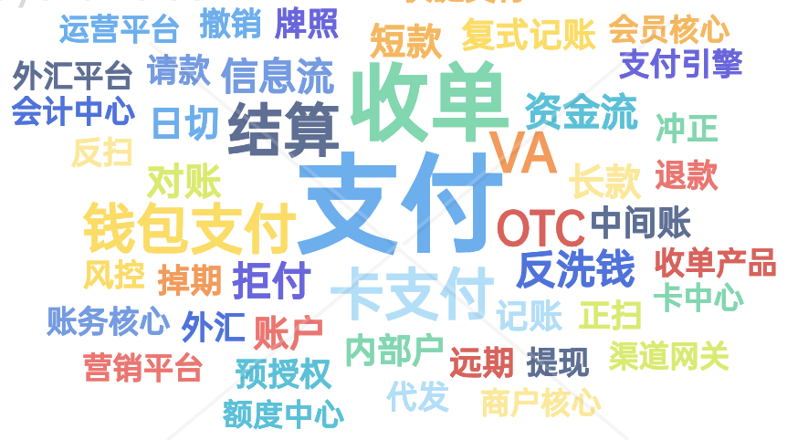

# 1.支付系统基础_支付相关必知术语一网打尽

这是《百图解码⽀付系统设计与实现》专栏系列⽂章中的第（1）篇。是从《跟着图⾛，学⽀

付：在线⽀付系统设计的图解教程》章节中独⽴出来的。

每个⾏业都⾃⼰的⾏业通⽤词语，官⽅名词叫“术语”。如果你是⽀付⾏业的新⼿或正尝试深⼊

了解这个复杂但⼜充满机遇的领域，那么掌握⾏业术语是打开这扇⻔的钥匙。

⽀付系统⽆论需求⽂档还是技术⽅案⽂档，都充斥着专业词汇和⾏业通⽤词语，这些术语有的

直观易懂，有的则晦涩难解。在这篇⽂章中，我们将揭开⽀付系统中常⽤术语的神秘⾯纱，⽤最通

需要补充说明的是：这些术语是个⼈从业10来年经验的总结，多⽤于聊需求或设计时使⽤，严

谨性可能不及⼀些权威书籍，但是⾜够实⽤，起码在中国绝⼤部分的⽀付⼤⼚也是通⽤的。此外，

⼀些术语在不同的领域有不同含义，下⾯的定义只适⽤在线⽀付系统场景下。

## 1.通⽤

**⽀付**

Payment。⽤户通过在线⽀付系统将资⾦转移给PSP。

在后续的清分结算阶段，⽀付平台会把这笔⽀付的钱分成平台⼿续费和商户待结算款，⼿续费留在

⽀付平台，待结算款会在后续结算给商户。

**退款**

Refund。⽀付系统将钱退还给⽤户。通常在取消交易或退回商品后发⽣。有全额退款和部分退

款。有些平台会退款退费，有些平台退款不退费。

**撤销**

Cancel/Void。通常在当天（⼀般是⽇切前，还没有清算）取消⼀笔交易。在预授权/请款模式

中，撤销⽤于取消预授权未请款那部分的⾦额。有全额撤销和部分撤销。

与退款的区别：

1）撤销⼀般是⽀付当天的逆向⾏为，退款⼀般是⽀付第⼆天的逆向⾏为。这⾥的当天⼀般是指会

计⽇，⽽不是⾃然⽇。

2）撤销通常退⼿续费，退款⼀般不退⼿续费。但不是绝对的。

另外，现在⼤部分的电⼦钱包把退款和撤销合并成⼀个退款接⼝。

**冲正**

与撤销类似。来源于POS机时代，在交易发⽣当天⽤户申请退货退款时，或POS机⽀付超时的情

况下，操作员发起⼀笔冲正，收单机构如果已经扣款就会退回。

**收单产品**

Acquiring Products。⽀付服务提供商（PSP）为商户提供的⽀付服务。这些⽀付服务需要基于交

易订单，在系统中有明确的买卖⾏为发⽣。不同的公司因为商业策略不同，开出的收单产品也会有

所不同。

**担保交易**

⽤户先把钱给到⽀付平台，⽤户确认收货再给钱到商家。

**即时到账**

付款资⾦直接转移到收款账户，不需要⽤户⼆次确认。

**资⾦产品**

Funds Products。通常指与处理客户资⾦流动相关的服务，包括充值、转账、提现、代发等功

能。

**充值**

Topup。往在线⽀付系统账户增加资⾦的⾏为。⽐如往⽀付宝、微信账户充钱。

**转账**

Transfer。将资⾦从在线⽀付系统⼀个账户转到另外⼀个账户的过程。可以是同⼀⽀付平台内部

转，也可以是跨平台或银⾏转。

特殊的，个⼈对个⼈的转账，简称：P2P转账。

**提现**

Withdraw。⽤户将在线⽀付系统账户中的余额提取到指定的银⾏账户。

**代发**

公司或组织通过在线⽀付系统将资⾦直接转⼊个⼈账户。有代发到余额和代发到卡。

**T⽇/T+N**

T⽇：交易实际发⽣的⽇期。

T+N：从交易⽇发⽣之后N个⼯作⽇。⽐如T+1清算，就是指交易完成后，第⼆天进⾏清算。

**⻛控**

交易的⻛险控制。欺诈检测、信⽤评估、合规检查等。

## 2. ⽀付⽅式与渠道

**⽀付⽅式**

终端⽤户可⻅的⽀付⼿段或⼯具。这个⽐较抽象，每个公司定义可能不⼀样。但⼀般来说，信⽤

Later）等都可以抽象成⽀付⽅式。

**渠道**

⼀般指外部提供⾦融服务能⼒的⾦融机构。⽐如⽀付渠道，外汇渠道，流出渠道等，分别提供⽀

付、外汇兑换、提现打款等⾦融服务。

**快捷⽀付**

通过在⽀付系统中提前绑定银⾏卡信息，快速完成⽀付交易，不需要每次都填写完整的卡详情。

**代扣**

个⼈授权商户直接去⽀付平台或银⾏进⾏扣款，不需要⽤户参与⽀付过程。⽐如⽔电煤代扣，滴滴

打⻋代扣。

**卡⽀付**

使⽤信⽤卡或借记卡⽀付。

**⽹银⽀付**

需要跳转到银⾏提供的⽀付⻚⾯，输⼊银⾏账户信息进⾏⽀付。

**VA⽀付**

Virtual Account。虚拟账户是银⾏临时⽣成的⼀个账户，与⽤户和订单临时关联。⼀般在东南亚

的支付场景，或者国际收款场景下使用得比较多。

东南亚很多⼈没有银⾏卡，但⼜要在线买东⻄，就可以临时⽣成⼀个VA。以⽀付流程为例：⽤户

选择某个银⾏的VA⽀付⽅式，⽀付系统调⽤银⾏接⼝，先为⽤户订单⽣成⼀个VA号，⽤户拿着VA

去钱下ATM机转账，银⾏收到钱后，通知⽀付系统，⽀付系统再通知商户，商户给⽤户发货。

**OTC⽀付**

Over-the-Counter。柜台⽀付。⼀般指⼤型连锁线下零售商提供的⽀付能⼒，⽐如7-11或肯德基

提供的⽀付能⼒。整体流程和VA很像。区别在于VA通常指银⾏提供的。

同样以⽀付流程为例：⽤户选择某个OTC服务提供商的OTC⽀付⽅式，⽐如7-11，⽀付系统调⽤

7-11接⼝，先为⽤户订单⽣成⼀个OTC码，⽤户拿着OTC码去钱下7-11柜台拿现⾦充值，7-11收

到钱后，通知⽀付系统，⽀付系统再通知商户，商户给⽤户发货。

**第三⽅钱包/电⼦钱包⽀付**

⾮银⾏机构提供的在线⽀付服务。⽐如⽀付宝、微信⽀付，国外的PayPal等。

**令牌化⽀付**

将敏感数据（⽐如信⽤卡号）替换成唯⼀的识别码（令牌），在⽀付过程中传输令牌进⾏⽀付。减

少信息泄露的⻛险。

可以认为这是卡组提供的绑卡⽀付能⼒。⽤户绑定后，卡组返回⼀个TOKEN给⽀付系统，⽀付系

统拿着TOKEN去⽀付，外部⽀付⽹关先把TOKEN换成真实银⾏卡信息，再去发卡⾏进⾏扣款，因

为发卡⾏只识别明⽂卡信息。

**⼆维码⽀付**

通过⼆维码发起⽀付交易。⼴泛应⽤于移动⽀付场景。

**正扫**

商户⽣成⼆维码，⽤户扫商户⼆维码。

**反扫**

消费者⽣成⼆维码，商户扫消费者的⼆维码。

## 3. ⼦系统/⼦应⽤分类

**开放⽹关**

主要对接商户，⽐如下单、⽀付等接⼝⼊⼝。通常要求有⽐较⾼的安全性。部分公司可能会把移动

端⽹关、PC⻔户⽹关、商户通知等能⼒集成在开放⽹关，也可能会单独拆出部署。

**收单结算**

负责把商户的单收下来，并给商户发起结算。承担的收单产品包括有：线上收单，线下收单，担保

交易、即时到账等，每个公司的商业策略不同，开出的收单产品会有差异。

**资⾦产品**

承担⽆买卖标的的纯资⾦转移能⼒。典型的有：充值、转账、提现、代发。和⽀付的区分在于⽀付

是有买卖标的，⽽资⾦产品没有。也就是在系统中没有买卖记录发⽣，但在线下可能有。

**收银核⼼**

渲染可⽤⽀付⽅式。包括查询账户是否有余额，查询营销是否有营销券，查询渠道⽹关是否有可⽤

**⽀付引擎**

负责真正的扣款或转账。有些公司叫⽀付核⼼，或资产交换。个⼈认为资产交换更合适，因为⽆论

对于⽀付、退款、充值、转账等各种交易，本质都是把资产从⼀个账户交换到另外⼀个账户。

**渠道⽹关**

负责去外部渠道扣款。通常还会提供渠道路由、渠道咨询等能⼒，做得细的公司可能下⾯再细分为

渠道产品，报⽂⽹关和⽂件⽹关。

**会员平台**

管理会员的注册、登录、密码、实名认证等。

**商户平台**

管理商户的⼊驻、登录、交易管理等。

**产品中⼼**

管理平台对外提供的产品能⼒。⼀般⼤的⽀付系统才会独⽴成⼀个⼦系统。

**资⾦账务**

负责账户开立，记账等。

**会计中⼼**

会计科⽬管理、分录管理、⽇切管理。

**对账中⼼**

负责明细对账和资⾦对账。

**营销平台**

提供满减、红包等营销⼯具。

**⻛控平台**

针对账户和交易，提供实时、离线⻛控，控制平台的⻛险。

**运营平台**

订单管理、渠道管理、产品管理等综合运营⼯具。

**数据平台**

主要⽤于数据汇总和分析。分布式部署后，数据都在各⼦系统中，需要汇总到数据平台⽤于经营分

析。

**卡中⼼**

负责管理用户的绑卡信息。需要经过PCI认证。

**额度中⼼**

累计⽤户、商户的额度，通常有⽇、⽉、年等各种分类。

**外汇平台**

负责外汇报价和兑换。

**流动性与调拨中⼼**

⼀些跨境⽀付公司，在多个国家多个银⾏有头⼨，各头⼨之间经常需要做流动性管理，提⾼资⾦利

⽤率。

**差错中⼼**

负责差错处理。⽐如渠道退款失败，需要通过其它的⽅式退给⽤户。

**拒付中⼼**

处理⽤户的拒付和举证。在跨境⽀付场景下，信⽤卡⽤户联系发卡⾏说卡被盗刷或商品没有收到，

或商品有问题等，拒绝⽀付给商户。

## 4. 监管合规

**⽀付服务提供商**

PSP，Payment Service Provider。

为商户提供支付解决方案的公司。银行、第三方支付公司都属于支付服务提供商。

**收单机构**

Acuquiring Institution/Acquirer。负责处理和清算商户交易的⾦融机构或⽀付服务提供商

（PSP）。

**牌照**

License。由监管机构或政府授予的官⽅许可，允许持牌者在特定的法律框架和规定内经营某种⾦

融服务或⽀付业务。⽀付相关的牌照主要有：

银⾏牌照：允许公司提供传统银⾏服务，例如接受存款、提供贷款等。

⽀付机构牌照：允许公司提供⽀付服务，如⽀付处理、资⾦转账、电⼦钱包服务等。

电⼦货币机构牌照：允许公司发⾏和管理电⼦货币，如预付卡、电⼦钱包中的资⾦等。

**PA牌照**

Payment Account。也就是储值牌照，⽤户可以先充值，后使⽤余额进⾏⽀付。

**PG牌照**

Payment Gateway。也就是⽀付⽹关牌照，只能调⽤外部渠道⽀付，不能有余额。

⼀般⽀付机构都会同时申请PA+PG牌照。

**展业**

在指定的区域开展业务。通常和牌照申请、监管合规等放在一起。

**监管与合规**

⽀付或⾦融机构遵守展业所在国家相关法律、规章、标准和⾏业准则的要求。需要定期向监管机构

报告业务活动和财务状况，以证明企业的合规性。

**反洗钱**

Anti-Money Laundering, AML。旨在预防、识别和打击通过⾦融系统将⾮法所得洗⽩变成合法资

⾦的⾏为。

**反欺诈**

Anti-Fraud。旨在预防、检测、调查和遏制欺诈⾏为。在⽀付领域，通常是⻛控系统负责。常⻅

有信⽤卡盗⽤，账户盗⽤等。

## 5. 卡⽀付

**预授权**

Authorization，简称Auth。对⽤户信⽤卡取得⼀个临时授权，对应资⾦将会冻结，直到请款或撤

销（主动或过期⾃动撤销）

**请款**

Capture。在预授权之后，商户向发卡行请求将预授权的资金正式扣除。有全额请款和部分请款。

**AUTH-CAPTURE模式**

预授权-请款模式。先冻结⽤户的资⾦，在请款时再实际扣款。

**SALES模式**

预授权-请款在⼀个步骤中完成。就是直接从信⽤卡账户中扣款。

**拒付**

Chargeback。当⽤户对信⽤卡交易提出异议（⽐如认为被盗刷），卡组⼀般会先将钱退回给⽤

户，并扣除商户的钱，同时启动调查，通知商户有拒付发⽣。

**拒付举证**

Chargeback Representment。商户收到拒付通知后，如果认为是⽤户真实⽀付⾏为或商品没有问

题，就会提供相关证明材料给卡组，这⼀过程称为拒付举证。如果卡组认为商户证据有效，拒付就

会被撤销，重新扣回⽤户的钱并结算给商户。

**拒付反转**

Chargeback Reverse。商户进⾏拒付举证后，卡组认为商户证据有效，就会把拒付扣除的资⾦还

给商户，同时撤销⽤户的退款。这⼀过程称为拒付反转。

**MOTO⽀付/2D⽀付**

⾮现场⽀付，以前是通过邮件或电话进⾏信⽤卡⽀付。在线⽀付系统⾥，通常指不需要跳转到独⽴

核身页面进行核身的支付方式。支付成功率高，风险较大。

**3DS⽀付**

额外增加⼀层安全验证，需要跳转到⼀个独⽴核身的⻚⾯输⼊密码、OTP、账单地址等信息验证

身份。对平台来说安全性⾼，但是⽀付成功率低。

**3DS1.0/3DS2.0**

3DS1.0通常是由发卡⾏来做身份验证。

3DS2.0由独⽴的第三⽅来进⾏身份验证。安全性更⾼。率先在欧洲启动。

**卡BIN**

卡号前6-8位号码，⽤于识别发卡⾏和卡种类。

**发卡⾏**

发⾏⽀付卡给⽤户的银⾏或⾦融机构。

**收单⾏**

为商户提供收单服务的银⾏或⾦融机构。

**卡组/卡品牌**

信⽤卡或借记卡交易⽹络的组织。⽐如VISA，MASTERCARD，银联等。

**PCI认证**

PCI DSS（Payment Card Industry Data Security Standard）。⽀付卡⾏业数据安全标准。保存

银⾏卡的⼦系统需要通过PCI认证。认证由专业的第三⽅机构执⾏，需要定期核查。

⽀付系统中只有PCI域可以保存⽤户的卡明⽂信息（也是需要加密存储），其它⾮PCI⼦域不能保

存⽤户的卡明⽂信息（加密存储也不允许）

**渠道路由**

当有多个外部渠道可以⽀持同⼀笔⽀付交易时，选择出最优的⼀条渠道。通常基于成功率、成本、

卡类型、⾦额等因⼦做路由决策。

## 6. 外汇

**锁汇**

锁定汇率。在电商场景下，电商平台不愿意承担汇损⻛险，就直接在⽀付成功后，使⽤⽀付⾦额向

外汇机构锁定⼀个固定汇率。

**换汇**

实际购汇。在电商场景下，电商平台不愿意承担汇损⻛险，在⽀付渠道清算后，使⽤原锁汇时的汇

率，正式向外汇机构购汇，完成交割。

**即期**

按当前市场汇率⽴即交换两种货币。⼀般是2个⼯作⽇内交割。⼀般是场内交易。

**远期**

双方约定以当前确定汇率（远期汇率）在将来某天交换货币。一般是场外交易。

**掉期**

双⽅先通过即期交易，然后约定在远期时再换回来。⼀般是场外交易。

**结汇⼊境**

以⼊境中国为例。先在境外兑换成离岸⼈⺠币，再结算到境内银⾏账户或⾦融机构账户。

**⼊境结汇**

以⼊境中国为例。先以外币⼊境，在境内再兑换成⼈⺠币。

## 7. 资⾦账务

**会计⽇**

标识⼀笔交易在会计层⾯的⽇期。交易需要跨多个⼦系统，完成⼀笔交易的时间在不同⼦系统中是

不⼀样的。与⾃然⽇可能有差异，特别是交易在零点附近的时候，所以统⼀使⽤会计⽇来明确交易

应该计⼊哪⼀天。有可能⼀笔交易发⽣在2023.12.23这天，但是交易记录在2023.12.24这个会计

⽇内。

**⽇切**

会计⽇切换到下⼀天。在这个点之后，所有的交易会被记录到下⼀个会计⽇。⽇切之后，通常需要

进⾏批处理，包括交易清算、账户余额更新、试算平衡等。

**记账**

交易记录到会计科⽬中。

**复式记账**

⼀种会计准则，要求每笔交易都要有两个或以上的账⽬变动来记录，使得借⽅和贷⽅的总⾦额相

等。

**账户**

记录特定类型财务交易的户头。⽐如商户账户、会员账户、收⼊账户等。

**科⽬**

会计账簿中⽤于分类和记录财务交易的项⽬。实际会分为多级。⽐如⼀级科⽬“应收”，⼆级科

⽬“应收-银⾏待清算”，三级科⽬“应收-银⾏待清算-CMB”。

**分录**

记录⼀笔交易在会计账簿中的具体⽅法，明确记录到哪个借⽅、哪个贷⽅。

**内部户**

不直接⾯向客户，⽤于⽀付系统的内部会计和资⾦管理。

**中间户**

一种特殊的内部户，比如“应付-过渡-网关过渡户”，用于刚从渠道扣款成功时临时记账。

**头⼨**

通俗地说，就是余额情况。头⼨不够，就是余额不够。

**流动性调拨**

在多个银⾏备付⾦账户中转账，以确保符合业务需求。⽐如因为⼀些特殊原因，所有⽤户当天通过

CMB渠道只⽀付了400万，但是当天所有⽤户合计要在CMB渠道退款500万，就需要从其它银⾏

的备付⾦账户调拨过来。

**结算**

收单机构把交易资⾦结转给商户。通常有结算到余额到结算到银⾏卡。

**清算**

机构之间进⾏交易资⾦的转移。通常会由专⻔的清算机构负责清算。本质和结算是⼀样的，只是结

算通常⽤在收单机构与商户之间，清算⽤在持牌的⾦融机构之间。

**轧差**

清分过程中把当天应收和应付⾦额相互抵消，最终只有净额需要结算或清算。

注意这个字读（gá），很多同学读成（zhá）是不对的。这是⼀个多⾳字，前者⽤在结算相关领

域，后者⽤在钢材领域。

**净清算额**

轧差之后，各参与方需要转移的资金总额。

**对账**

⽐对交易双⽅的记账或资⾦。⽐如和渠道的对账。通常有明细对账和资⾦对账。前者就是对交易数

据，按笔核对，后者对真实打款情况，当天交易100万，是否真实打款100万。

**⻓款/短款**

对账过程中发现实际的⾦额⾼于或低于账⾯⾦额。⼀般有⽀付⻓短款，退款⻓短款。对应的有差错

处理。

**计收费**

⽀付平台针对⼿续费的记录和汇总。⼀般有商户计费和渠道计费。

**⼿续费**

⽀付系统对于交易处理或服务收取的费⽤。对接外部的渠道，外部渠道也会收渠道⼿续费。

**税费**

交易中被政府收取的税收。

**资损**

因某些原因导致的资金损失。比如用户提现100元，平台打款了200元，就是平台资损100元。

### 8.会员与商户

**商户**

Merchant。销售商品的个体或企业。对接⽀付服务提供商的收单服务，⽤于完成所售商品的卖

出。

**会员**

⼀般指加⼊⽀付⾦融机构的个⼈。⽐如⽀付宝、微信⽀付会员。

**限额**

⼀个账户在特定时间内允许交易的最⼤⾦额。⼀般有单笔限额、⽇限额、⽉限额等。不同的业务类

型可能分开也可能共⽤额度。

**商户⼊驻**

新商户进⼊到⽀付系统，需要收集必要的商户信息，签署必要的协议，整个过程称为商户⼊驻。

**冻结/解冻**

冻结⼀般是因为某些⻛险问题暂时停⽌账户的交易活动或余额。

解冻则是恢复账户或余额的正常交易能⼒。

**KYC/实名认证**

Know Your Customer。实际就是实名认证。在国外⼀般称为KYC。就是“证明你是你”。

**KYB**

Know Your Business。有点类似商户级别的实名认证，除了验证商户的合法性，还会关联核实商

户的信誉，企业法⼈的信誉等。

**OTP/短信验证码**

One-Time Password。通常就是指短信验证码。

**PIN/密码**

Personal Identification Number。通常就是指密码。登录密码、⽀付密码等。

**签约/绑卡**

会员在⽀付系统中绑定某张银⾏卡或某个第三⽅钱包账号，这样在下次⽀付交易时，就可以直接⽀

付，⽽不需要输⼊完整的银⾏卡信息。

**解约/解绑**

会员取消在⽀付系统中绑定的某张银⾏卡或某个第三⽅钱包账号。

## 9. 交互

**信息流**

在交易过程中产⽣的⾮资⾦相关的数据。⽐如向渠道发起⼀笔⽀付，请求和响应都是信息流，签约

**资⾦流**

也就是资⾦的流转。⼀般分为虚拟资⾦流和实际资⾦流。

**虚拟资⾦流**

⽀付系统内部各个账户之间资⾦的流转。⽐如⽤户余额减少，商户待结算余额增加等。

**实际资⾦流**

通常指银⾏账户之间资⾦的流转，⽐如⽤户存款账户余额减少，⽀付平台备付⾦账户余额增加等。

**API接⼝**

⼀般指系统间实时交互数据的⼀组协议。⽐如通过http实时接⼝调⽤银⾏渠道进⾏⽀付、退款等操

作，就是API接⼝。API接⼝需要规定各字段的明确含义，签名验签以及加密解密的算法等。

**⽂件接⼝**

通过⽂件来交换数据，⼀般实时性不⾼。主要有清算⽂件、结算⽂件、流出交易⽂件。

**清算⽂件**

⾦融机构之间进⾏资⾦清算的交易记录⽂件。⼀般包括交易⽇下所有⽀付、退款等明细数据。

**结算⽂件**

金融机构与商户进行资金结算的交易记录文件。一般包括交易日下所有支付、退款等明细数据。

## 10. 结束语

本章主要讲了⼀些⽀付相关的常⻅的术语，通过了解这些术语，让我们在谈论⽀付系统时是同

频状态。

纯⽂字不好理解，后⾯有时间再加些图示。

