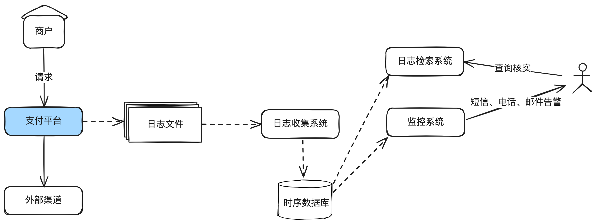
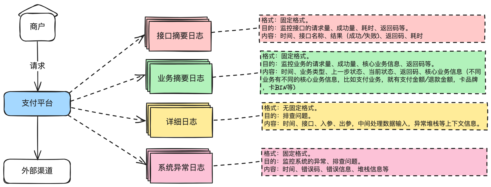

# 10.支付系统日志设计完全指南_构建高效监控和问题排查体系的关键基石

在⼀家头部互联⽹公司发现⼀些⼯作多年的同学打印的⽇志也是乱七⼋糟的，所以聊聊这个话

题。

本⽂主要讲结构清晰的⽇志在⽀付系统中的重要作⽤，设计⽇志规范需要遵守的⼀些基本原

则，以及接⼝摘要⽇志、业务摘要⽇志、详细⽇志、异常⽇志等常⽤⽇志设计的最佳实践。

通过这篇⽂章，你可以了解到：

1. 我为什么要写这个话题

2. 什么是⽇志

3. ⽇志对于⽀付系统运⾏保障的重要性

4. ⽇志设计的常⻅误区

5. 设计清晰⽇志规范的基本原则

6. ⼏个最佳实践

## 1. 我为什么要写这个话题

写过代码的同学，⼀定打印过⽇志，但经常发现⼀些⼯作多年的同学打印的⽇志也是乱七⼋糟

的。 我 曾 经 在一家 头 部 互 联网 公 司 接手过一 个上 线一 年 多 的 业务 ， 相 关日志一 开始 就 没 有 设计好 ，

导致很多监控⽆法实现，出了线上问题也不知道，最后只能安排同学返⼯改造相关的⽇志。所以有

必要聊聊这个话题。

## 2. 什么是⽇志

写过代码的同学⼀定再熟悉不过。⽇志本质就是⼀种系统记录⽂件，⽤于存储发⽣在操作系

统、应⽤软件、⽹络和存储设备上的事件，主要⽤于问题诊断、审计和性能监控。

## 3. ⽇志对于⽀付系统运⾏保障的重要性

⽇志的重要性相信不必多说，没有⽇志，系统上线后出问题就等于抓瞎。

在⽀付系统中，⽇志不仅⽤于记录交易详情和系统状态，还起到监控和安全审计的核⼼作⽤。

它们帮助我们实时监控系统的健康状态，快速排查线上的问题。此外，在⽀付领域⽇志对于交易验

证和法律合规性⽂档记录都是不可或缺的。

## 4. ⽇志设计的常⻅误区

设计⽇志系统时常⻅的误区包括：

1. 过度记录：记录⼤量⽆⽤信息，导致重要信息难以识别。

2. 格式混乱：不统⼀的⽇志格式给监控告警、⽇志分析和问题定位带来困难。

3. 忽视隐私和安全：未对敏感信息进⾏脱敏处理，增加数据泄露⻛险。⽐如卡号，身份证号，⼿机号等。

## 5. 设计清晰⽇志规范的基本原则

根据这么多年的实践，设计⼀个清晰的⽇志系统最少应遵循以下原则：

结构化⽇志：使⽤结构化数据格式记录，便于机器解析。这个尤其对监控系统有⽤。

⽇志分级：合理设置⽇志级别（如DEBUG、INFO、WARN、ERROR），便于过滤和搜索。

标准化字段：标准化常⽤字段（如时间戳、⽇志级别、请求ID等），保持⼀致性。

上下⽂信息：确保⽇志含有⾜够的上下⽂信息，⽅便定位问题。尤其是详细⽇志，⼀定要打印

上下⽂信息。

脱敏处理：对于敏感数据，如⼿机号、卡号等，进⾏适当的脱敏处理。

分布式追踪ID：引⼊分布式追踪系统，为跨服务的请求分配唯⼀的追踪ID。

## 6. ⼏个最佳实践

⾸先我们要明⽩⽇志是⽤来做什么的。只是先弄明⽩做事的⽬的，我们才能更好把事情做对。

在我看来，⽇志有两个核⼼的作⽤：1）监控，诊断系统或业务是否存在问题；2）排查问题。

对于监控⽽⾔，我们需要知道⼏个核⼼的数据：业务/接⼝的请求量、成功量、成功率、耗

时，系统返回码、业务返回码，异常信息等。对于排查问题⽽⾔，我们需要有出⼊参、中间处理数

据的上下⽂，报错的上下⽂等。

接下来，基于上⾯的分析，我们就清楚我们应该有⼏种⽇志：

1. 接⼝摘要⽇志。监控接⼝的请求量、成功量、耗时、返回码等。使⽤固定格式，需要打印：时

间、接⼝名称、结果（成功/失败)、返回码、耗时等基本信息就⾜够。

2. 业务摘要日志。监控业务的请求量、成功量、核心业务信息、返回码等。使用固定格式，需要

打印：时间、业务类型、上⼀步状态、当前状态、返回码、核⼼业务信息（不同业务有不同的

核⼼业务信息，⽐如流⼊，就有⽀付⾦额/退款⾦额，卡品牌，卡BIN等)。

3. 详细⽇志。⽤于排查问题，不⽤于监控。格式不固定。主要包括时间、接⼝、⼊参、出参，中

间处理数据输⼊，异常的堆栈信息等。

4. 系统异常⽇志。同时⽤于监控。格式固定。需要打印：时间、错误码、错误信息、堆栈信息

等。

补充⼀个典型的⽀付场景下的业务⽇志格式如下：

⽂件名：payment.biz.digest.log

格式规范：

[时间,分布式追踪ID,环境标,压测标,站点标,请求来源系统,上游请求ID,上游⽀付ID,我⽅系统业

务ID],[交易类型,交易币种,交易⾦额,上⼀个状态,当前状态],[渠道名,收单国家,发卡⾏,卡品牌,⻛控参

数],[我⽅标准返回码,我⽅标准返回码描述,渠道返回码,渠道返回码描述]

⽇志示例：[2024-01-04

20:02:32.239,293242318382329329232,P,0,UK,payment,2024010401203223220001,20240

10401203223220001,2024010401203223220003],[pay,USD,2392,INIT,PAYING],

[WPG,US,CMB,VISA,2D],[-,-,-,-]

说明：上⾯的⽇志使⽤[]进⾏了块分隔，第⼀个[]⾥⾯是基础信息，第⼆个[]⾥⾯是交易信息，

第三个[]⾥⾯是渠道信息，第四个[]⾥⾯是返回码信息。

使⽤[]切割的好处是，如果后⾯要加字段，可以找到对应的位置增加。不影响现有监控。⽐如

我要加个卡BIN，那就可以在⻛控参数后⾯加，不影响返回码监控位置。

有⼏点特别补充说明：

1. 正常业务和系统异常需要拆分出来。NPE就是系统异常，余额不⾜就是⼀个预期内的业务场

景，不要打印到异常⽂件中。

2. 业务摘要信息需要根据业务不同，设计不同的业务摘要⽇志格式。⽐如⽀付、流出提现的交

易，路由、渠道咨询等，监控诉求是不⼀样的，所以需要单独设计。拿路由举例，需要监控哪

些渠道分流了多少，命中了哪个规则等，必然不能直接使⽤⽀付、退款的业务摘要⽇志格式。

所以每出现⼀种新业务，就需要单独设计⼀种业务⽇志。

3. 接⼝摘要⽇志，不要打印出⼊参。因为出⼊参有可能包含⾮常多数据，⽽接⼝我们只关注请求

量、结果、耗时这些就够了，如果想查出入参，就去详细日志里面查。

4. 系统异常⽇志⼀定要有单独的⽇志⽂件。因为正常的系统，绝⼤部分是业务上报错，⽐如余额

不⾜，⽽不应该有很多NPE等系统异常。我们需要监控异常⽇志的⾏数或特定错误码的频率，

⽐如每分钟有X⾏或每分钟有Y个特定错误码就需要告警出来。

## 7. 结束语

⽇志系统是⽀付系统关键的⽀撑组件，⼀个良好设计的⽇志系统可以为监控、告警和问题排查

提供强有⼒的⽀持，反之，对于线上问题简直就是恶梦。

今天主要讲了⽇志格式规范的设计，对于log4j的配置什么的，⽹上已经有很多公开资料，这

⾥不再赘述。另外，分布式环境下⾯还有⽇志转存、查询等，也是⼀个很庞⼤的体系，后⾯有机会

再细聊。
