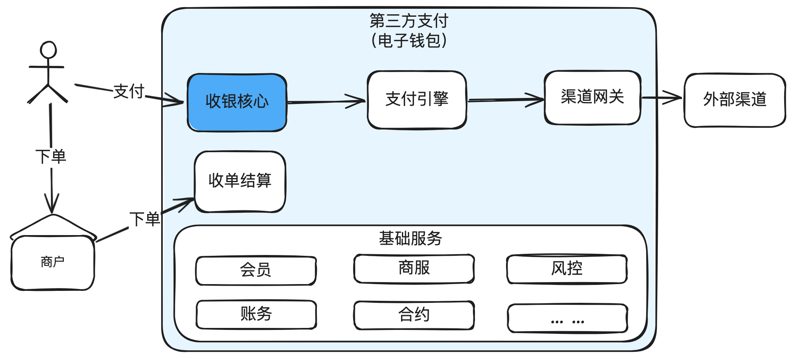

# 11.图解收银台_支付系统承上启下的关键应用

收银核⼼和⽀付引擎是⽀付系统最核⼼的两个⼦系统之⼀。

本篇主要讲清楚收银核⼼的设计与实现，包括收银核⼼如何渲染可⽤⽀付⽅式，如何做可⽀付检

查，收银台核⼼的系统架构、领域模型，常⻅⽀付⽅式等。

## 1. 前⾔

如果说电⼦商务是现代经济的繁华都市，那么在线⽀付系统⽆疑就是最繁忙的交通⼤动脉。在

这个每年数⼗万亿规模的在线⽀付交易世界中，有两个默契⼗⾜的队友密切配合，确保每⼀笔交易

都像优雅的华尔兹舞步⼀样流畅 -- 那就是：收银核⼼和⽀付引擎。

今天我们先讲“收单核⼼”

## 2. 协同作战

先给⼀个直观的协同作战的图，有⼀个整体的印象。

---

## 3. 收银核⼼：交易的智囊团

想象⼀下，你⾛进了⼀家精品咖啡店，在这⾥收银核⼼就好⽐是那位亲切的侍者，不仅为你呈

上菜单上各式⽀付⽅式的⼤餐，还会确保核验你的身份，然后查出你留存在咖啡店的预存款。在⽀

付你的账单时，还会偷偷做个背影调查（⻛控检查），以确保你不是正在洗钱。

## 4.收银核⼼在⽀付系统中的位置

---

收银核⼼是⽀付系统的⻔⾯，负责处理⽤户的⽀付请求，核⼼能⼒就两个：1）⽀付⽅式咨询，告

诉⽤户本次可以使⽤哪些⽀付⽅式。2）提交⽀付后的各种校验，⽐如订单是否有效，商户权限，

⽤户身份，⻛控等。

## 5.⽀付咨询

上面的图分别是电商（京东）的收银台，支付平台（微信支付）的收银台。

---

---

⽀付咨询阶段，需要做以下⼏个⼯作：

1. 基础检查：可⽀付检查（有可能订单已经已经被⽀付），⽤户检查，商户检查等。

2. 资产咨询：绑卡数据，账户余额，营销（⽐如满减、红包等）。

3. 渠道咨询：通过币种、⾦额、渠道开关等。

4. 额度咨询：单笔限额、⽇累计限额、⽉累计限额等。

5. ⽀付⽅式组装：把上⾯的资产、渠道等组装成⽤户⽅便理解的⽀付⽅式。

6. ⽀付⽅式排序：把⽤户可⽤⽀付⽅式做好推荐排序（既要考虑⽤户体验，⼜要考虑营销策

略）。

## 6. ⽀付受理

⽤户选择好⽀付⽅式，点击“确认⽀付”，就到了⽀付受理阶段。主要做以下⼏个⼯作：

1. 在⽀付咨询阶段的⼯作全部做⼀遍。因为⽤户在⽀付⽅式渲染后有可能过了很久才⽀付，很多

数据在后台可能已经发⽣变化，⽐如余额变了，或者订单已经过期了等情况。

2. 全部通过后，调⽤⻛控进⾏⻛险判断。
3. 如果是外部渠道的卡⽀付，还需要调⽤渠道路由，选择出⼀条最优的渠道。
4. 然后是提交⽀付请求到⽀付引擎进⾏真实扣款。

5. 最后是从收单平台轮询交易结果。

特别说明⼀下：为什么轮询结果是从收单平台⽽不是⽀付引擎？因为对⽤户⽽⾔，收单的结果

代表最终的⽀付结果。⽐如⽤户⽀付回来后，⽀付引擎是成功的，但是收单平台因为已经订单过期

关闭，就会发起资⾦退回操作，这样收单平台的订单实际是没有⽀付成功的。就会提示⽤户：“订

单已关闭，如果已经扣款，⽀付款项预计在15个⼯作⽇内原路退回。”

## 7. 收银核⼼系统架构

提供给⽤户有多种⽀付⽅式：卡、余额、⽹银等。

收单产品主要包括：标准收银台，前置收银台，扫码付等。其中标准收银是由⽀付平台提供，需要

跳转到⽀付平台，⽽前置收银台是直接嵌⼊到商户收银台⾥⾯完成⽀付。

核⼼服务包括：⽀付咨询、⽀付受理、⻛控挑战并⽀付等。

外部依赖主要有：会员、商服、卡中心、风控、渠道网关、支付引擎等。

## 8. 收银核⼼领域模型

## 9.常⻅⽀付⽅式

快捷⽀付

通过在⽀付系统中提前绑定银⾏卡信息，快速完成⽀付交易，不需要每次都填写完整的卡详情。

代扣/协议⽀付

个⼈授权商户直接去⽀付平台或银⾏进⾏扣款，不需要⽤户参与⽀付过程。⽐如⽔电煤代扣，滴滴

打⻋代扣。

卡⽀付

使⽤信⽤卡或借记卡⽀付。

⽹银⽀付

需要跳转到银⾏提供的⽀付⻚⾯，输⼊银⾏账户信息进⾏⽀付。

VA⽀付

Virtual Account。虚拟账户是银⾏临时⽣成的⼀个账户，与⽤户和订单临时关联。⼀般在东南亚

的⽀付场景，或者国际收款场景下使⽤得⽐较多。

东南亚很多⼈没有银⾏卡，但⼜要在线买东⻄，就可以临时⽣成⼀个VA。以⽀付流程为例：⽤户

选择某个银⾏的VA⽀付⽅式，⽀付系统调⽤银⾏接⼝，先为⽤户订单⽣成⼀个VA号，⽤户拿着VA

去钱下ATM机转账，银⾏收到钱后，通知⽀付系统，⽀付系统再通知商户，商户给⽤户发货。

OTC⽀付

Over-the-Counter。柜台⽀付。⼀般指⼤型连锁线下零售商提供的⽀付能⼒，⽐如7-11或肯德基

提供的⽀付能⼒。整体流程和VA很像。区别在于VA通常指银⾏提供的。

同样以⽀付流程为例：⽤户选择某个OTC服务提供商的OTC⽀付⽅式，⽐如7-11，⽀付系统调⽤

7-11接⼝，先为⽤户订单⽣成⼀个OTC码，⽤户拿着OTC码去钱下7-11柜台拿现⾦充值，7-11收

到钱后，通知⽀付系统，⽀付系统再通知商户，商户给⽤户发货。

第三⽅钱包⽀付

非银行机构提供的在线支付服务。比如支付宝、微信支付，国外的PayPal等。

余额⽀付

使⽤账户余额进⾏⽀付。

正扫

商户⽣成⼆维码，⽤户扫商户⼆维码。

反扫

消费者⽣成⼆维码，商户扫消费者的⼆维码。

## 10. 结束语

每个公司对于收银核⼼的设计可能各有不同，但⽆外乎就是如何为⽤户计算出可⽤的⽀付⽅式，提

交⽀付后做各种检查，然后调⽤⽀付引擎去做真正的⽀付。

