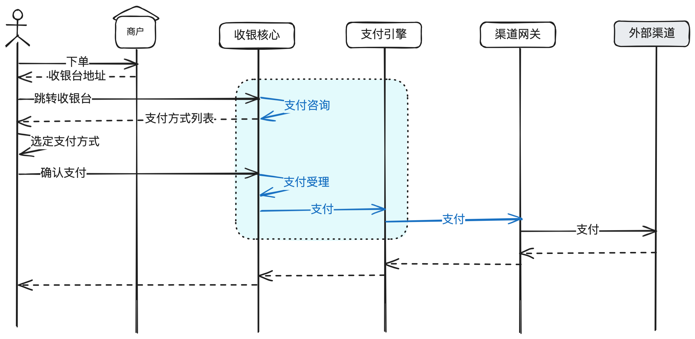
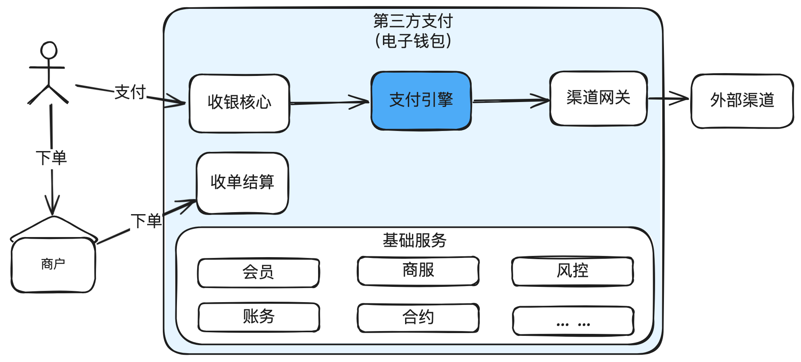
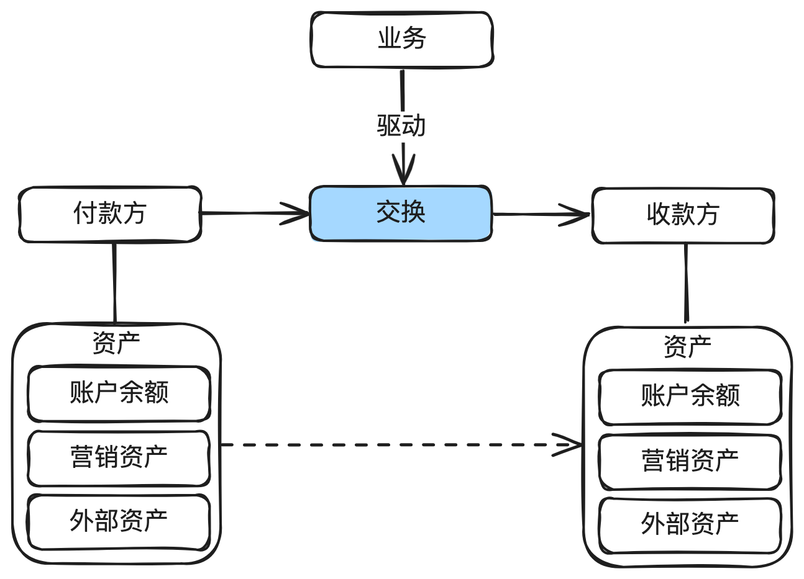
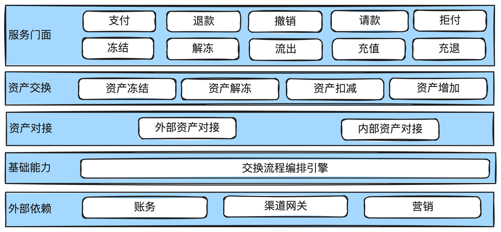
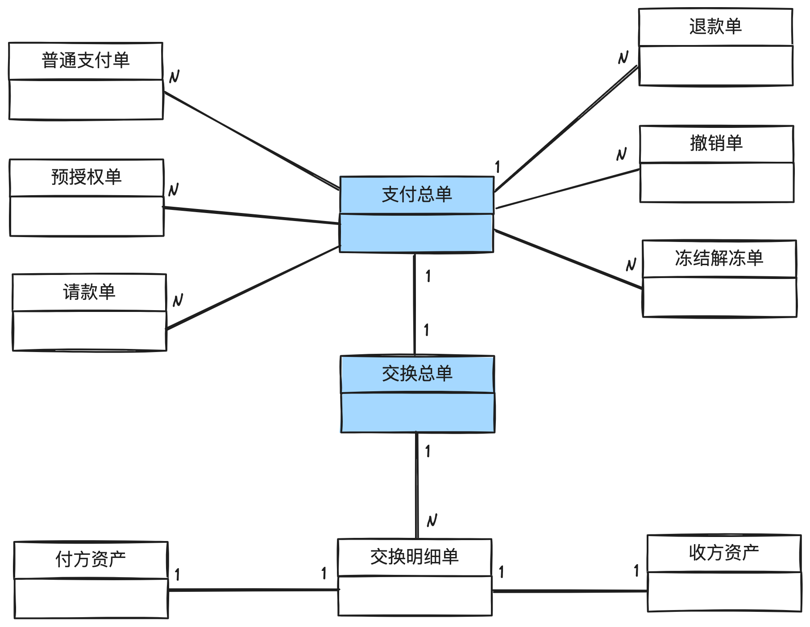
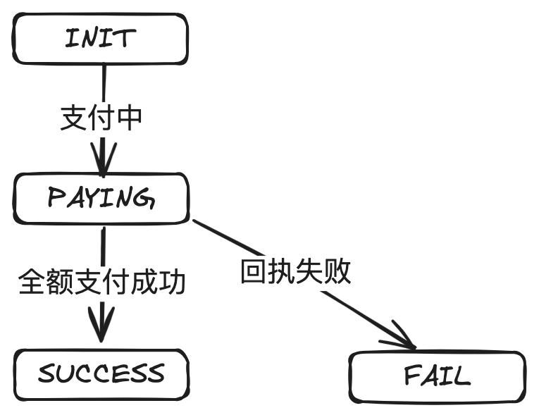
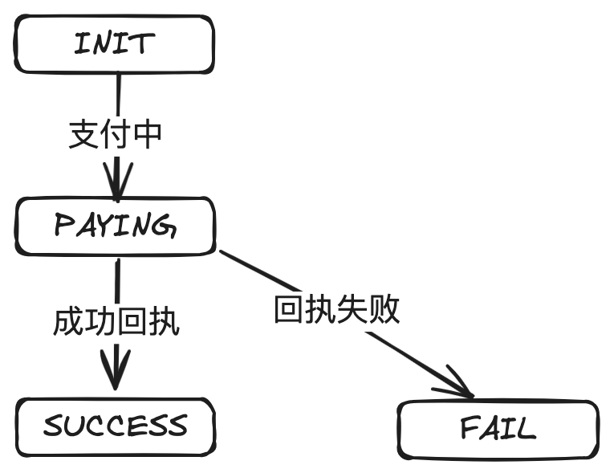
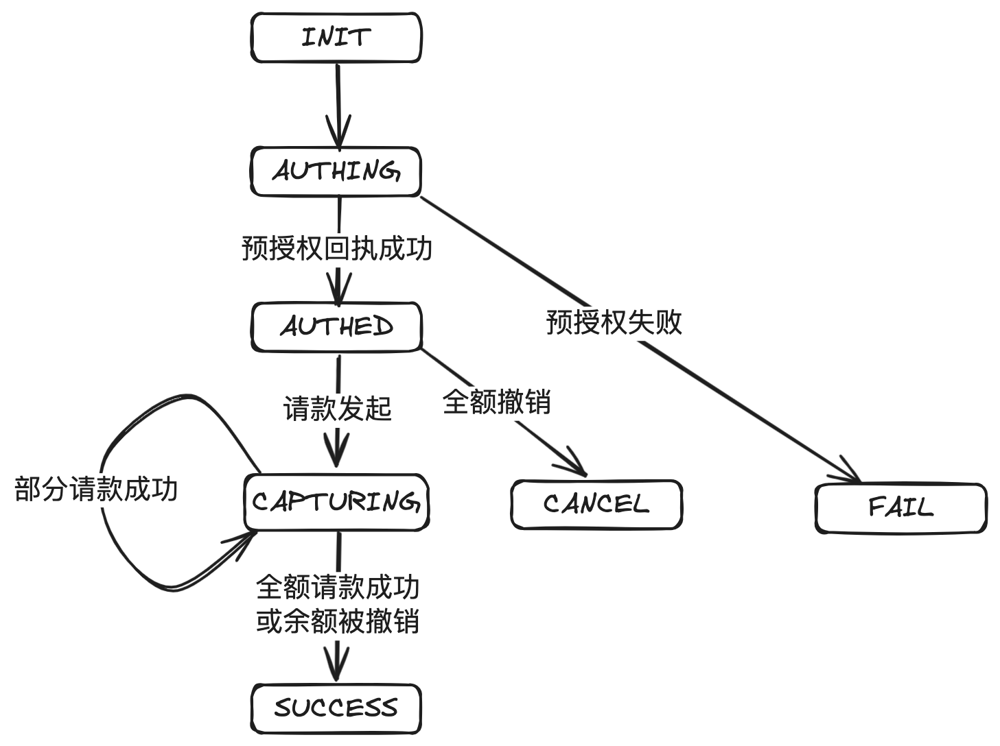
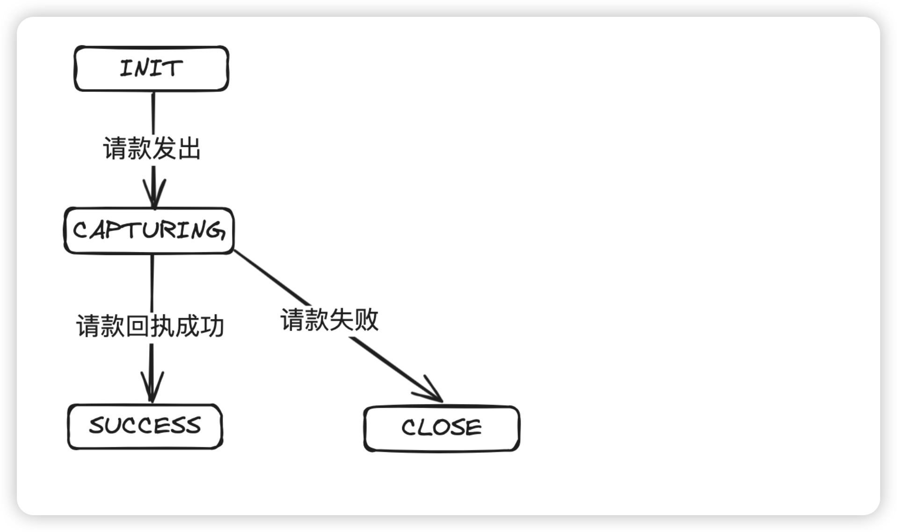

# 12.图解支付引擎_资产流动的枢纽

收银核⼼和⽀付引擎是⽀付系统最核⼼的两个⼦系统之⼀。

本篇主要讲清楚⽀付引擎的设计与实现，包括⽀付引擎如何去为商户扣款，系统架构，领域模型设

计，状态机设计等。

## 1. 前⾔

在上⼀章中有介绍，在每年数⼗万亿规模的在线⽀付交易世界中，正是因为有收银核⼼和⽀付

引擎这两个默契⼗⾜的队友密切配合，才确保每⼀笔交易都像优雅的华尔兹舞步⼀样流畅。

今天正式介绍另⼀位主⻆：⽀付引擎。

下面这个图第二次出现，只是为强化收银核心和支付引擎的“双剑合璧，天下无敌”。

---

## 2. ⽀付引擎：交易的⾏动派

⼀旦收银核⼼完成它的前期准备⼯作，⽀付引擎就像⼀位敏捷的忍者，悄⽆声息地完成了资⾦

的转移。它的⾏动快速且精准，决不允许出现任何纰漏。

简单地说，⽀付引擎就是做资⾦账户的转移，所以有些公司也称为资产交换。同时⽀付引擎处

在⽀付系统的核⼼位置，所以有些公司也称为⽀付核⼼。另⼀⽅⾯，⽀付引擎封装了多种⽀付能

⼒，⽐如余额、外部渠道、营销等，所以有些公司也称为统⼀⽀付。

## 3.⽀付引擎在⽀付系统中的位置

⽀付引擎在⽀付系统中处于核⼼地位，所有的资⾦操作的信息流都会经过⽀付引擎，包括⽀付、退

款、撤销、提现等。

## 4.资产交换

对于⽀付引擎来说，最核⼼的能⼒就是资产交换：根据指令把资产从⼀个账户交换到另外⼀个账

户。

⽐如⽀付，那就是把⽤户账户的钱交换到商户账户。退款就是把商户账户的钱交换到⽤户账户。提

现就是把⽤户或商户在⽀付平台账户余额的钱交换到⽤户或商户在外部银⾏账户。

## 5. 驱动记账

⽀付引擎除了做信息交换，还需要调⽤账务进⾏记账。

## 6. ⽀付引擎系统架构

⽀付引擎对外提供：⽀付、退款、撤销等基础的服务。

在资⾦交换层⾯，只有资产的冻结、解冻，扣减、增加。把变化的部分和不变的部分抽取出来。

资产对接只有两在类：内部资产和外部资产。内部资产包括：余额，内部营销资产。外部资产包

括：外部银行卡、外部第三方钱包等。

## 7. ⽀付引擎领域模型设计

上⾯的是业务单据，包括：⽀付、退款、撤销等。

下⾯是交换单据，包括：交换明细，付⽅资产，收⽅资产等。

## 8. ⽀付引擎状态机设计

### 8.1.⽀付总单

### 8.2. 普通⽀付单

### 8.3.预授权单

---

### 8.4. 请款单

## 9. 结束语

在数字⽀付的舞台上，收银核⼼和⽀付引擎就像是经验丰富的舞者，他们的表演总是那么⽆懈可

击，彼此依赖，共同庆祝每⼀次成功的交易。

每个公司对于收银核⼼和⽀付引擎的设计可能各有不同，但⽆外乎就是如何为⽤户计算出可⽤的⽀

付⽅式，提交⽀付后做各种检查，然后把⽤户的资产交换到商户的资产（⽀付），或者把商户的资

产交换到⽤户的资产（退款）。

