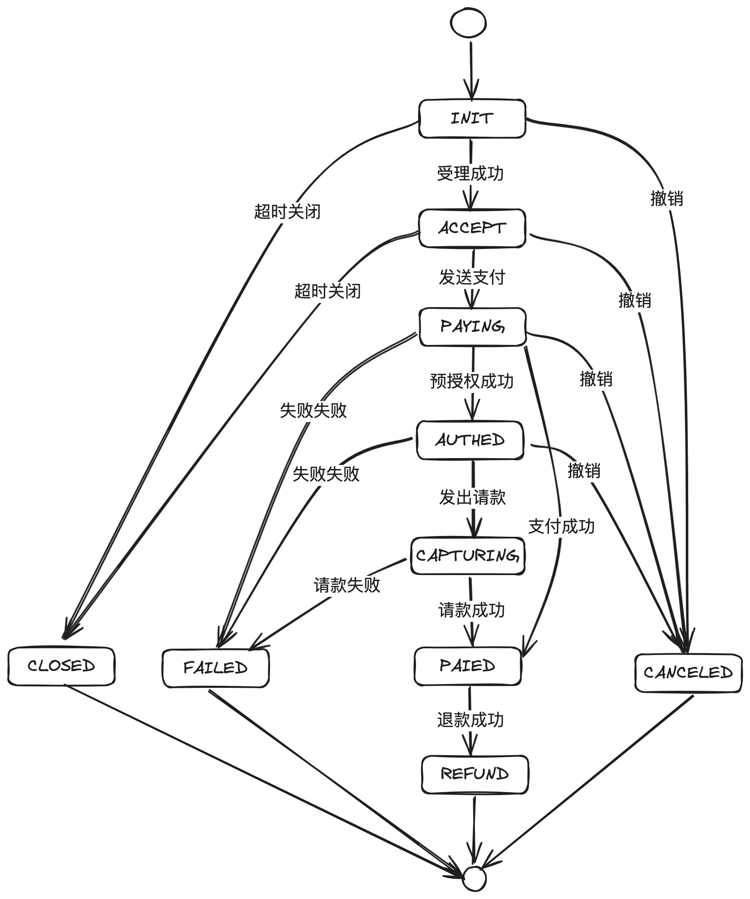
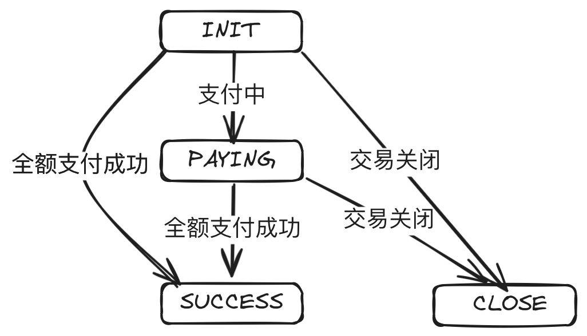
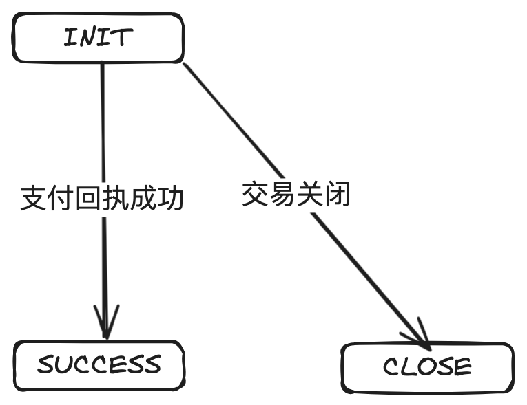
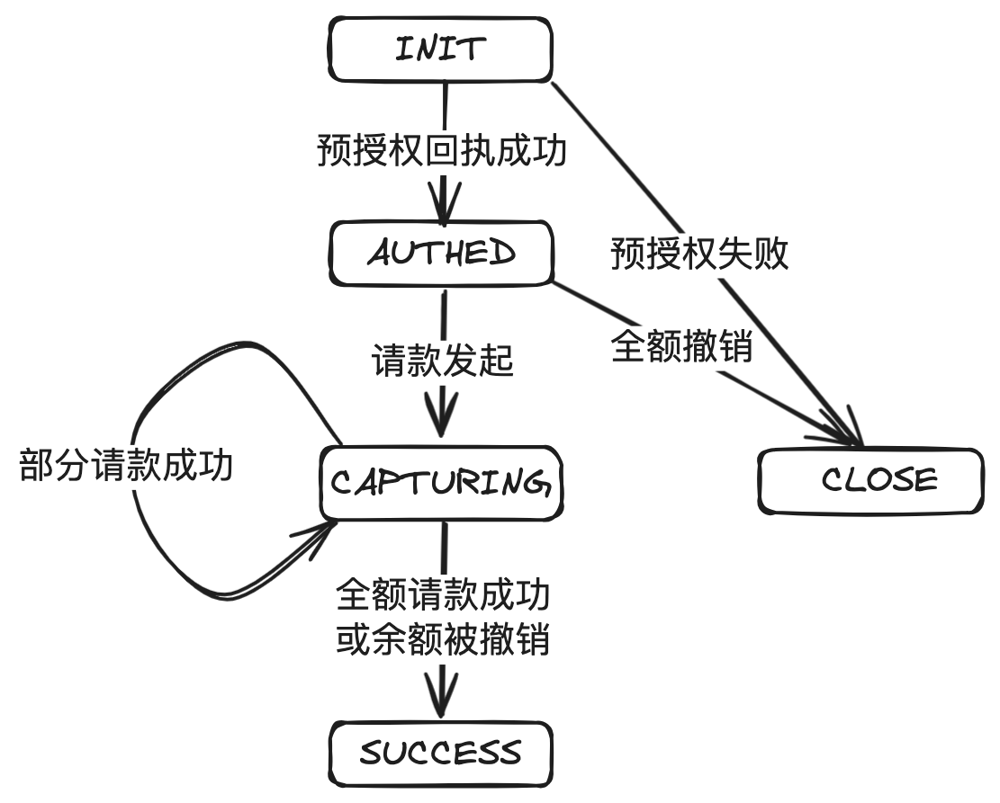
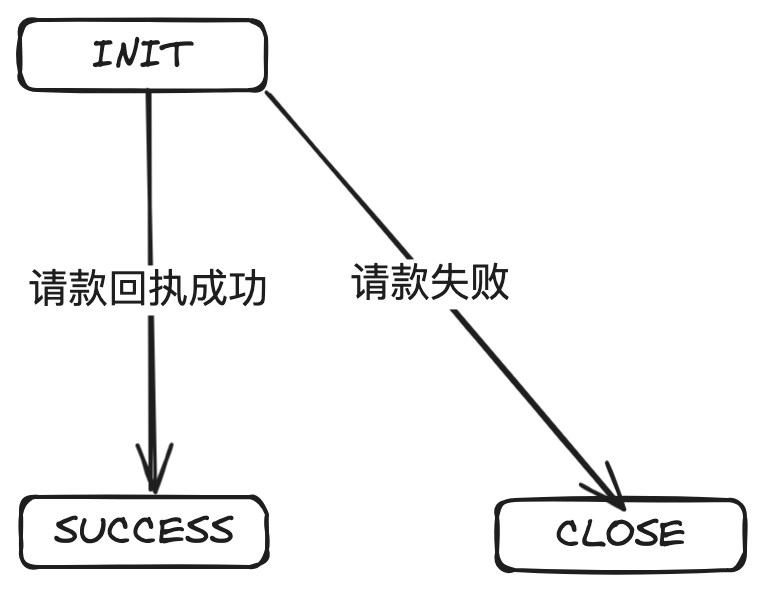
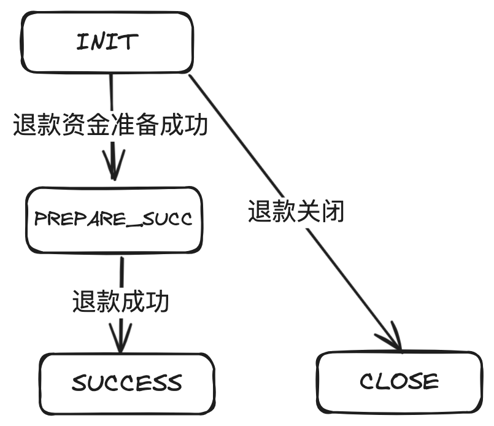
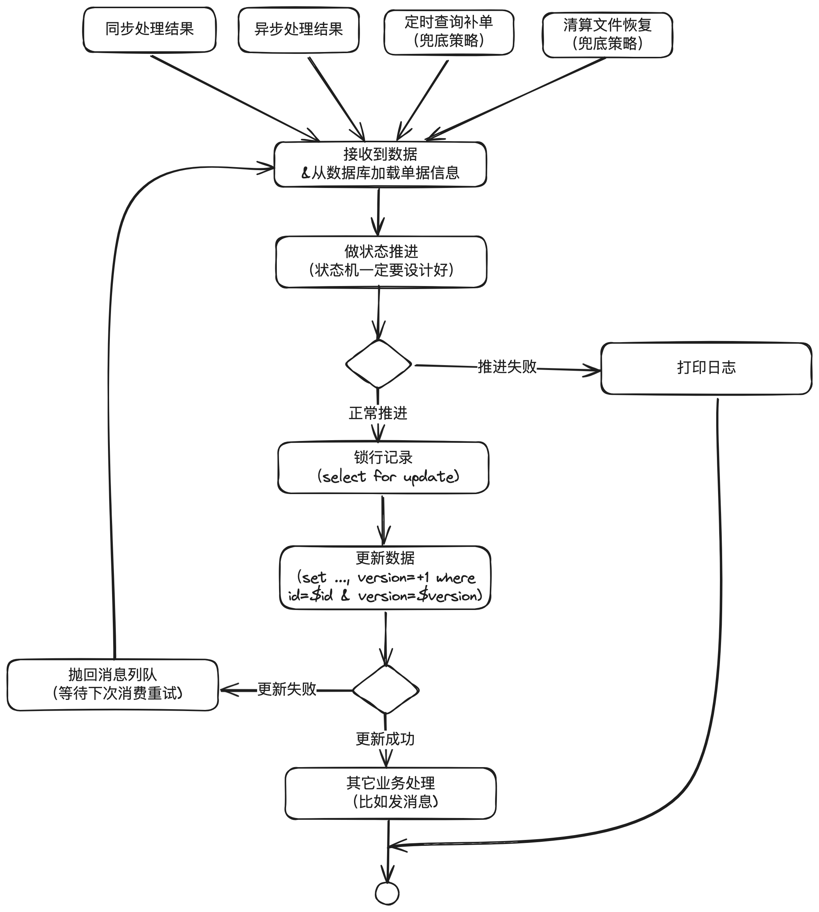

# 13.支付系统的心脏_简洁而精妙的状态机设计与核心代码实现

本篇主要讲清楚什么是状态机，简洁的状态机对⽀付系统的重要性，状态机设计常⻅误区，以及如

何设计出简洁⽽精妙的状态机，核⼼的状态机代码实现等。

我前段时间⾯试⼀个⼯作过4年的同学竟然没有听过状态机。假如你没有听过状态机，或者你听过

但没有写过，或者你是使⽤if else 或switch case来写状态机的代码实现，建议花点时间看看，⼀

定会有不⼀样的收获。


## 1. 前⾔

在线⽀付系统作为当今数字经济的基⽯，每年⽀撑⼏⼗万亿的交易规模，其稳定性⾄关重要。在这

背后，是⼀种被誉为⽀付系统“⼼脏”的技术——状态机。本⽂将⼀步步介绍状态机的概念、其在

⽀付系统中的重要性、设计原则、常⻅误区、最佳实践，以及⼀个实际的Java代码实现。

## 2.什么是状态机

状态机，也称为有限状态机（FSM, Finite State Machine），是⼀种⾏为模型，由⼀组定义良好

的状态、状态之间的转换规则和⼀个初始状态组成。它根据当前的状态和输⼊的事件，从⼀个状态

转移到另⼀个状态。

下图就是在《⽀付交易的三重奏：收单、结算与拒付在⽀付系统中的协奏曲》中提到的交易单的状

态机。


从图中可以看到，⼀共4个状态，每个状态之间的转换由指定的事件触发。

## 3. 状态机对⽀付系统的重要性

想像⼀下，如果没有状态机，⽀付系统如何知道你的订单已经⽀付成功了呢？如果你的订单已经被

⼀个线程更新为“成功”，另⼀个线程⼜更新成“失败”，你会不会跳起来？

在⽀付系统中，状态机管理着每笔交易的⽣命周期，从初始化到完成或失败。它确保交易在正确的

时间点，以正确的顺序流转到正确的状态。这不仅提⾼了交易处理的效率和⼀致性，还增强了系统

的鲁棒性，使其能够有效处理异常和错误，确保⽀付流程的顺畅。


## 4. 状态机设计基本原则

⽆论是设计⽀付类的系统，还是电商类的系统，在设计状态机时，都建议遵循以下原则：

明确性：状态和转换必须清晰定义，避免含糊不清的状态。

完备性：为所有可能的事件-状态组合定义转换逻辑。

可预测性：系统应根据当前状态和给定事件可预测地响应。

最⼩化：状态数应保持最⼩，避免不必要的复杂性。


## 5. 状态机常⻅设计误区

⼯作多年，⻅过很多设计得不好的状态机，导致运维特别麻烦，还容易出故障，总结出来⼀共有这

么⼏条：

过度设计：引⼊不必要的状态和复杂性，使系统难以理解和维护。

不完备的处理：未能处理所有可能的状态转换，导致系统⾏为不确定。

硬编码逻辑：过多的硬编码转换逻辑，使系统不具备灵活性和可扩展性。

举⼀个例⼦感受⼀下。下⾯是亲眼⻅过的⼀个交易单的状态机设计，⽽且⼀眼看过去，好像除了复

杂⼀点，整体还是合理的，⽐如初始化，受理成功就到ACCEPT，然后到PAYING，如果直接成功

就到PAIED，退款成功就到REFUND。



---

我说说这个状态机有⼏个不合理的地⽅：

1. 过于复杂。⼀些不必要的状态可以去掉，⽐如ACCEPT没有存在的必要。
2. 职责不明确。⽀付单就只管⽀付，到PAIED就⽀付成功，就是终态不再改变。REFUND应该由

退款单来负责处理，否则部分退款怎么办。

我们需要的改造⽅案：

1. 精简掉不必要的状态，⽐如ACCEPT。

2. 把⼀些退款、请款等单据单独抽出去，这样状态机虽然多了，但是架构更加清晰合理。

主单：



普通⽀付单：



预授权单：




请款单：



退款单：



---


## 6. 状态机设计的最佳实践

在代码实现层⾯，需要做到以下⼏点：

分离状态和处理逻辑：使⽤状态模式，将每个状态的⾏为封装在各⾃的类中。

使⽤事件驱动模型：通过事件来触发状态转换，⽽不是直接调⽤状态⽅法。

确保可追踪性：状态转换应该能被记录和追踪，以便于故障排查和审计。

具体的实现参考第7部分的“JAVA版本状态机核⼼代码实现”。


## 7. 常⻅代码实现误区

经常看到⼯作⼏年的同学实现状态机时，仍然使⽤if else或switch case来写。这是不对的，会让

实现变得复杂，且容易出现问题。

甚⾄直接在订单的领域模型⾥⾯使⽤String来定义，⽽不是把状态模式封装单独的类。

还有就是直接调用领域模型更新状态，而不是通过事件来驱动。

错误的代码示例：

```java
if (status.equals("PAYING") {
	status = "SUCCESS";
} else if (...) {
	...
}
```

或者：

```java
class OrderDomainService {
    public void notify(PaymentNotifyMessage message) {
        PaymentModel paymentModel = loadPaymentModel(message.getPaymentId());
        // 直接设置状态
        paymentModel.setStatus(PaymentStatus.valueOf(message.status));
        // 其它业务处理
        // ... ...
    }
}
```

或者：

```java
public void transition(Event event) {
    switch (currentState) {
        case INIT:
            if (event == Event.PAYING) {
                currentState = State.PAYING;
            } else if (event == Event.SUCCESS) {
                currentState = State.SUCCESS;
            } else if (event == Event.FAIL) {
                currentState = State.FAIL;
            }
            break;
        // Add other case statements for different states and events
    }
}
```


## 8. JAVA版本状态机核⼼代码实现

使⽤Java实现⼀个简单的状态机，我们将采⽤枚举来定义状态和事件，以及⼀个状态机类来管理

状态转换。

定义状态基类

```java
/**
* 状态基类
*/
public interface BaseStatus {
}
```


定义事件基类

```java
/**
* 事件基类
*/
public interface BaseEvent {
}
```

定义“状态-事件对”，指定的状态只能接受指定的事件

```java
/**
 * 状态事件对，指定的状态只能接受指定的事件
 */
public class StatusEventPair<S extends BaseStatus, E extends BaseEvent> {
    /**
     * 指定的状态
     */
    private final S status;
    /**
     * 可接受的事件
     */
    private final E event;

    public StatusEventPair(S status, E event) {
        this.status = status;
        this.event = event;
    }

    @Override
    public boolean equals(Object obj) {
        if (obj instanceof StatusEventPair) {
            StatusEventPair<S, E> other = (StatusEventPair<S, E>) obj;
            return this.status.equals(other.status) && this.event.equals(other.event);
        }
        return false;
    }

    @Override
    public int hashCode() {
        // 这里使用的是 google 的 guava 包：com.google.common.base.Objects
        return Objects.hash(status, event);
    }
}
```

定义状态机

```java
/**
 * 状态机
 */
public class StateMachine<S extends BaseStatus, E extends BaseEvent> {
    private final Map<StatusEventPair<S, E>, S> statusEventMap = new HashMap<>();
    /**
     * 只接受指定的当前状态下，指定的事件触发，可以到达的指定目标状态
     */
    public void accept(S sourceStatus, E event, S targetStatus) {
        statusEventMap.put(new StatusEventPair<>(sourceStatus, event), tar
                getStatus);
    }
    /**
     * 通过源状态和事件，获取目标状态
     */
    public S getTargetStatus(S sourceStatus, E event) {
        return statusEventMap.get(new StatusEventPair<>(sourceStatus, event));
    }
}
```

定义支付的状态机。注：支付、退款等不同的业务状态机是独立的。

```java

/**
 * 支付状态机
 */
public enum PaymentStatus implements BaseStatus {
    INIT("INIT",
            "初始化"),
    PAYING("PAYING",
            "支付中"),
    PAID("PAID",
            "支付成功"),
    FAILED("FAILED",
            "支付失败"),
    ;
    // 支付状态机内容
    private static final StateMachine<PaymentStatus, PaymentEvent> STATE_M
    ACHINE = new StateMachine<>();
    static {
// 初始状态
        STATE_MACHINE.accept(null, PaymentEvent.PAY_CREATE, INIT);
// 支付中
        STATE_MACHINE.accept(INIT, PaymentEvent.PAY_PROCESS, PAYING);
// 支付成功
        STATE_MACHINE.accept(PAYING, PaymentEvent.PAY_SUCCESS, PAID);
// 支付失败
        STATE_MACHINE.accept(PAYING, PaymentEvent.PAY_FAIL, FAILED);
    }
    // 状态
    private final String status;
    // 描述
    private final String description;
    PaymentStatus(String status, String description) {
        this.status = status;
        this.description = description;
    }
    /**
     * 通过源状态和事件类型获取目标状态
     */
    public static PaymentStatus getTargetStatus(PaymentStatus sourceStatus
            , PaymentEvent event) {
        return STATE_MACHINE.getTargetStatus(sourceStatus, event);
    }
}
```

定义支付事件。注：支付、退款等不同业务的事件是不一样的。

```java
/**
 * 支付事件
 */
public enum PaymentEvent implements BaseEvent {
    // 支付创建
    PAY_CREATE("PAY_CREATE",
            "支付创建"),
    // 支付中
    PAY_PROCESS("PAY_PROCESS",
            "支付中"),
    // 支付成功
    PAY_SUCCESS("PAY_SUCCESS",
            "支付成功"),
    // 支付失败
    PAY_FAIL("PAY_FAIL",
            "支付失败");
    /**
     * 事件
     */
    private String event;
    /**
     * 事件描述
     */
    private String description;
    PaymentEvent(String event, String description) {
        this.event = event;
        this.description = description;
    }
}
```

在支付单模型中声明状态和根据事件推进状态的方法：

```java
/**
 * 支付单模型
 */
public class PaymentModel {
    /**
     * 其它所有字段省略
     */
// 上次状态
    private PaymentStatus lastStatus;
    // 当前状态
    private PaymentStatus currentStatus;
    /**
     * 根据事件
     推
     进状态
     */
    public void transferStatusByEvent(PaymentEvent event) {
// 根据当前状态和事件，去获取目标状态
        PaymentStatus targetStatus = PaymentStatus.getTargetStatus(current Status, event);
// 如果目标状态不为空，说明是可以推进的
        if (targetStatus != null) {
            lastStatus = currentStatus;
            currentStatus = targetStatus;
        } else {
// 目标状态为空，说明是非法推 进，进入异常处理，这里只是抛出去，由调用者去具体处理
            throw new StateMachineException(currentStatus, event, "状态转换 失败");
        }
    }
}
```

代码注释已经写得很清楚，其中StateMachineException是自定义，不想定义的话，直接使用

RuntimeException也是可以的。

在支付业务代码中的使用：只需要

paymentModel.transferStatusByEvent(PaymentEvent.valueOf(message.getEvent()))

```java
/**
 * 支付领域域服务
 */
public class PaymentDomainServiceImpl implements PaymentDomainService {
    /**
     * 支付结果通知
     */
    public void notify(PaymentNotifyMessage message) {
        PaymentModel paymentModel = loadPaymentModel(message.getPaymentId(
        ));
        try {
            // 状态推进
            paymentModel.transferStatusByEvent(PaymentEvent.valueOf(messag e.getEvent()));
            savePaymentModel(paymentModel);
            // 其它业务处理
            ... ...
        } catch (StateMachineException e) {
            // 异常处理
            ... ...
        } catch (Exception e) {
            // 异常处理
            ... ...
        }
    }
}
```


上⾯的代码只需要完善异常处理，优化⼀下注释，就可以直接⽤起来。

好处：

1. 定义了明确的状态、事件。

2. 状态机的推进，只能通过“当前状态、事件、⽬标状态”来推进，不能通过if else 或case

switch来直接写。⽐如：STATE_MACHINE.accept(INIT, PaymentEvent.PAY_PROCESS,

PAYING);

3. 避免终态变更。⽐如线上碰到if else写状态机，渠道异步通知⽐同步返回还快，异步通知回来

把订单更新为“PAIED”，然后同步返回的代码把单据重新推进到PAYING。


## 9. 并发更新问题

留⾔中“⽉朦胧”同学提到：“状态机领域模型同时被两个线程操作怎么避免状态幂等问题？”

这是⼀个好问题。在分布式场景下，这种情况太过于常⻅。同⼀机器有可能多个线程处理同⼀笔业

务，不同机器也可能处理同⼀笔业务。

业内通常的做法是设计良好的状态机 + 数据库锁 + 数据版本号解决。



简要说明：

1. 状态机⼀定要设计好，只有特定的原始状态 + 特定的事件才可以推进到指定的状态。⽐如

INIT + ⽀付成功才能推进到sucess。

2. 更新数据库之前，先使⽤select for update进⾏锁⾏记录，同时在更新时判断版本号是否是之

前取出来的版本号，更新成功就结束，更新失败就组成消息发到消息队列，后⾯再消费。

3. 通过补偿机制兜底，⽐如查询补单。

4. 通过上述三个步骤，正常情况下，最终的数据状态⼀定是正确的。除⾮是某个系统有异常，⽐

如外部渠道开始返回⽀付成功，然后⼜返回⽀付失败，说明依赖的外部系统已经异常，这样只

能进⼈⼯差错处理流程。


## 10. 结束语

状态机在⽀付系统中扮演着不可或缺的⻆⾊。⼀个专业、精妙的状态机设计能够确保⽀付流程的稳

定性和安全性。本⽂提供的设计原则、常⻅误区警示和最佳实践，旨在帮助开发者构建出更加健壮

和⾼效的⽀付系统。⽽随附的Java代码则为实现这⼀关键组件提供了⼀个清晰、灵活的起点。希

望这些内容能够对你有⽤。
