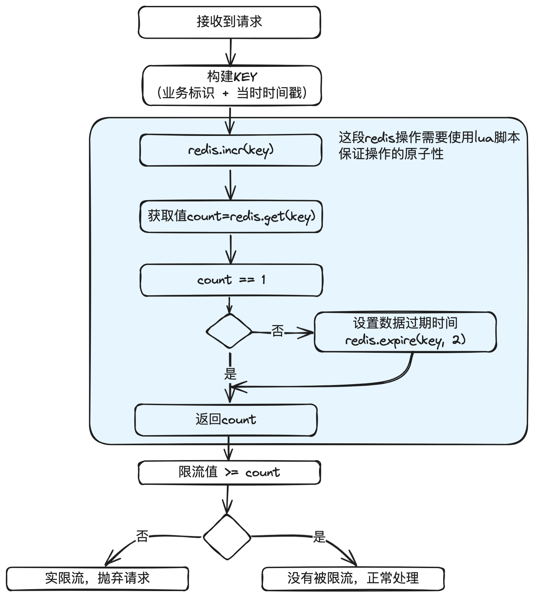

# 14.精确掌控并发_固定时间窗口算法在分布式环境下并发流量控制的设计与实现

这是《百图解码⽀付系统设计与实现》专栏系列⽂章中的第（14）篇，也是流量控制系列的第

（1）篇。点击上⽅关注，深⼊了解⽀付系统的⽅⽅⾯⾯。

本篇主要介绍分布式场景下常⽤的并发流量控制⽅案，包括固定时间窗⼝、滑动时间窗⼝、漏桶、

令牌桶、分布式消息中间件等，并重点讲清楚固定时间窗⼝应⽤原理和应⽤场景，以及使⽤reids

实现的核⼼代码。

在⾮⽀付场景，也常常需要⽤到这些并发流量控制⽅案。


## 1. 前⾔

在互联⽹应⽤⾥⾯，并发流量控制⽆所不在。在⽀付系统中，流量控制同样是⼀个关键的技术⽅

⾯，主要⽤于确保系统的稳定性和可靠性，尤其在⾼流量的情况下。以下是⼀些主要使⽤流量控制

的场景：

1. 对外API限流：对外提供的API（如⽀付接⼝）需要限流来保护后端服务不会过载。
2. 保护外部渠道：⼤促时，对下流渠道的⽀付流量要做削峰填⾕，避免突发流量把渠道打挂。
3. 保护内部应⽤：⼤促时，内部各应⽤要根据流量模型配置限流值，避免形成雪崩。
4. 满⾜外部退款限流要求：电商批量提交退款时，⽀付系统内部要在分布式集群环境下对某个渠

道实现低至1TPS的退款并发，避免超过渠道退款并发导致大批量失败。

特别说明的是，流量控制通常包括限流和限速。

限流：就是流量达到⼀定程度，超过的流量会全部⽴即拒绝掉，也就是快速失败。⽐如上⾯的API

限流。

限速：⼀般是指接收流量后，先保存到队列中，然后按指定的速度发出去，如果超过队列最⼤值，

才会拒绝。⽐如上⾯的⽀付流量和退款流量打到外部渠道。


另外，⽀付和退款流量控制虽然都是流量控制，但有⼀些细⼩的区别：

1. ⽀付的限流TPS通常⽐较⾼，从⼗⼏TPS到⼏百TPS都有，排队时效性要求很⾼，秒级内就要

付出去。

2. 退款的限流TPS通常⽐较低，在国外的基础设施建设很差，甚⾄部分渠道要求退款1TPS。但

是排队时效性要求很低，⼏天内退出去就⾏。


## 2. ⼏种⽅案对⽐

固定窗⼝：算法简单，对突然流量响应不够灵活。超过流量的会直接拒绝，通常⽤于限流。

滑动窗⼝： 算法简单，对突然流量响应⽐固定窗⼝灵活。超过流量的会直接拒绝，通常⽤于限

流。

漏桶算法：在固定窗⼝的基础之上，使⽤队列缓冲流量。提供了稳定的流量输出，适⽤于对流量平

性有严格要求的场景。后面会介绍如何应用到外部渠道退款场景。

令牌桶算法：在滑动窗⼝的基础之上，使⽤队列缓冲流量。能够允许⼀定程度的突发性流量，但实

现较为复杂。

分布式消息中间件：如Kafka和RabbitMQ等，能够有效地对消息进⾏缓冲和管理，增加系统复杂

性，且如果需要精确控制流量还需要引⼊额外的机制。后⾯会介绍如何应⽤到外部渠道⽀付场景。

Sentinel：阿⾥开源的流控与熔断利器，提供实时的监控、熔断、降级、限流等功能。后⾯会单独

介绍。


## 3. 固定时间窗⼝原理


固定窗⼝算法，也称为时间窗⼝算法，是⼀种流量控制和速率限制策略。此算法将时间轴分割成等

⻓、不重叠的时间段，称为“窗⼝”。每个窗⼝都有⼀个独⽴的计数器，⽤于跟踪窗⼝期间的事件

数量（如API调⽤、数据包传输等）。

固定窗⼝算法的好处是简单，缺点也很明显，就是⽆法应对突发流量，⽐如每秒30并发，如果前

100ms来了30个请求，那么在10ms内就会把30个请求打出去，后⾯的900ms的请求全部拒绝。

⼯作流程：

1. 窗⼝定义：⾸先确定窗⼝⼤⼩，⽐如1秒钟。
2. 计数：每当发⽣⼀个事件（⽐如⼀个请求到达），就在当前窗⼝的计数器上加⼀。
3. 限制检查：如果当前窗⼝的计数器达到预设阀值，则拒绝新的请求。直到下⼀个窗⼝开始。

4. 窗口重置：当前窗口结束时，计算数器重置为零，开始下一个窗口计数。


## 4. 固定时间窗⼝在⽀付系统中的应⽤场景

主要⽤于简单的限流。⽐如在渠道⽹关做限流，发送渠道的请求最⼤不能超过测算出来的值，避免

渠道侧过载，可能会导致⽀付请求批量失败。

是有损服务的⼀种实现⽅式。


## 5. 使⽤redis实现的核⼼代码

为什么选择redis?因为在分布式场景下，限流需要有⼀个集群共⽤的计算数来保存当前时间窗⼝的

请求量，redis是⼀个⽐较优的⽅案。

场景示例：WPG渠道的⽀付每秒不能超过20TPS。

那么设计key=“WPG-PAY” + 当前时间戳（精确到S），数据过期时间为2S（这个过期时间主要

是兼容各服务器的时间差）。

面是流程图：



---

lua脚本：limit.lua

```lua
local key = KEYS[1]
-- 默认为2S超期，精确到S级。也可以改造成由外
面传进来 --
local expireTime = 2
-- 先自增，如果不存在就自动创建 --
redis.incr(key);
local count = tonumber(redis.call("get", key))
-- 如果结果为1，说明是新增的，设置超时时间 --
if count == 1 then
	redis.call("expire", key, expireTime)
end
return count;
```

**redis操作类：RedisLimitUtil**

```java
/**
 * redis限流操作类
 */
@Component
public class RedisLimitUtil {
    // 限流脚本
    private static final String LIMIT_SCRIPT_LUA = "limit.lua";
    @Autowired
    private RedisTemplate<String, Object> redisTemplate;
    private DefaultRedisScript<Long> limitScript;
    /**
     * 缓存脚本
     */
    @PostConstruct
    public void cacheScript() {
        limitScript = new DefaultRedisScript();
        limitScript.setScriptSource(new ResourceScriptSource(new ClassPath
                Resource(LIMIT_SCRIPT_LUA)));
        limitScript.setResultType(Long.class);
        List<Boolean> cachedScripts = redisTemplate.getConnectionFactory()
                .getConnection().scriptExists(
                        limitScript.getSha1());
// 需要缓存
        if (CollectionUtils.isEmpty(cachedScripts) || !cachedScripts.get(0
        )) {
            redisTemplate.getConnectionFactory().getConnection().
                    scriptLoad(redisTemplate.getStringSerializer().serialize(limit
                            Script.getScriptAsString()));
        }
    }
    /**
     * 判断是否限流
     * 这里不考虑超过long最大值的情况，系统在达到long最大值前就奔溃了。
     */
    public boolean isLimited(String key, long countLimit) {
        Long count = redisTemplate.execute(limitScript, Lists.newArrayList
                (key));
        return countLimit >= count;
    }
}
```

**使用：PayServiceImpl**

```java
/**
 * 支付服务示例
 */
public class PayServiceImpl implements PayService {
    @Autowired
    private RedisLimitUtil redisLimitUtil;
    @Override
    public PayOrder pay(PayRequest request) {
        if (isLimited(request)) {
            throw new RequestLimitedException(buildExceptionMessage(reques
                    t));
        }
// 其它业务
        处理
... ...
    }
    /*
     * 限流判断
     */
    private boolean isLimited(PayRequest request) {
// 限流KEY，这里以[业务类型 + 渠道]举例
        String key = request.getBizType() + request.getChannel();
// 限流值
        Long countLimit = countLimitMap.get(key);
// 如果key对应的限流值没有配置，或配置为-1，说明不限流
        if (null == countLimit || -1 == countLimit) {
            return false;
        }
        return redisLimitUtil.isLimited(key + buildTime(), countLimit);
    }
}
```

注释写得比较清楚，没有什么需要补充的。


## 6. 结束语

分布式流控有很多实现⽅案，使⽤redis实现的固定时间窗⼝是最简单的⽅案，⽽且也⾮常实⽤，

应付⼀般的场景已经⾜够使⽤。

下⼀篇会介绍滑动时间窗⼝算法及实现。

