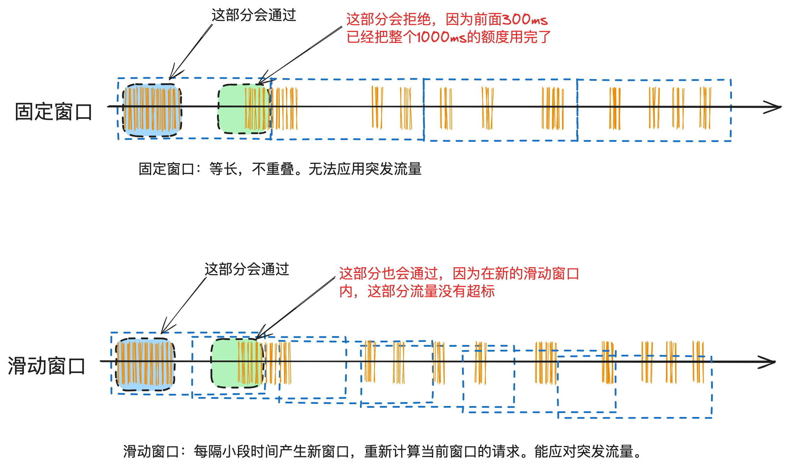

# 15.精确掌控并发_滑动时间窗口算法在分布式环境下并发流量控制的设计与实现

上⼀篇介绍了【固定时间窗⼝算法】在⽀付渠道限流的应⽤以及使⽤redis实现的核⼼代码。

本篇重点讲清楚分布式环境下【滑动时间窗⼝算法】原理和应⽤场景，以及使⽤reids实现的核⼼

代码。


## 1. 滑动时间窗⼝原理

滑动窗⼝算法是⼀种更为灵活的流量控制⽅案，它⽐固定窗⼝算法能更平滑地处理突发流量。在滑

动窗口中，时间窗口是重叠的，这意味着流量的计算是基于过去的一段连续时间内发生的事件。



---

⼯作流程：

1. 窗⼝定义：确定窗⼝的⼤⼩，例如1秒钟，并设置窗⼝的滑动间隔，⽐如100毫秒。

2. 计数与滑动：每个窗⼝都有⾃⼰的计数器。当⼀个新请求到达时，增加当前时间窗⼝及其前⾯

相邻的窗⼝的计数。

3. 限制检查：如果任何连续时间段内的请求总数超过阈值，则拒绝新的请求。

4. 窗⼝更新：随着时间的推移，不断向前滑动窗⼝，并更新相应的计数器。


## 2. 滑动时间窗⼝在⽀付系统中的应⽤场景

滑动时间窗⼝在⽀付系统中的应⽤场景主要也是各种精确限流，⽐如把前⼀篇讲的固定时间窗⼝算法

中，我们对外部渠道请求会做限流，那么就可以升级到滑动时间窗⼝，以提⾼精度。

只要是API限流，都可以使⽤。

## 3.使⽤redis实现的核⼼代码

滑动窗⼝可以通过队列或循环数组来实现。每个窗⼝对应队列中的⼀个元素，记录该窗⼝期间的请

求数。当时间滑动时，更新队列头部的元素，并可能将旧的元素出队。

在Redis中，可以使⽤列表或有序集合来模拟这种滑动窗⼝。下⾯是⼀个Rdis实现的示例，使⽤有

序集合（sorted set）来实现了滑动时间窗⼝算法：

```java
/**
 * redis限流操作类
 */
@Component
public class RedisLimitUtil {
    @Autowired
    private RedisTemplate<String, Object> redisTemplate;
    // 滑动时间窗口大小
    private static final long WINDOW_SIZE_IN_SECONDS = 1000;
    /**
     * 判断是否限流
     * 这里不考虑超过long最大值的情况，系统在达到long最大值前就奔溃了。
     */
    public boolean isLimited(String key, String reuqestId, long countLimit
    ) {
// 使用Redis的多个命令来实现滑动
        窗口
        redisTemplate.zremrangeByScore(key, 0, currentTimeMillis - WINDOW_
                SIZE_IN_SECONDS);
        long count = redisTemplate.zcard(key);
        if (countLimit >= count) {
            redisTemplate.zadd(key, currentTimeMillis, reuqestId);
            return true;
        } else {
            return false;
        }
    }
}
```


每个请求都以其发⽣的时间戳作为分数(SCORE)存储在集合中。通过移除旧于当前时间窗⼝的请

求来维护滑动窗⼝。通过检查集合中的元素数量，以确定是否超过了设定的最⼤请求数。

● zremrangeByScore ⽤于移除窗⼝之外的旧请求。

● zcard 获取当前窗⼝内的请求数量。

● zadd 将新请求添加到集合中。

使⽤：PayServiceImpl

```java
/**
 * 支付服务示例
 */
public class PayServiceImpl implements PayService {
    @Autowired
    private RedisLimitUtil redisLimitUtil;
    @Override
    public PayOrder pay(PayRequest request) {
        if (isLimited(request)) {
            throw new RequestLimitedException(buildExceptionMessage(reques
                    t));
        }
// 其它业务
        处理
... ...
    }
    /*
     * 限流判断
     */
    private boolean isLimited(PayRequest request) {
// 限流KEY，这里以[业务类型 + 渠道]举例
        String key = request.getBizType() + request.getChannel();
// 限流值
        Long countLimit = countLimitMap.get(key);
// 如果key对应的限流值没有配置，或配置为-1，说明不限流
        if (null == countLimit || -1 == countLimit) {
            return false;
        }
        return redisLimitUtil.isLimited(key, request.getRequestId(), count
                Limit);
    }
}
```


需要注意⼀点的是，这次需要传⼊requestId进去，⽤于保存这个requestId在redis有序队列⾥的分

数，⽤于计数和清理。


## 4. 注意事项

⼀些分布式服务框架，为了更⾼的可靠性，他们使⽤的是本地计算。⽐如接⼝限流1000TPS，⼀

共有20台应⽤服务器，框架就会把计算出每台机器是50个TPS，下发给所有的应⽤服务器，在服

务器上线、下线过程中，可能会有⼀段时间是不准确的。

但在渠道限流应该中，因为每个渠道的流量都不太⾼，所以可以使⽤这种redis⽅案。且精度更

⾼，不受应⽤服务器的上、下线影响。

另外，在分布式系统中，需要确保不同节点之间的时间同步，以保证流量计算的准确性。如果应⽤

服务器之间的时间不同步，那么流量就会计算错误。


## 5. 结束语

分布式流控有很多实现⽅案，通过把固定时间窗⼝算法升级为滑动时间窗⼝算法，我们对流量控制

的精度会⼤幅提升。

下⼀篇会介绍漏桶原理及实现。漏桶和令牌桶的特点是请求进来先保存起来，然后按⼀定的速度发

送出，⽽不是超过阀值就拒绝。


