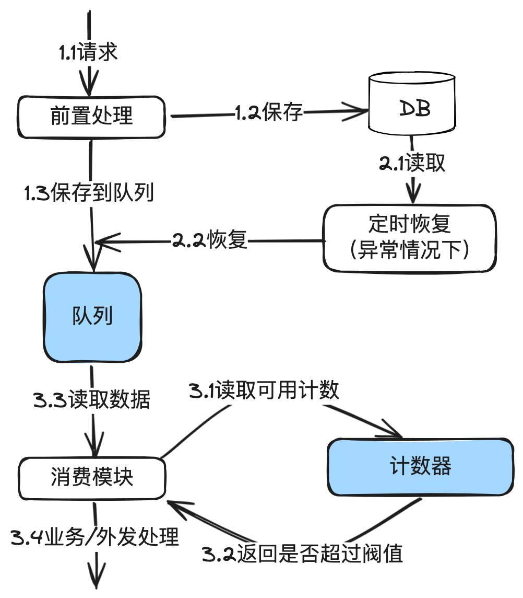

# 16.精确掌控并发_漏桶算法在分布式环境下并发流量控制的设计与实现

本篇重点讲清楚【漏桶】原理，在⽀付系统的应⽤场景，以及使⽤reids实现的核⼼代码。


## 1. 前⾔

在流量控制系列⽂章中的前两篇，分别介绍了固定时间窗⼝算法和滑动时间窗⼝算法在⽀付渠道限

流的应⽤以及使⽤redis实现的核⼼代码。

这两个算法有⼀个共同的问题：那就是超过阀值的数据会直接拒绝掉。如果超过阀值也不想拒绝请

求，后⾯仍然发出去，怎么办？这就是本篇要说的漏桶及下篇要讲的令牌桶解决的问题。


## 2. 漏桶原理

漏桶算法通过模拟⽔桶漏⽔的过程来控制数据的传输速率。它允许短时间的突发数据流，随后以恒

定的速率排空积聚的数据。这种机制特别适合于需要平滑处理瞬时⾼流量冲击，但后端需要恒定速

率处理的场景。⽐如批量接收上游商户的退款，然后根据渠道的要求以极低的TPS慢慢退出去到渠

道。

最简单的理解，漏桶 = 队列 + 固定窗⼝算法。其中队列⽤于先保存数据。固定窗⼝算法⽤于获取

可用计数，获取到就从队列获取一个请求进行业务处理。



---

⼯作原理：

1. 桶容量：漏桶有⼀个固定的容量，代表在任何时刻系统能够容纳的最⼤请求量。⽐如上⾯图中

的队列。

2. 数据流⼊：数据来了后就保存到桶（队列）中，如果桶已满，则溢出的数据会被丢弃。

3. 恒定速率流出：数据以固定的速率从桶中“漏出”，即被处理。这个速率是预先设定的，与请求

量⽆关。

4. 计数器最简单的做法，就是把固定时间窗⼝的代码⽤起来。

5. 保存到数据库，是为了持久化，以及队列出现问题时，可以重新恢复。

## 3.在⽀付系统下的应⽤场景

中国的IT基础设施领先于全球各个国家，各⼤银⾏和第三⽅钱包也被各电商双⼗⼀等⼤促场景狂虐

之后进化到⽀持极⾼的TPS，但是在跨境场景下，⽐如东南亚或南美的国家，他们的银⾏IT基础设

施差，系统⽼旧，⽆法⽀持⾼并发流量。甚⾄碰到过⼀些银⾏要求退款只能有1TPS。

在分布式场景下，要做到1TPS的⾼精度限流，只能依赖漏桶来做。


## 4. Redis实现漏桶的核⼼代码

漏桶算法通常通过队列 + 固定时间窗⼝计数法来实现。队列存储待处理的请求，⽽⼀个线程以固

定速率从队列中取出并处理这些请求。

为什么⼜是Redis？因为前⾯已经实现过Redis版本的固定时间窗⼝算法，再加⼀个队列就可以搞

定。当然⼤家也可以选择其它的⽅案实现，这只是⼀个抛砖引⽟。

下面是单机版本的伪代码：

```java
public class LeakyBucket {
    private final int capacity;
    private final long leakIntervalInMillis;
    private final LinkedBlockingQueue<Data> bucket;
    public LeakyBucket(int capacity, long leakRateInMillis) {
        this.capacity = capacity;
        this.leakIntervalInMillis = leakRateInMillis;
        this.bucket = new LinkedBlockingQueue<>(capacity);
    }
    // 尝试添加数据到桶中
    public boolean addToBucket(Data data) {
        return bucket.offer(data);
    }
// 启动桶的漏水过程
    public void startLeaking() {
        new Thread(() -> {
            while (true) {
                try {
                    Data data = bucket.poll(leakIntervalInMillis, TimeUnit
                            .MILLISECONDS);
                    if (data != null) {
                        process(data);
                    }
                } catch (InterruptedException e) {
                    log.debug("Leaking process interrupted");
                    continue;
                }
            }
        }).start();
    }
    // 处理桶中的数据
    private void process(Data data) {
// 业务处理
... ...
    }
}
```

上面单机的代码实用性不高，因为在分布式环境下，并发请求量是根据部署机器累计起来的，1台机器限流1TPS，20台机器就到了20TPS。

**优化为分布式：**

```java
class LeakyBucket {
    @Autowired
    private RedisLimitUtil redisLimitUtil;
    private Map<String, LeakyBucketHolding> leakyBucketHoldingMap = new Ha
    shMap();
    // 添加数据到桶中
    public boolean addData(Data data) {
        String key = buildKey(data);
        LeakyBucketHolding holding = leakyBucketHoldingMap.get(key);
        if (null == holding) {
            holding = buildHolding(data);
            leakyBucketHoldingMap.put(key, holding);
        }
        return holding.getLinkedBlockingQueue().offer(data);
    }
    public Data getData() {
        for(LeakyBucketHolding holding : leakyBucketHoldingMap.values()) {
            if(holding.getBucket().size() == 0) {
                return null;
            }
            /* RedisLimitUtil的实现参考
            * "精确掌控并发：固定时间窗口算法在分布式环
            境
            下并发流量控制的设计与实
            现"
            中的示例代码
            */
            boolean limited = RedisLimitUtil.isLimited(holding.getBizType(
            ), holding.getLimit());
            if (limited) {
                return null;
            }
            try {
                return holding.getBucket().poll(10, TimeUnit.MILLISECONDS)
                        ;
            } catch (InterruptedException e) {
                log.log("Leaking process interrupted");
            }
            return null;
        }
    }
}
```

上面的代码只是写一个示例，也没有做方法的抽取，真实的代码会比这个写得更优雅一点，大家将

就看一下，理解思路就行。

代码使用的是内存列队，也就是请求过来后，先保存到DB，然后发到内存队列。在重启服务器

时，内存列队的数据会丢失，这种情况下，依赖定时任务从DB中恢复任务到内存列队。

还有一种做法，就不使用内存队列，而是使用redis来实现队列。代码如下：

```java
public class LeakyBucket {
// 其它代码略
... ...
    // 添加数据到队列中
    public void addData(Data data) {
        return redisTemplate.rpush(data.getBizType(), data);
    }
    // 添加数据到队列中
    public Data getData(String bizType) {
        return redisTemplate.lpop(bizType);
    }
// 其它代码略
... ...
}
```

**退款流量控制实例：RefundServiceImpl**

```java
/**
 * 支付服务示例
 */
public class RefundServiceImpl implements RefudnService {
    @Autowiread
    private LeakyBucket leakyBucket;
    @Override
    public RefundOrder refund(RefundRequest request) {
// 前置业务
        处理
... ...
        Data data = buildData(request);
        leakyBucket.addData(data);
// 其它业务
        处理
... ...
    }
    @PostConstruct
    public void init() {
        new Thread(() -> {
            while (true) {
                Data data = leakyBucket.getData();
                if (null != data) {
                    process(data);
                } else {
                    sleep(10);
                }
            }
        }).start();
    }
}
```


在代码中可以看到，退款请求来后，只需要往桶⾥扔就完事。然后等另外的线程按固定速度发出

去。

代码中还存在的问题：

1. 上述代码只是示例，真实的代码还有很多异常处理，⽐如队列数据丢失，需要重新处理。
2. 暂时只能⽤于退款，因为退款的时效要求不⾼。另外，单机只需要开⼀个线程就⾏，因为服务

器是分布式部署，多个服务器合并起来仍然是多个线程在并发处理。对退款是足够的。


## 5. 为什么不使⽤消息中间件来做队列

为什么不直接使⽤RabbitMQ或Kafaka等消息中间件来做队列？主要是因为有些公司使⽤⾃码的消

息中间件，可能只有推模型⽽没有拉的模式。

如果只有推的模式，就会出现推下来后发现限流，⼜抛回来，来回做⽆⽤功。

如果消息中间件有拉的模式，同时配合redis的固定窗⼝实现，也是完全没有问题的。


## 6. 为什么不直接使⽤消息中间件来做流控

消息中间件是另外的选型⽅案，会在后⾯的⽂章中介绍。


## 7. 结束语

今天主要介绍了漏桶原理、在⽀付系统中的使⽤场景，以及基于redis实现的核⼼代码。

下⼀篇将介绍令牌桶在分布式场景下流量控制的应⽤和核⼼代码实现。


