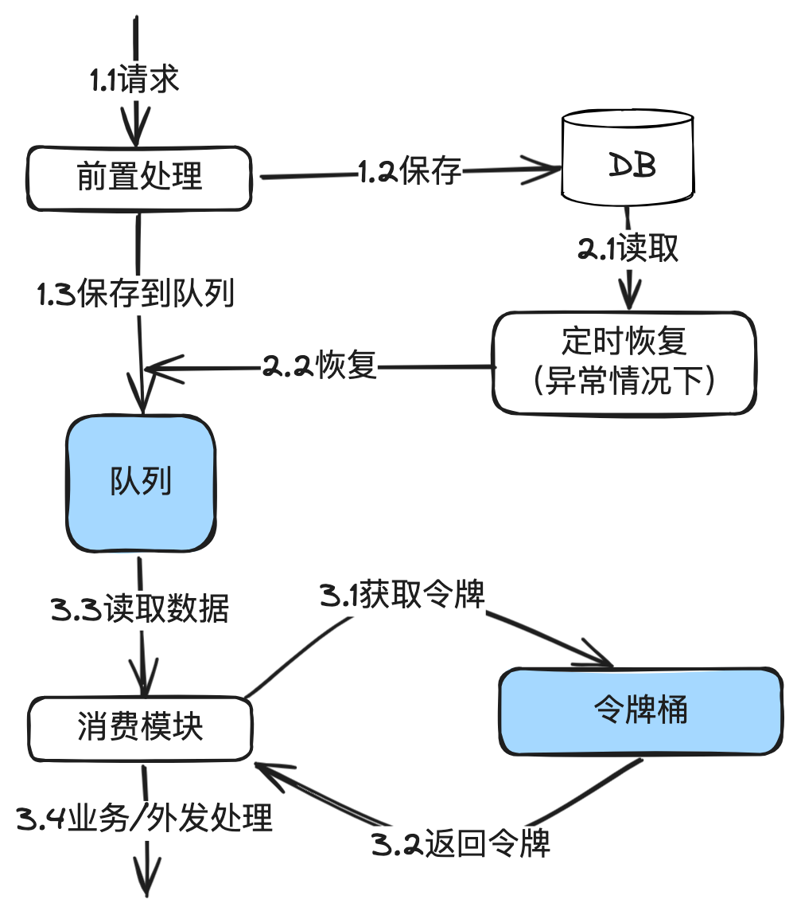

# 17.精确掌控并发_令牌桶算法在分布式环境下并发流量控制的设计与实现

本篇重点讲清楚【令牌桶】原理，在⽀付系统的应⽤场景，以及使⽤reids实现的核⼼代码。


## 1. 前⾔

在流量控制系列⽂章中的前三篇，分别介绍了固定时间窗⼝算法、滑动时间窗⼝算法、漏桶原理、

应⽤场景和redis核⼼代码。

我们做个简单回顾：

固定窗⼝：算法简单，对突然流量响应不够灵活。超过流量的会直接拒绝，通常⽤于限流。

滑动窗⼝： 算法简单，对突然流量响应⽐固定窗⼝灵活。超过流量的会直接拒绝，通常⽤于限

流。

漏桶算法：在固定窗⼝的基础之上，使⽤队列缓冲流量。提供了稳定的流量输出，适⽤于对流量平

滑性有严格要求的场景。

今天讲的令牌桶算法，其实只需要在滑动窗⼝的基础之上，使⽤队列缓冲流量。令牌桶能够允许⼀

定程度的突发性流量，但实现稍为复杂。

## 2. 令牌桶算法原理



令牌桶算法是⼀种流量整形和流量控制机制。它的核⼼思想是以固定速率放⼊令牌到桶中，每个传

⼊请求需要获取⼀个令牌才能继续执⾏。如果桶中⽆令牌可⽤，则请求要么等待，要么被拒绝。这

种机制允许突发流量的发⽣，同时通过限制令牌的放⼊速率控制数据的平均传输率。

1. 令牌桶：令牌桶本质上是⼀个存放令牌的容器，其中令牌代表着可以执⾏某个操作的许可或权

利。这个桶以固定的速率往其中放⼊令牌。

2. 令牌⽣成速率：令牌桶算法规定了每秒往令牌桶中添加令牌的速率，通常以令牌/秒

（Tokens Per Second，TPS）或类似的单位来表示。

3. 令牌消耗：当一个请求到来时，它需要获取一个令牌才能继续执行。如果桶中有可用令牌，请

求将获得⼀个令牌，并被允许执⾏。否则，请求将被阻塞或拒绝。

4. 限制速率：通过控制令牌⽣成速率，令牌桶算法限制了请求的速率，确保不会发⽣过于频繁的

请求，从⽽避免了系统的过载。

5. 处理突发流量：令牌桶允许短时间内处理突发流量，因为它可以在桶中积累多个令牌，允许⼀

次性处理多个请求，但仍然受到桶的容量限制。

6. 令牌桶容量：令牌桶还具有⼀个容量，表示桶中最多可以存放多少个令牌。如果桶已满，新的

令牌将被丢弃。

从上⾯的图中可以看到，实际实现时和漏桶很像。只是漏桶是以固定速率流出，⽽令牌桶允许⼀定

的突发流量。


## 3. ⽀付系统应⽤场景

在⽀付系统中，令牌桶算法⽤于控制交易请求的并发数。⽐如前⾯漏桶那⼀篇中对渠道退款的流量

控制。⽐如漏桶好⼀点的是平滑性更好。


## 4. 基于redis实现的令牌桶核⼼代码实现

⼜回到redis代码。因为直接把滑动时间窗⼝算法，再加⼀个队列就可以了。

参考滑动时间窗口算法中的redis代码实现，使用有序集合（sorted set）来实现了令牌桶算法：

```java
@Component
public class TokenBucket {
    @Autowired
    private RedisTemplate<String, Object> redisTemplate;
    private Map<String, LeakyBucketHolding> bucketHoldingMap = new HashMap
            ();
    // 滑动时间窗口大小
    private static final long WINDOW_SIZE_IN_SECONDS = 1000;
    public boolean getToken(String key, String reuqestId, long countLimit)
    {
// 使用Redis的多个命令来实现滑动
        窗口
        redisTemplate.zremrangeByScore(key, 0, currentTimeMillis - WINDOW_
                SIZE_IN_SECONDS);
        long count = redisTemplate.zcard(key);
        if (countLimit >= count) {
            redisTemplate.zadd(key, currentTimeMillis, reuqestId);
            return true;
        } else {
            return false;
        }
    }
    // 添加数据到桶中
    public boolean addData(Data data) {
        String key = buildKey(data);
        TokenBucketHolding holding = bucketHoldingMap.get(key);
        if (null == holding) {
            holding = buildHolding(data);
            bucketHoldingMap.put(key, holding);
        }
        return holding.getLinkedBlockingQueue().offer(data);
    }
    public Data getData() {
        for(TokenBucketHolding holding : bucketHoldingMap.values()) {
            if(holding.getBucket().size() == 0) {
                return null;
            }
// 注
            意这里的uuid()是生成一个随机不重复的uuid，只是占位使用
            boolean limited = !getToken(holding.getBizType(), uuid(), hold
                    ing.getLimit());
            if (limited) {
                return null;
            }
            try {
                return holding.getBucket().poll(10, TimeUnit.MILLISECONDS)
                        ;
            } catch (InterruptedException e) {
                log.log("Leaking process interrupted");
            }
            return null;
        }
    }
}
```


每个请求都以其发⽣的时间戳作为分数(SCORE)存储在集合中。通过移除旧于当前时间窗⼝的请

求来维护滑动窗⼝。通过检查集合中的元素数量，以确定是否超过了设定的最⼤请求数。

● zremrangeByScore ⽤于移除窗⼝之外的旧请求。

● zcard 获取当前窗⼝内的请求数量。

● zadd 将新请求添加到集合中。

使⽤⼀个队列来缓存数据，可以使⽤本机内存队列，也可以使⽤消息中间件，上⾯示例直接使⽤了

内存队列，下面还有一个redis做为示例。在使用时需要根据实际情况做出技术选型。

```java
public class RedisQ {
// 其它代码略
... ...
    // 添加数据到队列中
    public void addData(Data data) {
        return redisTemplate.rpush(data.getBizType(), data);
    }
    // 添加数据到队列中
    public Data getData(String bizType) {
        return redisTemplate.lpop(bizType);
    }
// 其它代码略
... ...
}
```

退款流量控制实例：RefundServiceImpl

```java

/**
 * 支付服务示例
 */
public class RefundServiceImpl implements RefudnService {
    @Autowiread
    private TokenBucket tokenBucket;
    @Override
    public RefundOrder refund(RefundRequest request) {
// 前置业务处理
... ...
        Data data = buildData(request);
        tokenBucket.addData(data);
// 其它业务处理
... ...
    }
    @PostConstruct
    public void init() {
        new Thread(() -> {
            while (true) {
                Data data = tokenBucket.getData();
                if (null != data) {
                    process(data);
                } else {
                    sleep(10);
                }
            }
        }).start();
    }
}
```


在代码中可以看到，退款请求来后，只需要往桶⾥扔就完事。然后等另外的线程按固定速度发出

去。

代码中还存在的问题：

1. 上述代码只是示例，真实的代码还有很多异常处理，⽐如队列数据丢失，需要重新处理。
2. 暂时只能⽤于退款，因为退款的时效要求不⾼。另外，单机只需要开⼀个线程就⾏，因为服务

器是分布式部署，多个服务器合并起来仍然是多个线程在并发处理。对退款是足够的。


## 5. 令牌桶使⽤注意事项

在实际应⽤中，要考虑以下⼏点以确保令牌桶算法的有效性和⾼效性：

1. 合理设置参数：令牌⽣成的速率和桶的容量需要根据实际情况调整，以平衡响应性和限制性。

2. 系统时间同步：在分布式环境中，确保所有节点的系统时间同步⾮常重要，以避免时间偏差导

致的算法执⾏错误。

3. 资源预留：在⾼并发场景下，令牌桶算法可能导致⼤量请求被暂时阻塞，需要确保系统有⾜够

的资源来处理这些积压的请求。

4. 监控与调整：持续监控令牌桶的性能，并根据系统负载情况进⾏动态调整。


## 6. 结束语

令牌桶算法提供了⼀种有效的机制来控制和管理分布式环境下的并发请求。它不仅可以防⽌系统过

载，还能够应对突发的⾼流量，从⽽保障⽀付系统的稳定性和可靠性。

下⼀篇聊聊消息中间件在流控中的应⽤。
