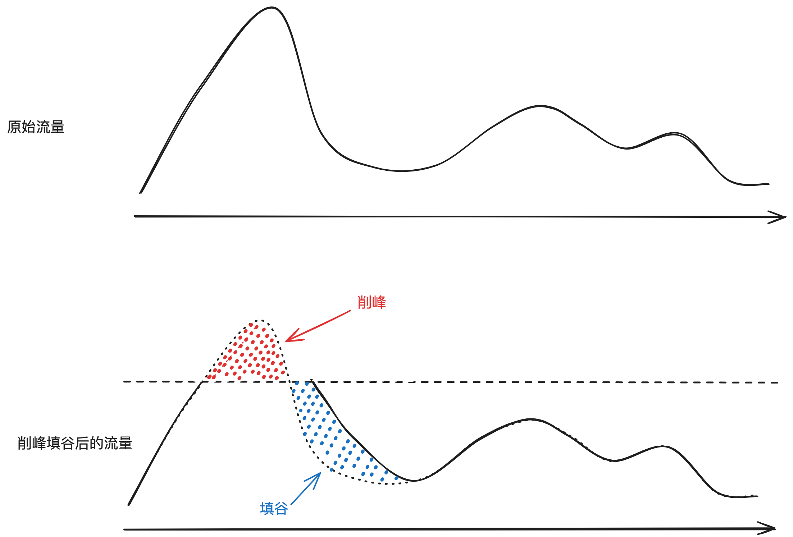
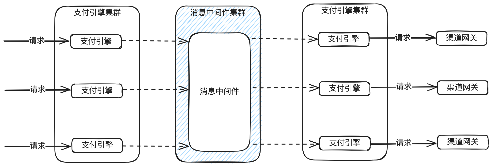
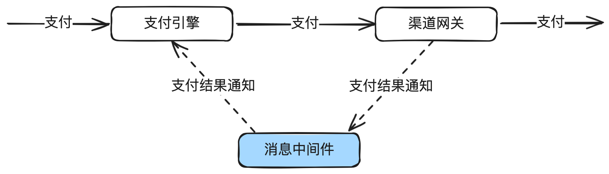

# 18.削峰填谷与应用间解耦_分布式消息中间件在分布式环境下并发流量控制的应用

本篇重点讲清楚分布式消息中间件的特点，常⻅消息中间件的简单对⽐，在⽀付系统的应⽤场景，

⽐如削峰填⾕，系统应⽤间的解耦，事务消息等。

内容偏⼊⻔介绍，已经使⽤过消息中间件的同学可以不⽤往下看了。


## 1. 前⾔

在流量控制系列⽂章中的前四篇，分别介绍了固定时间窗⼝算法、滑动时间窗⼝算法、漏桶原理、

令牌桶原理，应⽤场景和java版本的核⼼代码。

我们做个简单回顾：

固定窗⼝：算法简单，对突然流量响应不够灵活。超过流量的会直接拒绝，通常⽤于限流。

滑动窗⼝： 算法简单，对突然流量响应⽐固定窗⼝灵活。超过流量的会直接拒绝，通常⽤于限

流。

漏桶算法：在固定窗⼝的基础之上，使⽤队列缓冲流量。提供了稳定的流量输出，适⽤于对流量平

滑性有严格要求的场景。

令牌桶算法：在滑动窗⼝的基础之上，使⽤队列缓冲流量。提供了稳定的流量输出，且能应对突发流量。

今天讲的分布式消息中间件在⽀付场景的削峰填⾕和应⽤间解耦⽤得⽐较多，且对精度没有那么苛

刻的场景，⽐如集群低到1TPS，就⽆法做到。


## 2. 削峰填⾕原理



削峰：在流量⾼峰期，通过消息中间件暂存⼤量的请求，减少对后端系统的直接压⼒。

填⾕：在低峰期，逐渐处理这些积累的请求。

这种方法能有效平衡系统负载，防止在高峰时段系统崩溃。




我们⼀般使⽤消息中间件实现削峰填⾕。下⾯是⼀个⽀付引擎⾃产⽣消的示例图。收到⽀付请求

后，先扔到消息中间件，然后启⽤新的监听线程去消费。通过控制消费线程数来控制流量。

⽐如⼀下来了1000个请求，⼀共10台机器，每台机器消费线程只开5个，每个请求处理500ms，那

么每秒就处理100个请求，共耗时10秒处理完。

消息中间件还有⼀个作⽤，就是应⽤间的解耦。⽐如⽀付成功后，渠道⽹关通过消息中间件返回给

⽀付引擎。




## 3. 常⻅的分布式消息中间件介绍

消息中间件有很多，这⾥简单对⽐ RocketMQ、RabbitMQ 和 Kafka在性能、可靠性、易⽤性、

功能特性、适⽤场景等⽅⾯的不同。如下：

性能

● RocketMQ: 提供⾮常⾼的性能和吞吐量，特别适合⼤规模的消息传输和处理场景。

● RabbitMQ: 性能优秀，尤其在⼩型消息的传递上⾮常⾼效。但在处理⾮常⼤量的消息时，性

能可能不如 Kafka 和 RocketMQ。

● Kafka: 专为⾼吞吐量设计，特别适合需要处理⼤数据流的场景。它在持久化和分布式处理⽅

⾯的性能表现尤其出⾊。

可靠性

● RocketMQ: 提供⾼可靠性保证，⽀持分布式事务。

● RabbitMQ: 通过消息持久化、交付确认等机制提供可靠的消息服务。

● Kafka: 数据持久化和⾼容错能⼒，确保了⾼可靠性。

易⽤性和管理

● RocketMQ: 相对复杂，需要⼀定的学习曲线，但提供丰富的特性和灵活性。

● RabbitMQ: ⽤户友好，易于安装和配置，拥有直观的管理界⾯。

● Kafka: 配置和管理相对复杂，但社区⽀持强⼤，提供了丰富的⽂档资源。

功能特性

● RocketMQ: ⽀持⼴泛的消息模式，包括顺序消息、定时/延时消息和事务消息。

● RabbitMQ: 提供多种消息路由模式，⽀持灵活的消息模型和多种协议。

● Kafka: 专注于⾼吞吐量的消息队列和流处理，⽀持实时数据处理。

适⽤场景

● RocketMQ: 适⽤于⼤规模分布式系统中的消息处理，如电商平台和⾦融系统。

● RabbitMQ: 适合需要复杂路由、多种消息协议和⾼效⼩消息处理的场景，如企业应⽤集成。

● Kafka: ⾮常适合于需要⾼吞吐量、⼤数据处理和实时流处理的应⽤，如⽇志聚合和实时监控

系统。

结论

● 在⽀付系统，我个⼈更推荐RocketMQ，原因有两个：第⼀，经过阿⾥电商+⽀付各种⾮常⾼

并发的⼤促洗礼，RocketMQ 在⼤型分布式系统中表现出⾊。第⼆，⽀持事务消息，这个在

⽀付领域还是很有⽤的。

另外，我也只是简单介绍，⼤家实际应⽤的时候，根据实际情况去选型，建议是做多⽅了解后，部

署验证后才规模使⽤。不过话说回来，这⼏款分布式消息中间件的技术⾮常成熟了，除了⼏个顶流

的互联网公司外，基本可以随便用，哪个手熟就使用哪个。


## 4. 使⽤注意事项

脑裂问题

曾经在⽣产环境碰到过RabbitMQ脑裂问题，交易全部中断。在分布式环境中完全避免也不现实，

建议加强监控。

消费线程数问题

消费线程要合理设置，太多，可能达不到削峰填⾕的效果，太少，消息有可能会积累，影响处理时

效。

⽐如⽀付是有时效，积压太久就会导致⽤户放弃⽀付。

消息积压应对

提前做好预估，以及监控。⼀旦把中间件压爆，可能整个交易系统。

持久化与恢复

防⽌系统崩溃导致的数据丢失。

事务消息

在需要保证数据⼀致性的场景中，合理使⽤事务消息。

消息确认与重试

合理设置消息确认机制和重试策略。如果本次⽆法处理，⼀定再抛回去。建议不要先确认再处理，

万⼀确认后，本机⼜⽆法处理，消息就丢失了。


## 5. ⽀付系统应⽤案例

消息中间件在⽀付系统中核⼼有⼏个核⼼应⽤场景：

1. 流量的削峰填谷。尤其是支付交易。

2. 系统应⽤间的解耦。⽐如⽀付成功后，渠道⽹关发出⽀付成功消息，由⽀付引擎和账务分别监

听。

3. 事务消息。

4. 离线数据同步。有些公司使⽤离线库来做，有些公司直接抛消息。⽐如实时库根据⽤户来分库

分表，离线库要根据商户来聚合等。

基本上，消息中间件在⽀付系统中⽆所不在。


## 6. JAVA版的示例代码

先声明，以下代码纯演示，⽣产环境需要考虑更多因素。

⽐如⽀付场景下，接收请求后，先放到队列，然后使⽤单独的消费线程去消费。以下是简单示例。

1. **添加依赖**

⾸先，你需要在项⽬的 pom.xml ⽂件中添加 RocketMQ 的依赖：

```xml
<dependencies>
  <dependency>
    <groupId>org.apache.rocketmq</groupId>
    <artifactId>rocketmq-client</artifactId>
    <version>5.1.4</version>
  </dependency>
</dependencies>
```


确保使⽤最新版本的依赖。

2. **创建⽣产者 (Producer)**

创建一个生产者以发送消息到 RocketMQ 服务器：

```java

public class PayServiceImpl implements PayService {
    @Autowired
    private MQProducer mqProducer;
    public PayOrder pay(PayRequest request) {
        PayOrder payOrder = buildPayOrder(request);
// 前置处理，比如校
        验、保存DB等
... ...
// 发送到队列
        Message msg = buildMessage(payOrder);
        mqProducer.send(msg);
// 前置处理
... ...
        return payOrder;
    }
    public boolean processPay(PayOrder payOrder) {
// 外发处理
... ...
    }
}
```

3. **创建消费者** (Consumer)

创建一个消费者来接收从 RocketMQ 发送的消息：

```java
public class PayConsumerServiceImpl implements PayConsumerService {
    @Autowired
    private MQConsumer mqConsumer;
    @Autowired
    private PayService payService;
    @Postconstruct
    public void init() {
        mqConsumer.registerMessageListener((MessageListenerConcurrently) (
                msgs, context) -> {
            payService.processPay(buildPayOrder(msg);
            return ConsumeConcurrentlyStatus.CONSUME_SUCCESS;
        });
    }
}
```

再次声明，上述代码纯演示，在生产环境中，需要考虑更复杂的场景和错误处理机制。


## 7. 结束语

通过使⽤分布式消息中间件进⾏并发流量控制，⽀付系统可以更有效地应对⾼并发场景。能很好地

提⾼系统整体的稳定性和可靠性，毕竟瞬间的⼤流量被缓冲到了消息中间件⾥。

但有些场景⽆法使⽤消息中间件，⽐如要求整个集群低到1TPS，⼜或者对接了外部上百个渠道，

每个渠道要求不⼀样，有些要求最⾼20TPS，有些最⾼100TPS，使⽤消息中间件不好实现，就需

要前⾯⽂章介绍的⼿撸⼀个漏桶或令牌桶。


