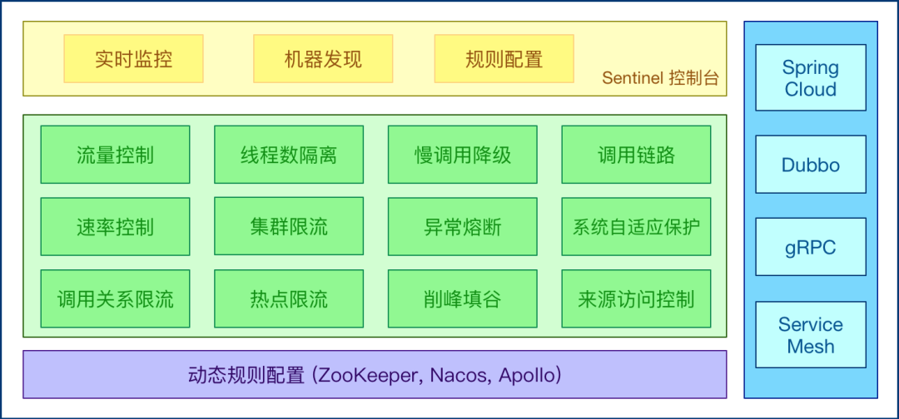
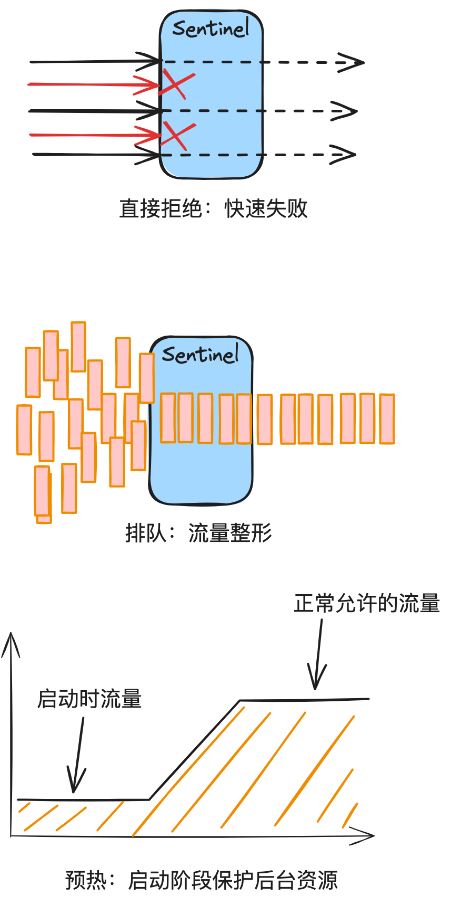
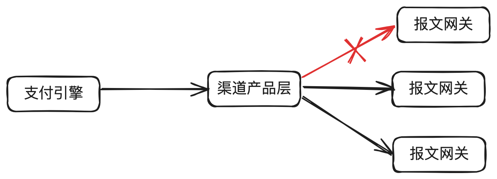

# 19.流量控制与熔断利器_Sentinel介绍

本篇聊聊流量控制与熔断利器Sentinel，背后的原理，适⽤的场景及存在的不⾜。不涉及具体的配

置，具体配置请参考官⽅⽂档。

## 1. 前⾔

在流量控制系列⽂章中的前五篇，分别介绍了固定时间窗⼝算法、滑动时间窗⼝算法、漏桶原理、

令牌桶、消息中间件如何应⽤到分布式环境下流量与并发控制。

我们做个简单回顾：

固定窗⼝：算法简单，对突然流量响应不够灵活。超过流量的会直接拒绝，通常⽤于限流。

滑动窗⼝： 算法简单，对突然流量响应⽐固定窗⼝灵活。超过流量的会直接拒绝，通常⽤于限

流。

漏桶算法：在固定窗⼝的基础之上，使⽤队列缓冲流量。提供了稳定的流量输出，适⽤于对流量平

滑性有严格要求的场景。

令牌桶算法：在滑动窗⼝的基础之上，使⽤队列缓冲流量。提供了稳定的流量输出，且能应对突发

流量。

分布式消息中间件：在支付场景的削峰填谷用得比较多，且对精度没有那么苛刻的场景。

今天介绍另⼀个流量控制和熔断机制利器：Sentinel。

需要说明的是，这⾥只是做简单介绍，更具体的使⽤，建议参考官⽅⽂档。

## 2. Sentinel简单介绍

图⽚来⾃⽹络。

Sentinel 是由阿⾥巴巴开源的⼀个轻量级的、⾼性能的流量控制、熔断降级的 Java 库。主要⽤于

在分布式系统中保护服务的稳定性和可靠性，通过实现流量控制、熔断降级、系统负载保护等功

能，来防⽌应⽤级别的故障和服务级别的雪崩效应。

主要特点

1. 丰富的流量控制策略：Sentinel 提供了多种流量控制策略，如 QPS、线程数、响应时间等。

2. 熔断降级机制：当资源的运⾏指标超过阈值时，Sentinel 可以⾃动进⾏熔断降级处理，防⽌系

统过载。

3. 系统负载保护：能够根据系统的负载情况，如 CPU 使⽤率、平均负载等，来⾃动调整流量⼊

⼝。

4. 实时监控和开放的指标：提供实时监控和丰富的指标数据，⽅便⽤户进⾏实时的流量监控和调

整。

5. 多维度规则授权：⽀持多种维度的规则配置，如调⽤关系、调⽤来源、API 级别等。

6. ⾼可⽤性和可扩展性：Sentinel 的设计考虑了⾼可⽤性，易于扩展，⽀持与其他组件和服务的

集成。

7. 轻量级和高性能：其对系统的性能影响很小，非常适合高并发的场景。

## 3. 流量控制

Sentinel 的流量控制基于资源的定义、流量控制规则的设定以及运⾏时的流量控制处理。在

Sentinel 中，流量控制主要是通过对服务调⽤或资源访问的限制来实现的。

1. 资源的定义

在 Sentinel 中，资源通常是指需要被保护的服务调⽤点或关键代码段。例如，⼀个 HTTP 接⼝、

⼀个内部定义的服务调⽤或⼀个数据库查询等都可以被定义为资源。

2. 流量控制规则

Sentinel 允许对每个资源设置流量控制规则。这些规则可以基于多种不同的标准，例如：

● QPS（每秒查询次数）：限制资源每秒可以处理的请求数。

● 并发线程数：限制资源同时处理的最⼤并发请求数。

● 响应时间：当资源的响应时间超过设定阈值时，可以触发流量控制措施。

3. 流量控制处理

---

⼀旦流量达到设定的阈值，Sentinel 会根据配置的流量控制效果来处理额外的流量。主要包括：

● 直接拒绝（Fast Fail）：⽴即拒绝访问请求，通常⽤于防⽌系统过载。

● 预热（Warm Up）：通过逐渐增加流量的⽅式来预热服务，适⽤于系统刚启动时。

● 排队等待（Rate Limiter）：使请求排队并逐个处理，保证系统稳定。排队还可以设定超时时

间。

4.流量计算与排队

Sentinel 内部也是使⽤滑动时间窗⼝算法来计算资源的实时流量。有兴趣的同学可以⾃⼰去翻⼀

下源代码。

排队通常使⽤先进先出（FIFO）的队列实现。

## 4. 熔断保护与⾃动恢复

熔断是⼀种保护系统的策略，当检测到某个微服务不稳定或者响应时间过⻓时，Sentinel会⾃动切

断对该服务的请求，防⽌系统雪崩。Sentinel的熔断策略是基于RT（响应时间）、异常⽐例和异常

数等不同的指标来实现的。⼀旦触发熔断规则，Sentinel会暂时阻断请求，直到服务恢复正常。

1. 熔断策略

Sentinel 提供多种熔断策略，典型的包括：

● 慢调⽤⽐例：如果资源的响应时间超过阈值的调⽤⽐例超过设定值，则触发熔断。

● 异常⽐例：如果资源的异常调⽤⽐例超过设定值，则触发熔断。

● 异常数：如果在⼀个统计窗⼝内，资源的异常数超过设定值，则触发熔断。

2. 统计窗⼝

● 滑动窗⼝：Sentinel 通常使⽤滑动窗⼝来统计资源的性能指标（如响应时间、调⽤异常等）。

● 时间间隔：Sentinel 允许配置统计窗⼝的时间间隔，以便根据应⽤的实际需求调整熔断的灵敏

度。

3. 熔断状态与⾃动化恢复

Sentinel 的熔断机制有三种状态：

● 关闭：正常状态，请求正常处理。

● 打开：熔断状态，所有对资源的请求都会被⽴即拒绝。

● 半开：⼀段时间后，Sentinel 会⾃动将熔断器置为半开状态，允许部分请求通过以检测资源的

健康状态。如果这些请求成功，则关闭熔断器；如果失败，则再次打开熔断器。

## 5. ⽀付系统应⽤场景

Sentinel⼴泛应⽤于微服务架构中，可以应对突发流量、分布式服务之间的依赖保护、系统负载过

⾼等情况。在电商、⽀付、⾦融等⾏业随处可⻅。

我们主要⽤在各⼦域之间的限流。每年⼤促，就会梳理业务请求量，算出流量分布图，根据流量分

布图，设置每个⼦应⽤各接⼝的限流值。

## 6. ⽆法适⽤的场景

Sentinel的限流有两种模式：1）总量除以机器数，然后做单机限流。2）拿出⼀台机器做集群结

点，然后做集群限流。

但⽆论哪种模式都⽆法解决跨服务单元的限流。⽐如部署了两个机房，两个机房合⽤限流到

1TPS，Sentinel是⽆法做到的。这个时候就需要⽤到我们前⾯⼏篇⽂章中讲到的⾃⼰实现的限流⽅

案，比如漏桶，令牌桶等。

## 7. 结束语

在当前微服务架构的盛⾏的时代，Sentinel作为⼀个⾼效的流量控制与熔断⼯具，为确保系统的稳

定性和可⽤性提供了强有⼒的⽀持。通过使⽤Sentinel，我们可以⼤⼤提⾼在线⽀付系统等复杂应

⽤的稳定性和⽤户体验。

但另⼀⽅⾯，我们也需要知道不同的⼯具有不同的应⽤场景，Sentinel解决的是限流和熔断，消息

中间件解决削峰填⾕和应⽤间解耦，⾃⼰⼿撸⼀个漏桶或令牌桶解决极低TPS这种特殊场景。

