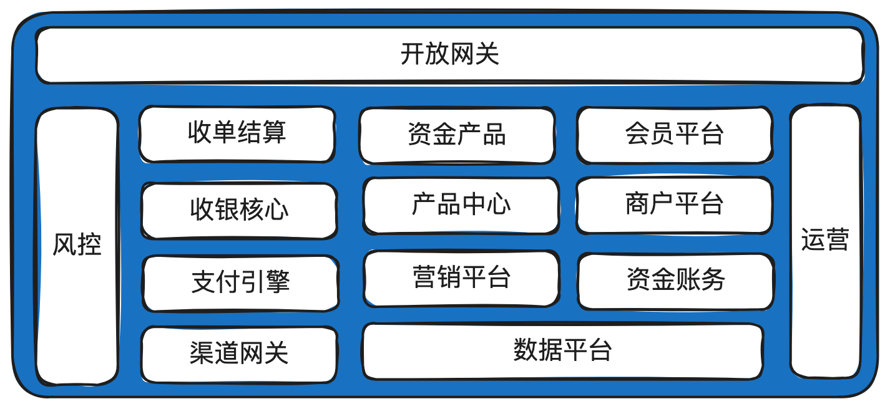

# 2.跟着图走学支付_在线支付系统设计的图解教程

这是《百图解码⽀付系统设计与实现》专栏系列⽂章中的第（2）篇。整个系列会讲清楚互联

⽹在线⽀付系统设计与实现的⽅⽅⾯⾯，既有全景概略，⼜有细节实现，适合⼈群：刚毕业的同

学，⼊⾏后想快速提⾼的同学，想了解这个⾏业的专业⼈⼠。

本章内容讲清楚⽀付系统是什么，主要解决什么问题，部分核⼼流程，以及⼀些后⾯会频繁使

⽤到的术语。

## 1.基本概念

下⾯描述的概念⼤部分做了极致简化，只是⽤于⼊⻔，对于理解概念应该是够⽤的。真实的实

现会复杂⾮常多，后⾯的系列⽂章会展开做详细说明。

后⾯的描述中，经常混着⽤“⽀付系统”、“⽀付平台”，本质是⼀个东⻄。在内部来说，就是

⼀个⽀付系统，但从和外部机构交互来说，就是⼀个⽀付平台。

最简⽀付流程

### 1.1. 说明：

1. 这是⼀个最简化的⽀付流程。真实的交互⽐这个复杂得多，单收银台渲染就可以写⼀整篇⽂

章。但对于讲清楚⽀付系统的作⽤，已经⾜够。

2. 从图中可以引申出⽀付系统最核⼼的作⽤：帮商户收钱。

3. 有⽀付当然就有退款、撤销等逆向操作，复杂的跨境⽀付还会有外汇交易，跨境结算等业务。

这些全部在后⾯的系列⽂章中细讲。

### 1.2. 最简清结算流程

---

说明：

1. 这⾥画的是信息流。

2. 银⾏和⽀付平台之间是机构对机构的关系，通常使⽤清算概念，因为⾦融机构之间⼤部分情况

下会有独⽴的清算机构做清算服务。

3. ⽀付平台和商户之间，通常使⽤结算概念，由⽀付平台直接打款给商户。

4. 上⾯画的是结算到商户开在⽀付平台的内部账户余额，所以需要商户⼿动提现，⽀付平台通常

也⽀持直接结算到卡，这样就不需要商户⼿动提现。

5. 清结算三个字还有另外⼀层含义：清分 + 结算。前者是把钱算清楚，后者是真实打款。

### 1.3. 最简本对本收单流程

说明：

1. 所谓本对本收单，就是指商户的商品标价币种、向⽀付系统的下单币种、⽤户⽀付币种、商户

结算币种都是同⼀个币种。不涉及到外汇交易。

2. ⼀个中国⼈拿着中国招商银⾏信⽤卡在淘宝或京东买东⻄，就是标准的本对本收单。

### 1.4. 最简跨境收单流程

说明：

1. 所谓跨境收单，就是结算给商户的币种和⽤户⽀付的币种不⼀样，需要经过外汇机构换汇。

2. 在扣款EUR成功后，⽀付平台会调⽤外部的外汇机构进⾏锁汇（HA）。

3. 在银⾏清算后，⽀付平台再调⽤外部的外汇机构进⾏真正的换汇（TA）。

4. 最后⽀付平台结算给商户USD。

如果换成时序图，如下：

### 1.5. 最简信息流与资⾦流

---

说明：

1. ⽤户在⽀付平台充值10元，⽀付平台向银⾏发起扣款请求，这些指令操作归属于信息交互，属

于信息流。

2. 真实资⾦流：银⾏账户余额的变动。⽐如：银⾏在内部把⽤户的余额减10元，给⽀付平台备付

⾦账户加10元。

3. 虚拟资⾦流：⽀付平台内部账户余额的变动。⽐如：⽀付平台内部把银⾏应收账户加10元，给

⽤户余额账户加10元。

4. 为什么会有真实资⾦流和虚拟资⾦流之分？因为我们真正能拿到钱的地⽅是银⾏，在⽀付系统

内看到的只是⼀个数字，如果想变成真实世界的钱，还得发给银⾏提现。

### 1.6. 跨境收单的协议关系

---

说明：

1. 这只是跨境收单的⼀种协议关系，真实场景存在多种形态。

2. 上述的收单机构是持牌的，但是没有跨境结算的能⼒，所以需要委托有跨境结算牌照的⾦融机

构代为处理跨境结算业务。

3. 跨境电商平台只是⼀个商户平台，没有收单资质，所以需要委托收单机构给它下⾯的供应商结

算打款。

4. 剩下的协议关系都是⼀⽬了然的，只是我们⽇常没有注意。⽐如⽤户和电商平台之间在注册时

就会有会员协议要签署。

5. 特殊的情况下，⼀些实⼒雄厚的机构，⽐如蚂蚁或财付通，下⾯会成⽴多个实体（不同的法律

主体），然后用不同的实体去申请不同的牌照（收单、银行、外汇、跨境

代发等），这样表面

上全部是⼀家公司搞定，但是实际的协议关系仍然是上⾯这样的，在各实体之间仍然需要签署

各种协议。

6. 如果是本对本收单场景就简单很多，没有外汇和跨境结算这⼀层关系，如果跨境电商的货品全

部是电商实体⾃营的，那就更简单，没有供应商委托结算的协议。

7. ⼀般电商平台在没有牌照情况下是不能开设余额账户的，如果电商想开通余额，可以委托第三

⽅有牌照的公司托管（通常也是收单机构，收单机构⼀般会同时申请PA、PG牌照），这种情

况下，电商平台和收单机构还会签署账户委托协议。

### 1.7. 跨境资⾦⽅案

说明：

1. 这是⼀个典型的跨境资⾦流案例。⽤户⽀付USD，收单机构收到的是USD，但是需要结算

RMB给中国境内的商户。

2. 收单机构（也就是⽀付平台）需要先将USD兑换成CNH（离岸⼈⺠币），再由⼊境代发机构

把RMB结算给中国境内商户。这是所谓的“结汇⼊境”。

3. 如果采⽤“⼊境结汇”的⽅式，则收单机构直接结算USD给商户在境外的银⾏账户中，由商户以

USD汇⼊境内，再兑换成RMB。或者收单机构先把USD汇⼊境内备付⾦账户，再兑换成

RMB，然后再结算RMB给中国境内商户。

4. 以上这些不同的资⾦处理⽅案，统称为资⾦⽅案。

### 1.8. 简明复式记账

金融机构的记账一定是基于复式记账法。下面以用户通过支付平台使用银行支付500块为例做

个简要说明。

假设：支付平台使用CMB做为收单行，在CMB开设有备付金账户。

涉及的支付平台内部账户：

| 账户类型 | 账户 | 备注 |
| --- | --- | --- |
| 借记账户 | 应收-渠道-CMB | 应收归属借记账户 |
| 贷记账户 | 应付-过渡-⽹关过渡户 应付-平台托管-商户待结算 应付-平台托管-商户余额 ⼿续费收⼊-商户-消费 | 应付归属贷记账户 ⼿续费意味着所有者权益增 加，归属贷记账户 |

记账步骤：

| 阶段 | 操作账户 | ⾦额 |
| --- | --- | --- |
| 第⼀步 资⾦从渠道到⽹关过渡户 | 借：应收-渠道-CMB 贷：应付-过渡-⽹关过渡户 | 500 |
| 第⼆步 扣除⼿续费 | 借：应付-过渡-⽹关过渡户 贷：⼿续费收⼊-商户-消费 | 10 |
| 第三步 ⽹关过渡户到商户待结算账户 | 借：应付-过渡-⽹关过渡户 贷：应付-平台托管-商户待结算 | 490 |
| 第四步 结算给商户 | 借：应付-平台托管-商户待结算 贷：应付-平台托管-商户余额 | 490 |

---

说明：

1. 支付系统的记账一定是复式记账法。内部开设了很多账户和科目。

【借 记 类 】 账户：资产 ， 应 收 款 等 ；

【贷记 类 】 账户：负债 ， 所 有者 权 益， 应 付 款 等 ；

资⾦从渠道到⽹关过渡户 贷：应付-过渡-⽹关过渡户

2. 借贷简要公式（不太严谨，但是够用）：

【借记类】账户（如资产，应收款），【增加】为【借】，【减少】为【贷】；

【贷记类】账户（如负债和所有者权益，应付款），【增加】为【贷】，【减少】为【借】；

3. 复式记账的专业书籍很多，这⾥只摘录⼏个重要的说明：

复式记账法定义：对每项经济业务按相等的⾦额在两个或两个以上有关账户中同时进⾏登记的⽅

法。

记账原则：有借必有贷，借贷必相等。

记账依据：会计恒等式：1. 资产 = 负债 + 所有者权益；2. 利润 = 收⼊ - 费⽤。

账户：具有⼀定格式和结构，能够⽤来连续、系统、全⾯的记录反映某种经济业务的增减变化及

其结果。

科⽬：同类财务交易的分类，⽐如资产、负债、所有者权限、收⼊或费⽤等都属于科⽬。⼀般科

⽬会分为多级。

账户和科⽬的区别：科⽬只有名字，账户包括结构和格式，每个账户对应⼀个特定的科⽬。

## 2. 概要设计

### 2.1.简明产品架构图

---

说明：

1. 这个图画得⽐较简单，但是已经涵养⼀个⽀付系统最核⼼的产品能⼒。

2. 上⾯部分是会员或商户感知的产品能⼒，包括⻔户、收银台，收单产品，资⾦产品等。下⾯部

分是⽀付系统最核⼼的服务，⽤于⽀撑对外的产品能⼒。

### 2.2. 极简⽀付系统架构图

---

说明：

1. 这个图很精简，但是基本已经够⽤，应付本对本交易这种简单的业务是完全没有问题的。

2. ⼀些复杂的⽀付系统可能还有外汇、额度中⼼、产品中⼼、卡中⼼等，甚⾄⼀个⼦系统可能会

拆分为多个应⽤独⽴部署，⽐如收单结算就可以拆成收单和结算两个独⽴的应⽤。

### 2.3. 完整⽀付系统架构图及各⼦系统简介

---

说明：

1. 这是⼀⽐较完整的系统架构图，属于逻辑划分。在单体应⽤中，就是⼀些模块，在分布式应⽤

中，就是⼀些⼦域、⼦应⽤或⼦系统。

2. 以下是各⼦系统简单介绍：

a. 开放⽹关：主要对接商户，⽐如下单、⽀付等接⼝⼊⼝。通常要求有⽐较⾼的安全性。部

分公司可能会把移动端⽹关、PC⻔户⽹关、商户通知等能⼒集成在开放⽹关，也可能会

单独拆出部署。

b. 收单结算：负责把商户的单收下来，并给商户发起结算。承担的收单产品包括有：线上收

单，线下收单，担保交易、即时到账等，每个公司的商业策略不同，开出的收单产品会有

差异。

c. 资⾦产品：承担⽆买卖标的的纯资⾦转移能⼒。典型的有：充值、转账、提现、代发。和

⽀付的区分在于⽀付是有买卖标的，⽽资⾦产品没有。也就是在系统中没有买卖记录发

⽣，但在线下可能有。

d. 收银核⼼：渲染可⽤⽀付⽅式。包括查询账户是否有余额，查询营销是否有营销券，查询

渠道⽹关是否有可⽤的外部渠道，最后组合成可⽤⽀付⽅式，供前端渲染。

e. ⽀付引擎：负责真正的扣款或转账。有些公司叫⽀付核⼼，或资产交换。个⼈认为资产交

换更合适，因为⽆论对于⽀付、退款、充值、转账等各种交易，本质都是把资产从⼀个账

f. 渠道⽹关：负责去外部渠道扣款。通常还会提供渠道路由、渠道咨询等能⼒，做得细的公

司可能下⾯再细分为渠道产品，报⽂⽹关和⽂件⽹关。

g. 会员平台：管理会员的注册、登录、密码、实名认证等。

h. 商户平台：管理商户的⼊驻、登录、交易管理等。

i. 产品中⼼：管理平台对外提供的产品能⼒。⼀般⼤的⽀付系统才会独⽴成⼀个⼦系统。

j. 资⾦账务：负责账户开⽴，记账等。

k. 会计中⼼：会计科⽬管理、分录管理、⽇切管理。

l. 对账中⼼：负责明细对账和资⾦对账。

m. 营销平台：提供满减、红包等营销⼯具。

n. ⻛控平台：针对账户和交易，提供实时、离线⻛控，控制平台的⻛险。

o. 运营平台：订单管理、渠道管理、产品管理等综合运营⼯具。

p. 数据平台：主要⽤于数据汇总和分析。分布式部署后，数据都在各⼦系统中，需要汇总到

数据平台⽤于经营分析。

q. 卡中⼼：负责管理⽤户的绑卡信息。需要经过PCI认证。

r. 额度中⼼：累计⽤户、商户的额度，通常有⽇、⽉、年等各种分类。

s. 外汇平台：负责外汇报价和兑换。

t. 流动性与调拨中⼼：⼀些跨境⽀付公司，在多个国家多个银⾏有头⼨，各头⼨之间经常需

要做流动性管理，提⾼资⾦利⽤率。

u. 差错中⼼：负责差错处理。⽐如渠道退款失败，需要通过其它的⽅式退给⽤户。

v. 拒付中⼼：处理⽤户的拒付和举证。在跨境⽀付场景下，信⽤卡⽤户联系发卡⾏说卡被盗

刷或商品没有收到，或商品有问题等，拒绝⽀付给商户。

### 2.4. 核⼼系统依赖图

---

说明：

1. 图中画得⽐较清楚了，没有太多需要补充的。

2. 其中红⾊线为⽀付主链路。

## 3. 常⻅术语索引

已经独⽴出去，具体参考“⽀付系统基础：⽀付系统必知术语⼀⽹打尽”篇章。

## 4. 结束语

本章主要讲了⼀些⽀付相关的基本概念，⽀付系统的概要设计框图，部分核⼼流程，以及⼀些

常⻅的术语，让同学对⽀付系统有⼀个整体的理解。

下⼀章节将围绕⾯向商户的收单和结算，请清楚如何给商户收单，⼜是如何结算给商户的。

