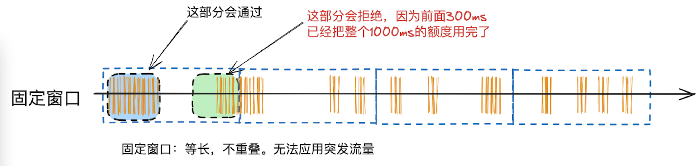
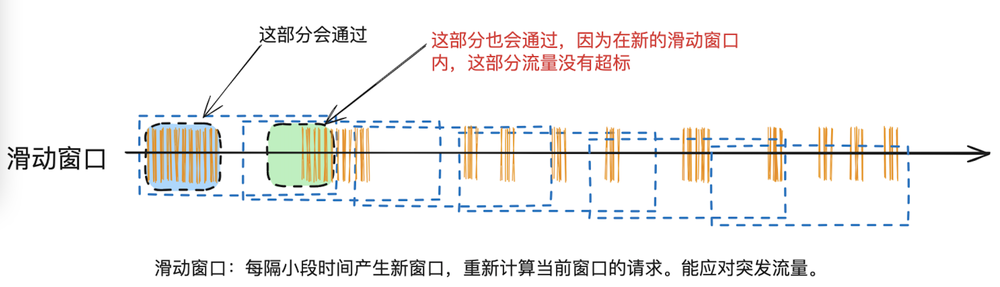
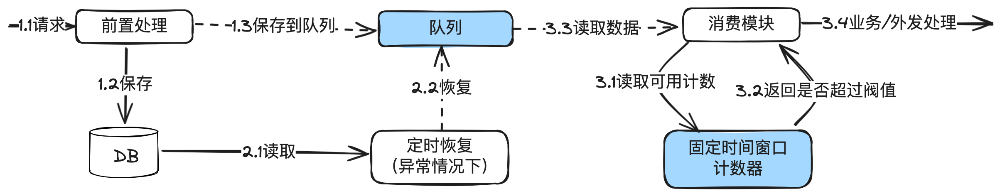
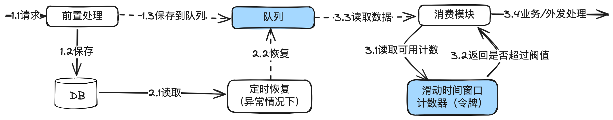
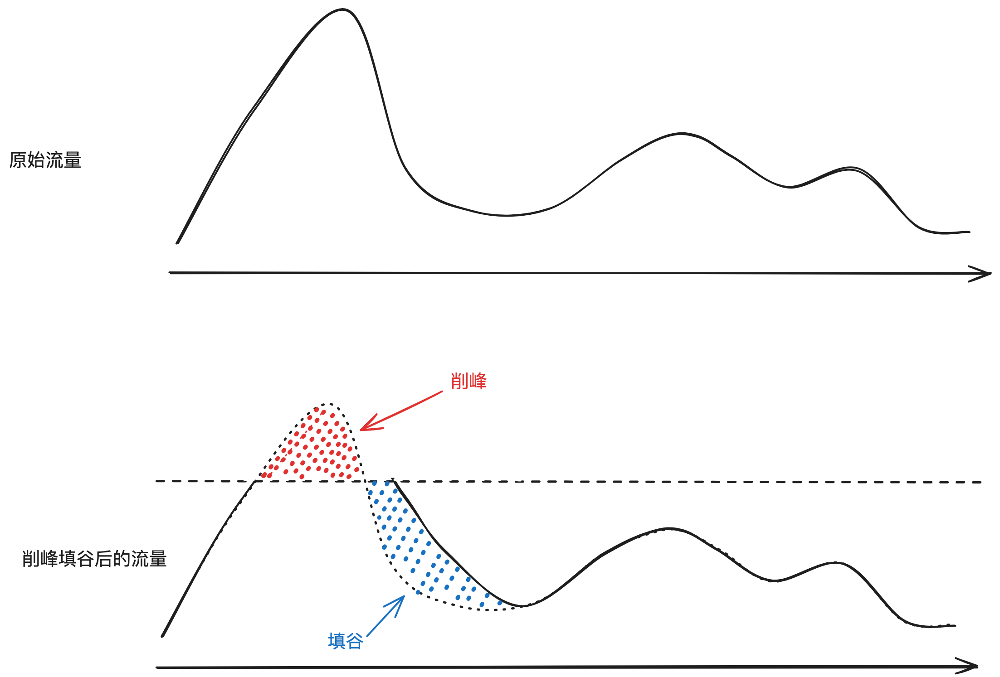
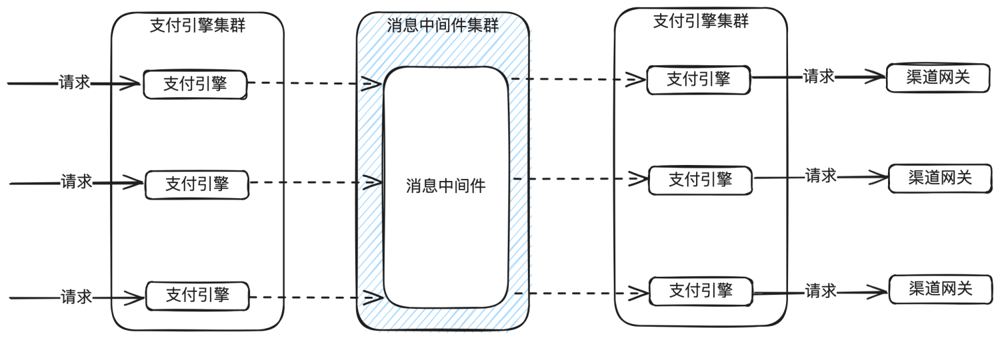
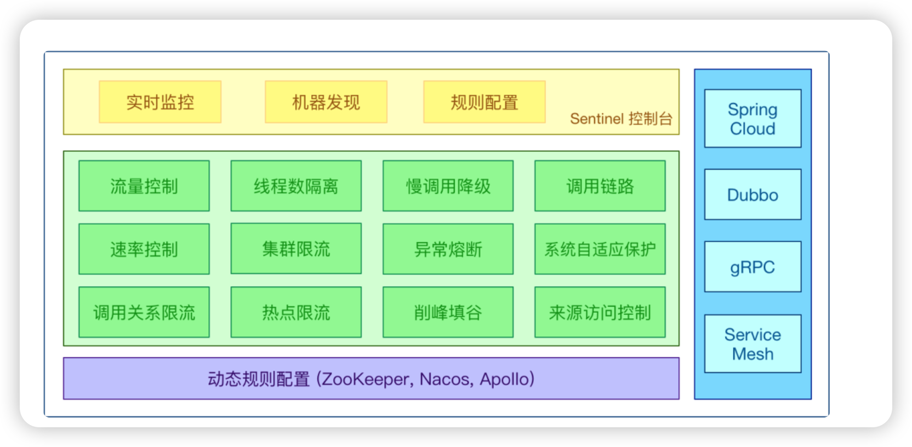

# 20.分布式环境下流控技术汇总

本篇主要是对分布式环境流控技术及使⽤场景做个简要的汇总，包括：固定时间窗⼝算法，滑动时

间窗⼝算法，漏桶算法，令牌桶算法，分布式消息中间件，流控与熔断利器Sentinel。

## 1. 前⾔

在流量控制系列⽂章中的前六篇，分别介绍了固定时间窗⼝算法、滑动时间窗⼝算法、漏桶原理、

令牌桶、消息中间件、Sentinel如何应⽤到分布式环境下的流量与并发控制。

这⾥再次对这⼏个做⼀个简单回顾，知道⼯具箱⾥⾯的不同⼯具的特性，才能更好更快地⼲活。

## 2.固定时间窗⼝算法

固定窗⼝：算法简单，对突然流量响应不够灵活。超过流量的会直接拒绝，通常⽤于限流。

详⻅：《精确掌控并发：固定时间窗⼝算法在分布式环境下并发流量控制的设计与实现》

## 3. 滑动时间窗⼝算法

滑动窗⼝： 算法简单，对突然流量响应⽐固定窗⼝灵活。超过流量的会直接拒绝，通常⽤于限

流。

详⻅：《精确掌控并发：滑动时间窗⼝算法在分布式环境下并发流量控制的设计与实现》

## 4.漏桶算法

漏桶算法：在固定窗⼝的基础之上，使⽤队列缓冲流量。提供了稳定的流量输出，适⽤于对流量平

滑性有严格要求的场景。

详⻅：《精确掌控并发：漏桶算法在分布式环境下并发流量控制的设计与实现》

## 5. 令牌桶算法

令牌桶算法：在滑动窗⼝的基础之上，使⽤队列缓冲流量。提供了稳定的流量输出，且能应对突发

流量。

详⻅：《精确掌控并发：令牌桶算法在分布式环境下并发流量控制的设计与实现》

## 6.分布式消息中间件

---

分布式消息中间件：在⽀付场景的削峰填⾕⽤得⽐较多，且对精度没有那么苛刻的场景。以及应⽤

间的解耦。

详⻅：《削峰填⾕与应⽤间解耦：分布式消息中间件在分布式环境下并发流量控制的应⽤》

## 7.流控与熔断利器Sentinel

Sentinel：分布式场景下的流量控制和熔断机制利器。

详⻅：《流量控制与熔断利器：Sentinel介绍》

## 8. ⽅案选型

限流和熔断保护：Sentinel。

削峰填⾕和应⽤间解耦：消息中间件。

极低并发要求：⾃⼰使⽤redis实现漏桶或令牌桶。

想⼿撸⼀段代码测试：固定时间窗⼝和滑动时间窗⼝。

实际上，⾃⼰实现的固定时间窗⼝或滑动时间窗⼝，还可以加上⼀些其它技术，解决⼀些其它的问

题，⽐如渠道⾃动开关。这个后⾯单独开⽂章介绍。

## 9. 结束语

前⾯六篇⽂章对流控的原理、实现⽅案、应⽤场景分别做了详细的描述，应对绝⼤部分的⽀付系

统，是绰绰有余的。哪怕中国TOP2的⽀付公司，内部的使⽤也差不多是这样，只是部署集群的规
