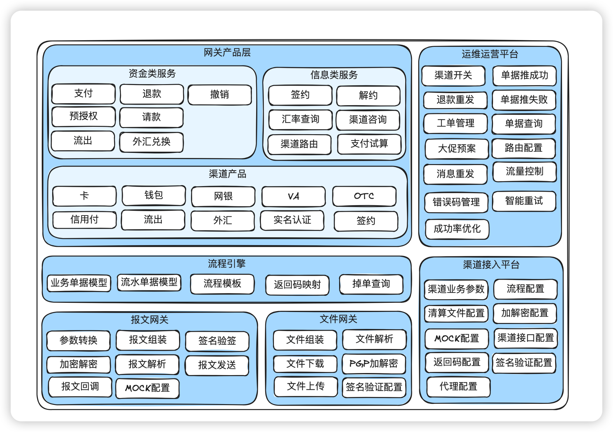

# 21.图解支付渠道网关(一)_不只是对接渠道的接口

本篇主要讲清楚什么是⽀付通道（渠道），有哪些类型的通道，什么是渠道⽹关，渠道⽹关在⽀付

系统中定 位、 核心功 能 、 常见 渠道 类 型 、 渠道网 关 的产 品 架构、系统架构等 。

## 1. 前⾔

数字经济持续⾼歌猛进，⽀付系统每年数⼗万亿规模的交易额全部都需要和银⾏打交道，毕竟钱都

在银⾏账户⾥。⽀付系统如何安全⾼效地和银⾏交互，准确⽆误地把钱从⼀个账户搬到另⼀个账

户？答案就是渠道⽹关。

渠道⽹关是⼀个幕后英雄，终端⽤户是⽆法感知的，这个⾦融界的多⾯⼿，搭建起了⽤户、⽀付系

统、银⾏、外汇机构间的桥梁。

今天我们将⾛进渠道⽹关的世界，揭秘它是如何⻓袖善舞，把各位⾼富帅和⽩富美的钱准确⽆误地

从银⾏间账户搬来搬去。

## 2. 渠道⽹关在⽀付系统中的定位

_不只是对接渠道的接口_page_2_img_1.png)

从图中，我们可以看到，所有外部⾦融机构（渠道）打交道，全部都要通过渠道⽹关出去。不同的

公司有不同的叫法，⽐如：渠道⽹关，⾦融⽹关等，本质就是⼀个意思。个⼈认为叫渠道⽹关更直

⽩。

## 3. 渠道⽹关不只是对接渠道的接⼝

很多⼈以为渠道⽹关只是对接渠道提供的接⼝，其实没有这么简单。报⽂对接只是最基础的能⼒，

大致有以下能力：

渠道接⼝对接：包括报⽂映射，加密解密，签名验签，⽂件下载，⽂件解析等。

渠道开关：渠道可⽤性管理。

渠道路由：渠道择优能⼒。

渠道咨询：业务适配管理。

差异处理：退款重发管理。

渠道⽹关的更多的核⼼能⼒介绍可以参考“5.渠道⽹关的产品架构”。

## 4. 常⻅渠道类型

渠道类型在各个公司的定义是不⼀样的，没有⼀个⾏业标准，且持续在发展。先讲⼏个当前仍然通

⽤的分类。

### 4.1. 渠道分类

从资⾦流转的⻆度，渠道分为三⼤类：

#### 4.1.1⽀付类渠道

_不只是对接渠道的接口_page_3_img_1.png)

这类渠道的核⼼作⽤是实现⽤户资⾦的流⼊。具体来说，它们将⽤户在银⾏账户中的资⾦转移到⽀

付平台在银⾏的备付⾦账户。这个过程在我们⽇常⽣活中极为常⻅，典型的场景包括⽤户的充值操

作和在线⽀付。例如，当你使⽤⼿机应⽤进⾏购物⽀付时，资⾦从你的银⾏账户流向商家的账户，

就是通过这类渠道完成的。

#### 4.1.2.流出类渠道

_不只是对接渠道的接口_page_4_img_1.png)

相对于资⾦的流⼊，流出类渠道则处理资⾦的流出。这包括两种主要情形：⼀是将⽀付平台的备付

⾦转移⾄⽤户个⼈或商户的银⾏账户，常⻅于⽤户提现或商户收款的场景；⼆是将资⾦从⼀个备付

⾦账户转移到另⼀个，通常⽤于⽀付平台内部的资⾦流动性调配。这类渠道确保了资⾦在⽤户和商

户之间的顺畅流动，是整个⽀付系统的重要⽀撑。

#### 4.1.3外汇渠道

_不只是对接渠道的接口_page_5_img_1.png)

---

这类渠道涉及货币兑换和跨国资⾦转移，⽀持不同货币间的转换和结算。在跨境电商、国际旅游等

场景中，外汇渠道提供了资⾦转换和结算的关键服务。随着全球化贸易的增⻓，跨境⽀付需求⽇益

增加，外汇渠道的作⽤变得更加重要。

### 4.2. ⽀付类渠道

随着业务和技术的发展，⽀付类的渠道定义也是千奇百怪，或者说是与时俱进。下⾯是个⼈⻅解，

仅供参考。

#### 4.2.1卡

_不只是对接渠道的接口_page_6_img_1.png)

---

借记卡/信⽤卡⽀付：这是最传统且⼴泛使⽤的⽀付⽅式之⼀。⽤户通过输⼊卡信息进⾏⽀付，资

⾦直接从其银⾏账户扣除。其中信⽤卡还有预授权、请款，2D、3D等场景。

还有所谓的预付卡，就是提前充值的⽀付卡，⽤户⽀付时，资⾦从预付卡余额中扣除。这个在⽀付

平台⼀般不感知。

国外的信⽤卡普遍使⽤得⽐较多。

先绑定后使用token支付模式：

_不只是对接渠道的接口_page_7_img_1.png)

---

⽀付流程和明⽂⽀付差不多，只是发给渠道时发token，⽽不是卡明⽂。

卡的交易有所谓的四方模式：商户、收单行、卡组、发卡行。这里的四方指的是四种类型的机构。

_不只是对接渠道的接口_page_8_img_1.png)

---

#### 4.2.2⽹银

_不只是对接渠道的接口_page_9_img_1.png)

---

通过跳转到银⾏⽹站完成⽀付。这个操作麻烦，成功率不⾼，在中国已经很少使⽤。国外还有不

少。

#### 4.2.3快捷⽀付

_不只是对接渠道的接口_page_10_img_1.png)

---

⽤户事先在⽀付平台绑定银⾏卡，⽀付时⽆需重复输⼊卡信息，便捷快速。这个是率先被⽀付宝发

明出来的。

国外有些叫“⼀键⽀付”，差不多⼀个意思。

#### 4.2.4代扣

_不只是对接渠道的接口_page_11_img_1.png)

---

代扣⽀付是⼀种银⾏或第三⽅⽀付平台在⽤户授权的基础上，直接从⽤户的银⾏账户或关联的⽀付

账户中⾃动扣除款项的⽀付⽅式。

这种⽅式和快捷⽀付最⼤的区别在于：快捷⽀付是⽤户实时参与交易过程，有可能出⻛控挑战，⽐

如OTP（短信验证码），或者密码等。代扣是提前授权，交易过程⽤户不会实时参与，也就没办

法出挑战，要不成功，要不失败。

代扣⼴泛⽤于定期⽀付场景，如⽔电费⾃动缴纳、会员服务费、订阅服务等，还有就是滴滴打⻋这

种，下⻋就⾛。这种⽅式免去了⽤户每次⼿动⽀付的麻烦，特别适合固定周期的定期付款。

#### 4.2.5第三⽅钱包

_不只是对接渠道的接口_page_12_img_1.png)

---

基于第三⽅钱包账户基础之上的⽀付。在中国有⽀付宝、微信⽀付等，在国外有paypal，gcash

等。

第三⽅钱包通常是⼀个综合⽀付⼯具，⽐如有钱包余额，钱包⾥⾯可能还绑定了银⾏卡、⽹银等。

跳转类：⽐如在京东APP下单，选择使⽤微信⽀付，就会跳转到微信APP。

⾮跳转类：⽐如在淘宝APP下单，直接后台调⽤⽀付宝的免密⽀付。

#### 4.2.6VA

_不只是对接渠道的接口_page_13_img_1.png)

---

Virtual Account, 虚拟账户。⽤户通过银⾏⽣成的虚拟账号进⾏⽀付，常⽤于⽆卡⽀付场景。在东

南亚⽤得特别多。

简单地说，就是⽤户没有银⾏卡，但是⼜要在⽹上购物，那么⽀付平台调⽤银⾏⽣成⼀个VA，并

把这个VA和订单绑定，再展示给⽤户，⽤户拿着这个VA，去银⾏的ATM把现⾦存进去，银⾏通知

⽀付平台这个VA⼊账成功，⽀付平台通知商户发货。

#### 4.2.7OTC

_不只是对接渠道的接口_page_14_img_1.png)

---

Over-The-Counter。在⽀付场景下，和VA很类似，也是⽣成⼀个⽀付码，只是这个⽀付码是由

7-11，肯德基等这些连锁店⽣成的，⽽VA是真实的银⾏账户。⽤户拿着这个OTC码去线下连锁

店，给店员现⾦，店员给这个OTC码充值，连锁店系统通知⽀付平台⽀付成功，⽀付平台通知商

户发货。

#### 3.2.8 信⽤付

渠道根据⽤户的信⽤授予⼀定的额度，可以先消费，后还款。国外通常叫BNPL（Buy Now Pay

Later)。

国内有⽀付宝的花呗，京东的⽩条。国外也有各种第三⽅⾦融机构，⽐如AKULAKU就是⼀个中国

⼈在东南亚开的信贷平台。

支付流程和第三方钱包差不多，只是需要先做授权。

信⽤付与信⽤卡分期的区别：信⽤卡分期是以银⾏发⾏的信⽤卡为基础，信⽤付不是基于卡。在⼀

些银⾏卡普及率不⾼的国家地区，信⽤付就很有优势。

### 4.3. 流出渠道

流出类渠道处理资⾦的流出。国际上通常是花旗，汇丰等这些全球性银⾏。国内的话各⼤银⾏都可

以。

在国际上，同⼀家银⾏，可以指定不同的清算⽹络，这些清算⽹络有不同的额度、到账时效、⼿续

费要求。⽐如同样的花旗，⾛ACH和RTGS的额度、到账时效、⼿续费就不同，需要根据业务类型

来选择清算⽹络。

下⾯只做⼀些简单的科普。后⾯有时间单独开⼀章节讲流出。

1.TT（电汇 Telegraphic Transfer）

●特点：通过电⼦⽅式进⾏的国际资⾦转账，常⽤于⼤额跨国交易。

●优势：速度较快，可以跨不同国家和货币。

●局限：⼿续费相对较⾼。

2. ACH（Automated Clearing House）

●特点：处理电⼦转账和直接借记业务，通常⽤于批量、⼩额、定期⽀付。

●优势：成本低，适合定期账单⽀付。

●局限：处理速度相对较慢。

3. RTGS（Real-Time Gross Settlement）

●特点：即时⼤额⽀付系统，按交易逐笔即时结算。

●优势：实时结算，安全性⾼。

●局限：主要⽤于⼤额交易。

4. BOOK（银⾏内部转账）

●特点：同⼀银⾏内部账户之间的转账。

●优势：实时处理，⽆需外部清算。

●局限：只限于同⼀银⾏的账户。

5. SWIFT（全球银⾏⾦融电讯协会）

特点：提供安全、可靠的国际⾦融交易信息传输。

●优势：⼴泛的国际接受度。

●局限：不直接处理资⾦转移，只是信息传输。

6. SEPA（Single Euro Payments Area）

●特点：简化欧洲国家之间的银⾏转账，统⼀欧元区⽀付市场。

●优势：提⾼跨境⽀付的效率和降低成本。

●局限：只限于欧元⽀付。

7. FPS（Faster Payments Service）

●特点：英国的即时⽀付系统，提供快速⽀付处理服务。

●优势：适⽤于即时⼩额⽀付。

●局限：主要服务于英国国内。

8. CHAPS（Clearing House Automated Payment System）

●特点：英国的⼤额⽀付系统，提供当⽇结算。

●优势：适⽤于⾼优先级、⼤额交易。

●局限：成本较⾼。

9. TARGET2（Trans-European Automated Real-time Gross Settlement Express Transfer

System）

●特点：欧洲中央银⾏的跨境⽀付系统，提供实时⼤额⽀付。

●优势：⽀持欧元区货币政策，安全稳定。

●局限：主要⽤于⼤额欧元交易。

中国央⾏清算⽹络：

1. 央⾏⼤额⽀付系统（High-value Payment System, HVPS）

●特点：主要处理⼤额和紧急⽀付，提供实时清算服务。

●应⽤：⽤于处理银⾏间的⼤额转账，如跨⾏转账、证券交易结算等。

2. 央⾏⼩额⽀付系统（Bulk Electronic Payment System, BEPS）

●特点：处理⼩额但批量的⽀付，通常是⾮实时的批量处理。

●应⽤：处理⼯资发放、社会保障⾦⽀付、公共事业缴费等⼩额批量业务。

3. ⽹上⽀付跨⾏清算系统（Online Payment Interbank Clearing System）

特点：⽀持⽹上⽀付业务的跨⾏清算。

●应⽤：处理线上购物、电⼦商务等互联⽹⽀付业务。

4. 同城清算系统（City Clearing System）

●特点：在同⼀城市或地区内处理银⾏间的⽀付和清算。

●应⽤：适⽤于处理同城的⽀票、汇票等传统⽀付⼯具。

5. 跨⾏实时⽀付系统（Interbank Real-time Payment System）

●特点：⽀持银⾏间即时⽀付，提⾼资⾦流转效率。

●应⽤：常⽤于个⼈转账、即时⽀付需求等场景。

### 4.4. 外汇渠道

外汇渠道就是⽤于交换货币。在全球外汇市场中，主要对接的有巴克莱（Barclays）、汇丰

（HSBC）、摩根⼤通（JPMorgan Chase）等。

外汇是⼀⻔很专业的领域，后⾯有时间单独开⼀章节讲。

## 5.渠道⽹关的产品架构

_不只是对接渠道的接口_page_18_img_1.png)

---

通过上图可以看出来，渠道⽹关核⼼能⼒包括：

1. 对上提供资⾦类和信息类服务。资⾦类包括⽀付、退款、预授权、请款、流出、外汇等，信息

类包括签约、解约、渠道咨询、渠道路由等。

2. 内部的运维运营能⼒。包括渠道开关、错误码管理、差错处理等。

3. 底层的渠道接⼊与配置。渠道接⼝映射、清算⽂件解析等。

## 6.渠道⽹关的系统架构

⽹关产品层：主要负责处理上游的业务，⽐如⽀付、退款、请款，签约解约等。

流程引擎：负责流程编排。有些渠道⼀次⽀付只需要和渠道做⼀次交互，有些渠道⼀次⽀付需要和

渠道做2到3次交互，这个差异由流程引擎处理。

报⽂⽹关：负责实时API接⼝的处理。包括参数转换、报⽂组装解析、签名验签、加解密等。

⽂件⽹关：负责⾮实时类的⽂件交互处理。主要是清算⽂件、账单⽂件、流出⽂件等。包括下载、

解析、组装、上传等。

运维运营平台：负责运维运营类操作，包括渠道开关、渠道路由配置、单据查询、异常推进等。

渠道接⼊平台：负责渠道的接⼊配置。

## 7. 结束语

今天主要讲了⼀些渠道相关的⼊⻔知识和渠道⽹关概要设计。后⾯还有4篇会讲⼀些模型、状态

机、报文网关、文件网关、异常处理等细节。

