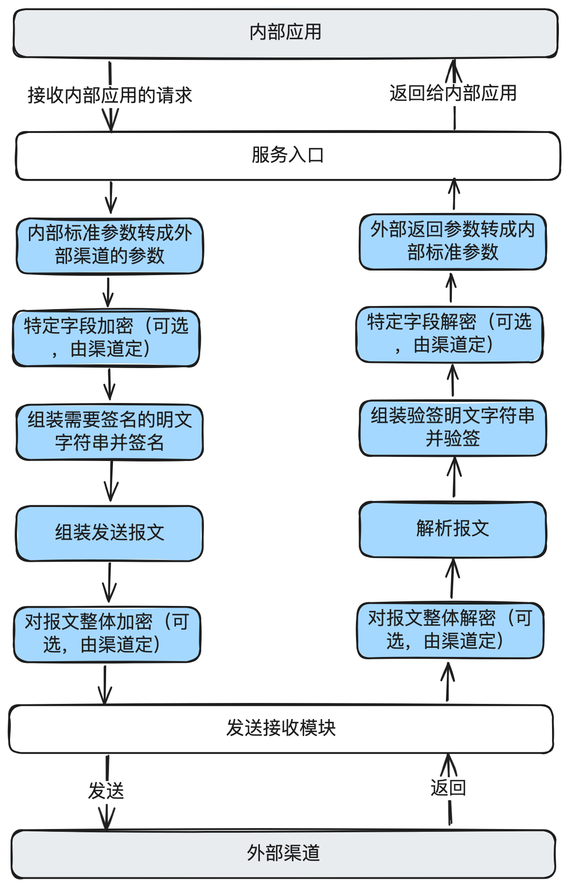

# 23.图解支付报文网关_一种低代码报文网关的设计思路与核心代码实现

所有的⽀付系统都对接了很多的外部⽀付、流出、外汇等各种类型的通道，这些通道的接⼝和报⽂

格式各异。今天和⼤家⼀起聊聊如何实现⼀种简洁⾼效的低代码报⽂⽹关设计，主要包括：报⽂⽹

关的定位，三种形态，低代码报⽂⽹关的设计思路，系统架构，核⼼代码实现。

如果你做过⽀付系统并写过脚本或代码对接过通道（渠道），或者你好奇如何通过低代码来对接外

部千奇百怪的渠道，欢迎⼀起探索。


## 1. 前⾔

在数字⽀付领域的深处，存在着⼀个关键的、却往往被忽视的英雄——报⽂⽹关。作为⽀付系统与

外部世界沟通的桥梁，报⽂⽹关承担着参数转换、报⽂组装与解析、安全加密、签名验签等多重重

要任务。

⼀般来说，⼩型公司可能根本就没有报⽂⽹关这⼀说法，直接引⼊HttpClient包，⼿撸⼏个类，就

把⼀个渠道对接搞定。稍⼤的公司，可能做⼀些模板⽅法的抽象，或者⼀些组件的抽象，也能实现

⼀定的⾼效接⼊及复⽤。但对于更⼤型跨国公司，如果接⼊的渠道有⼏百条，这样⼿写接⼊渠道，

往往伴随着代码⾼复杂性和⾼维护成本。因应这⼀挑战，"低代码报⽂⽹关"的概念应运⽽⽣。

在本⽂中，我们将⼀起探索这种低代码报⽂⽹关的创新设计。我们会从报⽂⽹关在⽀付系统中的⻆

色和重要性入手，然后深入探讨低代码报文网关的工作原理、，产品架构、3系统架构以及核心代码实

现。我们的⽬标不仅是理解其技术细节，更是领悟其背后的设计哲学——如何在保证系统强⼤功能

的同时，实现更⾼的接⼊效率和可维护性。

这篇⽂章旨在为⼴⼤⽀付技术从业者、软件开发者以及对⽀付系统感兴趣的读者们，提供⼀个全新

视⻆来理解和应⽤低代码报⽂⽹关。


## 2. 报⽂⽹关在⽀付系统中的定位


报⽂⽹关最核⼼的职责就是对接外部渠道的API接⼝，把内部的请求发出去，把渠道返回的数据转

成内部的参数。

这⾥⾯还涉及到很多技术细节，⽐如参数转换、签名验签、加密解密、报⽂组装解析，发送接收

等。

在前⾯的两篇⽂章中，我们介绍了渠道⽹关，两者的区别在于：

渠道⽹关：是⼀个更⼤范围的⽹关，还包括渠道路由、渠道开关、渠道咨询等能⼒。

报⽂⽹关：是渠道⽹关的⼀部分，只负责对接渠道的接⼝，⼩团队可能只是⼀个⼩模块，⼤团队可

能会独⽴出应⽤。

## 3.报⽂⽹关的⼏种形态

⼀般来说，从简单到复杂、从固定到灵活，报⽂⽹关会存在四种形态：

1. 纯⼿撸代码：

●在这种最初级的形态中，每个外部渠道都需要单独的代码实现。这意味着为每个新接⼊的银⾏

或⽀付服务，开发团队需要编写⼀套新的接⼝逻辑。

●优点：针对性强，可以精确控制每个渠道的交互细节。

●缺点：随着接⼊渠道的增多，代码变得越来越复杂，维护和扩展的成本急剧上升。

2. 模板⽅法报⽂⽹关：

●这种形态通过引⼊模板⽅法模式，将报⽂处理流程的共通部分抽象出来，为各个渠道提供统⼀

的处理框架，同时留有接⼝供具体渠道实现其特定逻辑。

●优点：提⾼了代码的重⽤性，降低了维护成本。

●缺点：对于⼀些特殊需求，模板⽅法可能仍然不够灵活，需要额外的定制。

3. 低代码报⽂⽹关：

○低代码报⽂⽹关把所有核⼼的代码逻辑实现后，只需要写⼏个配置⽂件，就可以完成渠道

的接⼊。

○优点：极⼤地提⾼了灵活性和易⽤性，加快了新渠道的接⼊速度，核⼼代码由有经验的资

深员⼯编写，减少出错可能性。

○缺点：复杂场景下可能需要写⼀些内联函数，造成了⼀定复杂度。

4. 产品化配置报⽂⽹关：

○在低代码报⽂⽹关基础上，提供图形化配置界⾯，进⼀步降低使⽤难度。

○优点：极⼤地提⾼了易⽤性，加快了新渠道的接⼊速度，以前写代码可能需要4、5天才接

⼀个接⼝，变成可能0.5天就能接⼀个接⼝。

○缺点：平台的初始研发成本很⾼，如果总体接⼊的渠道不多，ROI可能不⾼。

每种形态都反映了各公司在特定时期的技术⽔平和⽅案造型，但总体来说，对于中⼤型公司来说，

低代码报⽂⽹关和产品化配置报⽂⽹关是⼀个⽐较不错的选择。⼀⽅⾯可以提⾼效率，另⼀⽅⾯也

有足够的研发资源来建平台。

## 4.⼀种低代码报⽂⽹关设计思路




⾸先我们要知道报⽂⽹关核⼼只做这么⼏件事：

1. 接收内部应⽤的请求。

2. 内部标准参数转成外部渠道的参数。⽐如内部叫mobileNo，渠道可能叫：mobile_id。

3. 特定字段加密（可选，由渠道定）。

4. 组装需要签名的明⽂字符串并签名。

5. 组装发送报⽂，⽐如有json，kv，xml等。

6. 对报⽂整体加密（可选，由渠道定）。

7. 发送请求，并接收请求。

8. 对报⽂整体解密（可选，由渠道定）。

9. 解析报⽂。

10. 组装验签明⽂字符串并验签。

11. 特定字段解密（可选，由渠道定）。

12. 外部返回参数转成内部标准参数。

13. 返回给内部应⽤。

通过上⾯的流程分析，我们很容易想到流程引擎或责任链处理，再加⼀个上下⽂，就可以实现全部

的操作。

**具体包括：**

1. 可视化配置：提供直观的⽤户界⾯，允许⽤户通过图形化⽅式配置报⽂的处理流程，⽆需编写

复杂的代码。

2. 模块化处理逻辑：将报⽂处理的各个步骤模块化，如报⽂解析、加密/解密、数据映射等，⽤

户可以根据需要组合这些模块来构建完整的处理流程。

3. 灵活的适配能⼒：⽀持灵活地适配不同的⽀付渠道，包括但不限于银⾏接⼝、电⼦钱包、第三

⽅⽀付平台等。

4. 动态配置管理：所有配置信息动态管理，⽀持实时更新，⽆需重启系统或重新部署。

## 5.低代码报⽂⽹关的系统架构


---

说明：

1. 最上层是API：核⼼服务和管理服务分离。

2. 核⼼上下⽂：主要是⽤于保存接⼝配置，原始请求，中间处理结果等。

3. 核⼼处理Handler：参数转换、加密、解密等全部基础功能全部组件化。

4. 流程引擎：负责串起所有的Handler依次运⾏。

5. 内联函数：解决特殊场景下的报⽂转换。

6. 配置中⼼：配置内部接⼝，外部接⼝，参数映射等。

7. 流程管控：发布、回滚、权限管理等能⼒。

通过这种系统架构，低代码报⽂⽹关不仅能够提供强⼤灵活的配置能⼒，还能确保处理流程的稳定

执⾏，同时保持⾼度的可维护性。这样的架构使得报⽂⽹关能够适应不断变化的业务需求，同时降

低了总体的维护成本和技术复杂性。


## 6. 低代码报⽂⽹关的核⼼代码实现

代码实现有很多种⽅式，且报⽂⽹关也是⼀个独⽴的应⽤，把所有的代码展示出来也不太现实。这

⾥给出上⾯系统架构图中的核⼼代码示例。读者可以扩展实现细节，有兴趣的同学也可以私信我。

整体思路如下

1. 设计数据库表结构：⽤于存储内部接⼝定义，外部接⼝定义，接⼝映射关系，外部渠道参数

等。这部分在这⾥略过。

2. 设计运⾏上下⽂：GatewayContext（保存处理的上下⽂信息，包括接⼝配置、内部请求参

数、加解密临时数据、加验签临时数据、发送渠道报⽂、渠道返回原始报⽂、解析后报⽂

等）。

3. 设计各种处理Handler：内部参数转外部参数Handler，加密Handler，签名Handler，报⽂组

装Handler，发送Handler，报⽂解析Handler，验签Handler，解密Handler，外部参数转内部

参数Handler等。

4. 设计Handler⼯⼚类：GatewayHandlerFactory（通过getHandlers()获取处理的责任链）。

5. 设计内联函数：⽤于处理⼀些复杂操作。⽐如外部渠道返回的币种和⾦额两个字段转成内部的

⼀个Money类。这部分在这⾥略过。

下⾯是核⼼代码组件包括 GatewayContext 、 GatewayHandlerFactory 和⼀系列的 Ga

tewayHandler 基本实现：

GatewayContext 类⽤于保存处理过程中的上下⽂信息，包括临时参数、报⽂信息等。

```java
public class GatewayContext {

    private InterfaceInfo interfaceInfo;

    private Map<String, Object> originalRequestParam;

    private String requestParam;

    private String signPlanContext;

    // getter setter
//         ... ...
}
```

GatewayHandlerFactory 是一个工厂类，用于构建处理责任链

```java
public class GatewayHandlerFactory {

    /**
     * A static list that holds all the gateway handlers.
     * The list is initialized with a set of predefined handlers in the static block.
     */
    private static final List<GatewayHandler> handlers = new ArrayList<>();
    /**
     * Static initialization block that populates the handlers list.
     * The handlers are added in a specific order to ensure proper processing sequence.
     */
    static {
        handlers.add(new ParameterTransformHandler()); // Adds handler for parameter transformation
        handlers.add(new EncryptionHandler());         // Adds handler for request encryption
        handlers.add(new SignatureHandler());          // Adds handler for request signature verification
        // handler
        ... ...
      }
    public List<GatewayHandler> getHandlers() { // handler
        return handlers;
   }
  }
```

GatewayHandler 接口定义了处理逻辑的执行方法

```java
public interface GatewayHandler {
   void execute(GatewayContext context);
}

```

具体的 Handler 实现
内部参数转外部参数Handler

```java

public class ParameterTransformHandler implements GatewayHandler {
    @Override
  public void execute(GatewayContext context) {
  } 
}

```

签名Handler

```java
public class SignatureHandler implements GatewayHandleraOverridepublic void execute(GatewayContext context){
// 不需要签名
    if(!context.isNeedsign()) {
        return;
        context.setSignMessage(sign(context.getSignPlainContext(),
                context.getInterfaceInfo().getSignConf
                ig()));
//签名方法略
    }
```

其它Handler的实现略。
执行Service

```java
public class GatewayServiceImpl implements GatewayService {
 @Override
       public GatewayResponse execute(GatewayRequest request) {
         //
                   GatewayContext context = buildGatewayContext(request);

                   //


        List<GatewayHandler> handlers = GatewayHandlerFactory.getHandlers ();
        for(GatewayHandler hander : handlers) {
            hander.execute(context);
             }
         //
                   return convertResponse(context.getResponseParam);
         }

         //
         ... ...
}
```


这些组件和处理器共同构成了低代码报⽂⽹关的核⼼功能，允许系统灵活地配置和处理⽀付系统与

外部渠道之间的报⽂交换。通过这种设计，报⽂⽹关可以轻松适应不同⽀付渠道的接⼊和业务流程

的变更，同时⼤⼤减少了传统编码⽅式所需的开发和维护⼯作。


## 7. 结束语

在本⽂中，我们深⼊探讨了报⽂⽹关在⽀付系统中的重要性，从其在⽀付系统中的定位、不同形态

的发展，到⼀种具体的低代码设计思路，以及详细的系统架构。我们还看到了核⼼代码的实现，展

示了如何通过灵活的处理器和上下⽂管理，实现报⽂⽹关的关键功能。

产品化配置的低代码报⽂⽹关通过提供直观的配置界⾯和强⼤的后端处理能⼒，使得⽀付系统更加

灵活，能够快速适应新的⽀付渠道和业务模型。同时，它也降低了技术⻔槛，使得初始技术⼈员能

够更容易地参与到支付渠道的对接中，而不用担心技术太菜可能导致的各种各样的问题。

