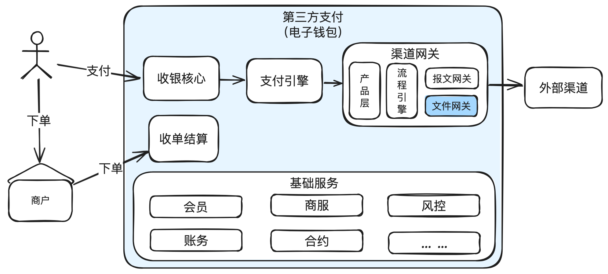
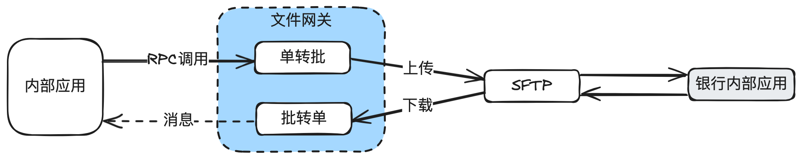
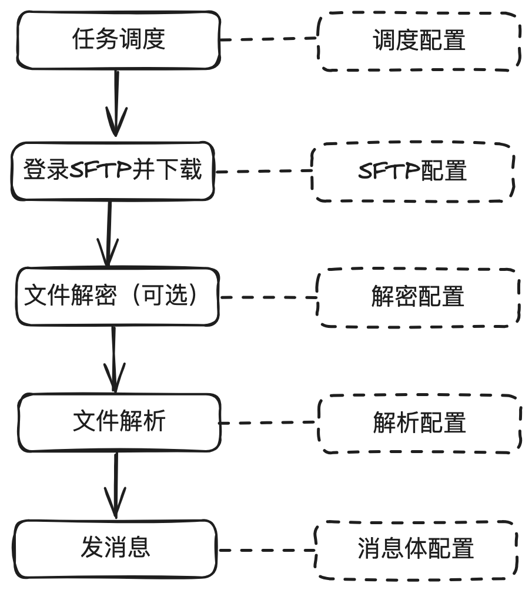
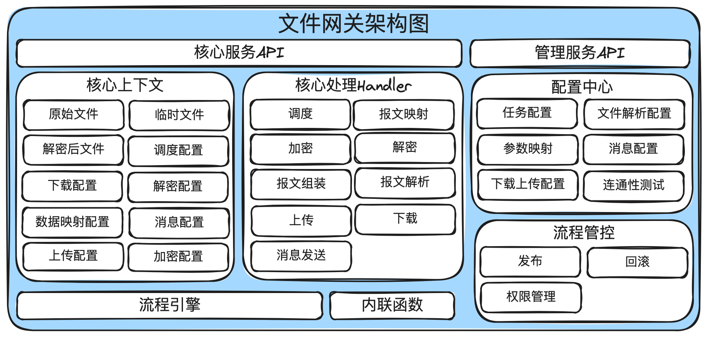

# 24.图解文件网关_文件交互的底座

在上⼀篇《图解⽀付报⽂⽹关：⼀种低代码报⽂⽹关的设计思路与核⼼代码实现》，我们深⼊讨论

了报⽂⽹关的设计与实现，今天和⼤家聊聊⽂件⽹关的设计与实现。

在这篇⽂章中，你可以了解到⽂件⽹关的作⽤，什么情况下⽂件⽹关需要独⽴部署，⽂件⽹关的⼏

种常⻅形态，如何抽象通⽤的模块进⾏复⽤。

## 1. 前⾔

在⽀付系统中，和外部银⾏通道⼀般有两种信息交互模式：

1. 实时报⽂交互：组装指定的格式（JSON，KV等）报⽂实时发给外部银⾏通道，银⾏⼀般是实

时返回结果，或异步通知返回结果。现在⼀般是通过https进⾏传输，以前还有直接通过

socket传输，现在很少⻅到。

实时报⽂交互⼀般⽤于⽀付通道的⽀付、退款、签约、解约等。

2. ⽂件交互：组装⽂件，发给外部银⾏通道，或者外部银⾏通道⽣成⽂件，供我⽅下载处理。⼀

般是通过SFTP进行传输，有些特殊的是通过邮件或https进行传输。

⽂件交互⼀般⽤于⽀付通道的清算⽂件，流出转账渠道的流出指令等。

## 2. 术语

1. ⽂件交互

⽂件交互是指⽀付平台与银⾏或其他⾦融机构之间通过⽂件形式进⾏数据交换的过程。与实时接⼝

（如API调⽤）相⽐，⽂件交互通常⽤于处理批量指令，实时性要求不⾼。常⻅的场景包括银⾏提

供的清算⽂件处理、流出转账的批量指令等。

2. ⽂件接⼝

⽂件接⼝是指⽀持⽂件格式数据交换的通信界⾯。在⽀付系统中，⽂件接⼝允许系统批量导⼊或导

出数据，如转账指令、清算数据等，通常以CSV、XML或其他特定格式的⽂件进⾏数据传输。

3. 批处理

批处理是指将⼀组数据或指令作为⼀个批次进⾏处理的过程。在⽀付系统中，批处理常⽤于处理⼤

量类似的交易或数据更新任务，如夜间批量处理银⾏清算⽂件或执⾏批量转账指令。

4. 批转单

批转单是将⼀批数据或指令分拆成单条进⾏处理的过程。⽐如外部银⾏的⼀个清算⽂件通常包含了

⼏百万条数据，把这些⽂件的内容解析后，⼀条条发给内部系统进⾏处理，就是批转单的应⽤。

5. 单转批

单转批是指将多个单独的指令聚合成⼀个批次进⾏统⼀处理的过程。⽐如流出转账指令，上游发下

来的是⼀条条单个转账指令，把这多个指令汇总成⼀个⽂件发给外部银⾏，就是单转批的应⽤。

6. PGP加解密

Pretty Good Privacy，是⼀种加密程序，⽤于信息传输的加密和解密，保证电⼦数据的安全性。

它通过使⽤公钥加密和私钥解密的⽅法，实现了信息的机密性和完整性，同时也⽀持数字签名以确

保信息来源的真实性。

有个形象的说法，PGP就像⼀个信封⼀样，不但加密保护⾥⾯的信息，还通过签名确定真实的来源

## 3.⽂件⽹关在⽀付系统中的地位

⽂件⽹关最核⼼的作⽤就是解决⽂件交互的问题。

再细化分为两种：

1. 单转批：把内部指令，打批成⼀个⽂件，然后上传到外部银⾏的SFTP上。

2. 批转单：把外部银⾏⽣成的⽂件，下载后并解析⼀条条内部需要的数据，然后发给内部应⽤处

理。

## 4. ⽂件⽹关在什么情况下需要独⽴应⽤

在⼀些⼩型⽀付公司，⼀般没有独⽴的⽂件⽹关，可能只是⼀个⼩模块，正常也是能运⾏的。

但是对于⼤型⽀付公司来说，和外部银⾏通道⼀天的交易可能有⼏千万笔，⼀个清算⽂件有上百

M，如果和实时交易系统共⽤应⽤，有可能会影响实时交易（⽐如⽀付业务），在这种情况，就需

要把文件网关独立出去。也就是实时交易和非实时交易拆分开，互相不影响。

## 5. ⽂件⽹关的⼏种形态

⼀般来说，从简单到复杂、从固定到灵活，⽂件⽹关和实时报⽂⽹关会⼀样，也存在四种形态：

1. 纯⼿撸代码：

●在这种最初级的形态中，每个外部⽂件都需要单独的代码实现。

●优点：针对性强，可以精确控制每个⽂件的交互细节。

●缺点：随着接⼊通道的增多，代码变得越来越复杂，维护和扩展的成本急剧上升。

2. 模板⽅法⽂件⽹关：

●这种形态通过引⼊模板⽅法模式，将⽂件处理流程的共通部分抽象出来，提供统⼀的处理框

架，同时留有接⼝供具体⽂件实现其特定逻辑。

●优点：提⾼了代码的重⽤性，降低了维护成本。

●缺点：对于⼀些特殊需求，模板⽅法可能仍然不够灵活，需要额外的定制。

3. 低代码⽂件⽹关：

○低代码⽂件⽹关把所有核⼼的代码逻辑抽象出来，每个⽂件只需要写⼀个配置⽂件，就可

以完成⽂件的对接。

○优点：极⼤地提⾼了灵活性和易⽤性，加快了新⽂件的接⼊速度，核⼼代码由有经验的资

深⼯程师编写，减少出错可能性。

○缺点：复杂场景下可能需要写⼀些内联函数，造成了⼀定复杂度。

4. 产品化配置⽂件⽹关：

○在低代码报⽂⽹关基础上，提供图形化配置界⾯，进⼀步降低使⽤难度。

○优点：极⼤地提⾼了易⽤性，加快了新⽂件的接⼊速度，以前写代码可能需要4、5天才接

⼀个⽂件，变成可能0.5天就能接⼊⼀个⽂件。

○缺点：平台的初始研发成本很⾼，如果接⼊的⽂件不多，ROI就不够⾼。

每种形态都反映了各公司在特定时期的技术⽔平和⽅案选型，但总体来说，对于中⼤型公司来说，

低代码报文网关和产品化配置报文网关是一个比较不错的选择。一方面可以提高效率，减少出错的

可能，另⼀⽅⾯也有⾜够的研发资源来建平台。

## 6. 低代码⽂件⽹关的设计思路

看过《图解⽀付报⽂⽹关：⼀种低代码报⽂⽹关的设计思路与核⼼代码实现》的同学可能知

道，实时报⽂的核⼼处理流程是固定的，其实⽂件⽹关的处理流程也是固定的。下⾯⽂件下载为例

说明设计思路，上传逻辑也是差不多的。

从上图可以看到，标准流程只有5个：

1. 任务调度：⼀天的什么时候执⾏，执⾏多少次等。⼀般使⽤CRON表达式来做。⽐如银⾏的清

算⽂件每天凌晨5点⽣成，那么⼀般设计任务在5点到7点之间执⾏，每30分钟尝试⼀次。

2. 登录SFTP并下载：⼀般是SFTP，也有可能是邮件，设计成接⼝就⾏。如果是SFTP，⼀般

SFTP的主机名，⽤户名，密码，⽬录，⽂件名规则等。其中⽂件名⼀般是每天变化，建议使

⽤正式表达式来做。

3. ⽂件解密：这个⼀般是可选的，有些银⾏可能会使⽤PGP加密，这种情况下，就先进⾏解密，

需要用到银行公钥进行验签，我方私钥进行解密。

4. ⽂件解析：根据银⾏接⼝⽂档，可能有XML，CSV，EXCEL等多种格式，相关的代码在⽹上

都有。最主要的是解析出我⽅需要的数据，⽐如银⾏可能叫：charge_no，我们内部叫：

pay_no，那就把对⽅的数据解析后并映射到内部的数据。

5. 发消息：根据消息体配置，把⼀条数据按照消息体的配置，组装成消息，通过消息中间件发出

去。

我们只需要把上⾯5个步骤所做的操作，全部抽象出单独的代码，然后通过配置⽂件来驱动即可。

## 7. ⽂件⽹关架构图

⼏点说明：

1. 核⼼上下⽂：把解决配置、临时变量等保存在上下⽂中，供后⾯流程引擎驱动⽂件的解析或打

批。

2. 核⼼处理Handler：把核⼼处理能⼒抽象成通⽤的Handler，⽐如上传下载，报⽂解析，报⽂

映射，消息发送等。

3. 流程引擎：把各handler组成⼀个责任链，依次执⾏。
4. 配置中⼼：提供产品化配置的能⼒。

5. 流程管控：解决发布和回滚问题。

## 8. 核⼼代码实现

核⼼的代码实现思路和报⽂⽹关基本是⼀致的，具体的代码实现是不⼀样的，详⻅：《图解⽀付报

⽂⽹关：⼀种低代码报⽂⽹关的设计思路与核⼼代码实现》。

另外的区别在于⽂件⽹关需要考虑任务调度，失败重试等，⽽报⽂⽹关是不需要考虑的，失败就由

上游发起重试。

实现有困难的同学可以私聊。

## 9. 常⻅问题及应对⽅案

⽂件⽹关主要处理批量⽂件，有⼏个特殊的地⽅需要重点考虑，否则在后续的运维过程中可能

是⼀头的包：

1. 任务分配不均

在分布式场景下，有多台服务器并发处理任务，如果调度系统设计不好，有可能部分服务器持

续⾼负载处理，部分服务器持续在闲置，⼀些任务⼀直在排队，⽆法得到及时处理。

⼀般这种情况下，最简单的做法，就是随机调度⼀台服务器执⾏。另⼀种做法就是轮询法，先

通过接⼝判断服务器当前状态是否空闲，如果正在执⾏任务，就找下⼀台，直到找到空闲的服务

器。

2. 任务踩踏与并发执⾏

所谓任务踩踏，就是⼀个任务执⾏的时间⾮常久，在还没有结束时，另外⼀台服务器（也可能

是同⼀台服务器）也被调度起来执⾏相同的任务，导致⼀个任务被两个服务器并⾏处理。

常⽤的解决⽅案，就是给任务加锁，但是加锁时需要设计超时释放。因为有可能任务跑到⼀半

服务器重启，如果锁不释放，这个任务就⽆法重新被捞取执⾏。

3. 瞬时超⼤并发流量

⽂件⽹关解析⽂件是很快的，有可能⼏分钟解析出⼏百万条数据，如果不做任何保护措施，有

可能瞬间对内部系统造成上万TPS的高并发压力，进而有可能影响在线实时业务的处理。

⼀般来说，⽂件⽹关不要通过RPC直接调⽤内部应⽤，⽽是通过消息的形式通知内部应⽤。主

要考虑：⽂件⽹关短时间内解析出⼤批量的数据，如果直接调⽤内部应⽤，内部应⽤如果不限流，

有可能把内部应⽤打到宕机，如果做了限流，⽂件⽹关还需要做调⽤失败重试。

如果通过消息中间件的形式通知内部应⽤，⼀⽅⾯可以由内部应⽤根据⾃⼰的能⼒来控制数据

消费的速度，另⼀⽅⾯可以由消息中间件来缓存数据，⽆论是⽂件⽹关还是内部应⽤的实现都可以

做得⽐较简单。

4. 通过RPC还是消息交互

如果是内部应⽤调⽤⽂件⽹关，建议使⽤RPC调⽤，这样⽐较简单。⽐如流出打款的指令。

如果是⽂件⽹关调⽤内部应⽤，建议使⽤消息中间件。解决⽂件⽹关瞬时超⼤并发流量对内部

应⽤的冲击问题。

5. 任务恢复与重试

对于⼤⽂件的执⾏，有可能执⾏⼀半服务器就被重启，这种情况下就需要做任务恢复，对应

的，上下游都需要做好幂等设计，因为部分数据可能会被重复解析并发送。

6. 异常单据处理

外部银⾏通道⽣成的⽂件，有可能因为系统BUG导致⽣成的部分数据的格式或内容有问题，

⽆法正常解析。

常⽤的解决⽅案⼀般也是两种：1）记录有问题的数据，继续往下执⾏。2）任务终⽌，等外部

银⾏修复⽂件后，重新执⾏。

⼀般是建议记录后，继续执⾏。主要是考虑外部银⾏修复会⽐较慢，有问题的数据放在差异⾥

⾯去处理更好。

另外，对于部分数据缺失的场景，我们还可以主动补⻬数据。⽐如正常情况下，外部银⾏通道

需要给我⽅单号，银⾏单号，⾦额，币种等数据，假如⼀个包含⼏百万条数据的⽂件中有5条数据

没有给我⽅单号，但是银⾏单号、⾦额、币种都能对上，那么我们就⾃⾏补全我⽅单号就⾏。没必

要⾮得从⼏百万条数据中取出5条让银⾏补上。

6. 顺序执⾏与并发执⾏

对于银⾏的清算⽂件来说，系统正常是按顺序执⾏的，⽐如先解析20240101的数据，再解析

20240102的数据，如果在解析20240101数据出现问题，通常也有两种⽅式：⼀、卡住，等

20240101处理完成，才处理20240102。⼆、不管20240101失败，继续处理20240102的数据。

这⾥体现的是两种思维⽅式：顺序执⾏与并发执⾏。⼀般来说，推荐使⽤并发执⾏，⼀个任务

失败，不要影响另⼀个任务。

## 10. 结束语

在本⽂中，我们探讨了⽂件⽹关在⽀付系统中的定位、不同形态的发展，到⼀种低代码设计思路，

以及对应的系统架构。⼀个完整的⽂件⽹关代码量⽐较多，这⾥没有贴，后⾯在⼀些技术专题的拆

解中，再贴上⼀些代码供参考，⽐如讲⼯⼚模式，讲责任链模式。因为整体代码没有什么特别难的

地⽅，⽆外就是把原理想清楚，加上⼀些常⻅的设计模式就能实现。

