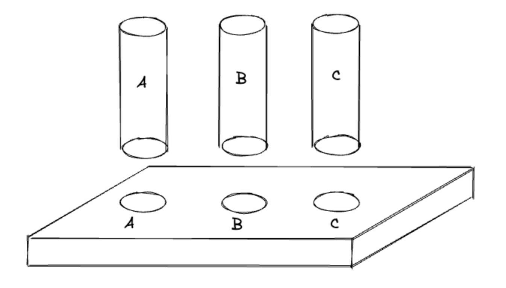
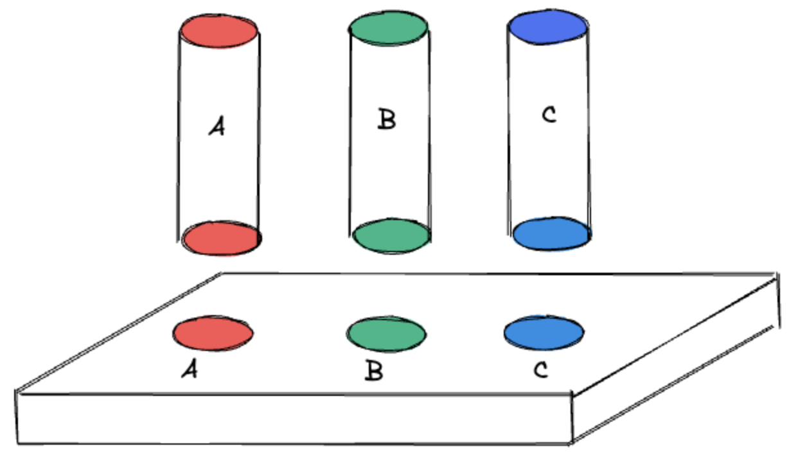
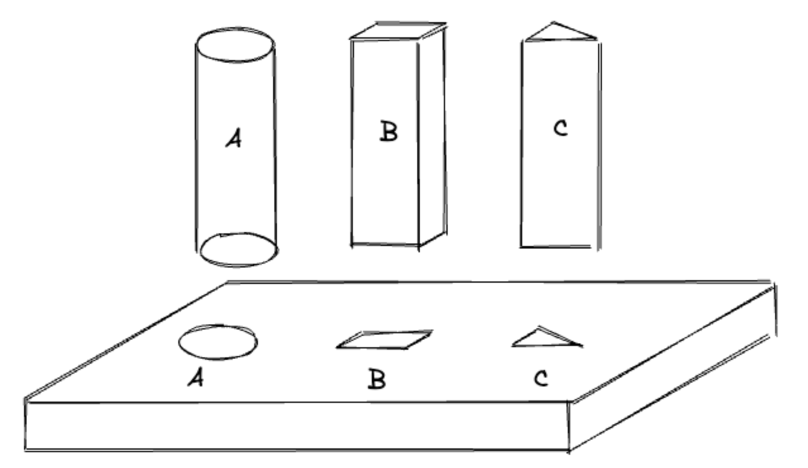
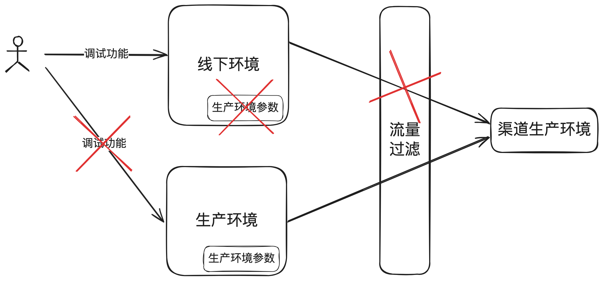

# 28.一种行之有效的防错策略_在支付系统中实施防呆设计的实践

聊个⽀付⼈都会碰到的问题：资损防控。做⽀付如果还没有碰到过资损，那就是做得时间还不够

久。资损防控是⼀个很⼤的话题，需要开⼏篇⽂章才能讲完，今天只从⼀件⼩事⼊⼿聊⼀个简单⽽

⼜⾏之有效的防错策略：防呆设计的实践。

## 1. ⼀个线上事故

曾经处理过⼀个资损事件，很典型，值得说道说道。

⼀个研发同学在线下测试环境做测试，为图⽅便，直接从⽣产捞取⼀段⽇志的参数做为请求参数，

不幸的是，线下测试环境竟然配置了外部第三⽅的⽣产环境参数，导致真实资⾦被错误地转⼊个⼈

账户，造成了平台的资⾦损失。尽管损失⾦额不⼤，但由于操作不规范，事件的性质⾮常严重。

这类事件出来后，通常会发起所谓的复盘，然后给出⼀堆的整改措施，流程规范、管理制度、设计

优化等。我们今天抛开那些⼤⽽全（或者华⽽不实）的整改措施，单单聊聊如何通过“防呆设

计”来预防此类事件的发⽣。

## 2. 防呆设计定义及在⼯业界的应⽤

“防呆设计”（⽇语：ポカヨケ poka yoke）是⼀种预防性设计策略，⽬的是通过限制⽅法减少错

误的发生。用户在无需额外注意力、经验或专业知识的情况下，也能准确无误地完成操作。

这个概念起源于⽇本，被⼴泛应⽤于丰⽥汽⻋的⽣产过程中，随着时间的推移，已成为全球范围内

⼴泛采⽤的设计策略。

在⼯业设计中，防呆设计的例⼦⽐⽐皆是。例如，USB接⼝的设计确保了只有正确⽅向才能插

⼊，⽽Type-C接⼝则进⼀步简化，⽀持双⾯插⼊。

第⼀版：使⽤字⺟标识，容易出错。

第二版：使用颜色标识，减少出错。

第三版（防呆）：不同形状只能插到不同的位置，想错都错不了。

## 3.针对事故的防呆设计措施

---

再说回到开头所说的故障，我们应该使⽤“防呆”设计的思想，彻底阻断使⽤者犯错的可能性。具

体怎么做呢？如下：

1. 环境隔离：确保所有测试环境均配置为外部渠道的测试参数，防⽌测试操作影响真实交易环

境。

2. 流量控制中间件：在系统中集成⼀个流量控制中间件，维护⼀个外部渠道的⽣产环境⽩名单。

通过中间件筛选请求来源，若来源于测试环境，则⾃动阻断请求。

3. 禁⽤线上环境的直接操作：关闭线上环境调试、⼿动直接调⽤能⼒。

4. 增加操作审核：对线上环境的操作引⼊审核机制，由具备⻛险控制能⼒的团队成员负责审核。

通过实施上述防呆措施，即使是经验不⾜的新员⼯也能避免类似的资损⻛险。防呆设计并⾮只是解

决问题的⼿段，⽽是⼀种预防性策略，旨在通过系统设计减少⼈为错误的可能性。

## 4. ⽀付系统中防呆设计的应⽤

在⽀付⾏业中，防呆设计随处可⻅，举⼏个例⼦：

1. 拆分输⼊框：信⽤卡绑卡⻚⾯将有效期拆分为两个输⼊框，分别⽤于输⼊⽉份和年份，从⽽减

少输⼊错误。把⽤户的First Name和Last Name分开两个输⼊框。（我还真⻅过有⽀付平台提

供的First Name和Last Name使⽤⼀个输⼊框，导致信⽤卡绑卡成功率持续很低）。

2. 自动超时退出：在线支付系统在用户一段时间内无操作时，会自动退出，以防止未经授权的使⽤

3. 限制尝试次数：⽀付系统会限制密码或验证码输⼊错误的次数，超过限制会暂时锁定账户，以

防试图破解。

4. 防⽌重复提交：为防⽌⽤户多次点击造成重复交易，⽀付系统通常会在⾸次点击后禁⽤提交按

钮

5. 可视化的交易流程：针对新⽤户第⼀次使⽤时给出指引⻚⾯，通过图形化界⾯展示交易流程，

帮助⽤户轻松理解每⼀步操作。

## 5. 结束语

从业多年，⻅过太多的线上故障，得到⼀个朴素的道理：“⼈都是不可靠的，如果能通过系统解决

的，就⼀定不要依赖⼈或流程来解决。”多引⼊⼀些防呆设计，让再“呆笨”的⼈都没有出错的可能

性，那么系统就是健壮的，也就没有那么多的线上应急和复盘。

