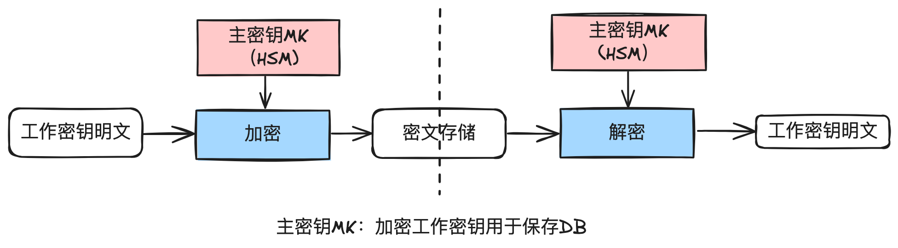

# 29.图解金融级密钥管理系统_构建支付系统的安全基石

经常在⽹上看到某某公司⼏千万的个⼈敏感信息被泄露，这要是放在持牌的⽀付公司，可能就是⼀

个⾮常⼤的麻烦，不但会失去⽤户的信任，⽽且可能会被吊销牌照。⽽现实情况是很多公司的技术

研发⼈员并没有⾜够深的安全架构经验来设计⼀套⾼度安全的密钥管理系统。

今天我们解构⾦融级别的密钥管理系统设计与实现，讲清楚如何设计密钥分级体系，密钥轮换机

制，如何兼顾存储安全与运算速度，跨机房容灾⽅案等技术细节。

安全⾏业有句俗话：“密钥的价值等于数据的价值”，如果你对数据安全感兴趣，或想加固⾃⼰公

司的数据安全级别，或好奇金融级别的安全体系相关知识，欢迎和墨哥一起探索如何设计一个金融

级的密钥管理系统。

## 1. 前⾔

在当今数字化经济的浪潮中，⽀付系统扮演着极其关键的⻆⾊，⽀付系统⾯临的安全挑战也⽇益增

加，尤其是数据泄露事件频发，对信任机制和整个⽀付⽣态系统构成了严重威胁。在这样的背景

下，⾼度安全的⾦融级密钥管理系统（KMS）的作⽤变得尤为重要，它是确保⽀付系统安全的关

键技术之⼀。

密钥管理系统涵盖了密钥的⽣命周期管理，包括密钥的⽣成、分发、使⽤、存储、轮换和销毁等环

节，旨在通过严格的安全措施保护密钥不被未授权访问，从⽽确保交易数据的安全。当然，有效的

密钥管理不仅仅是技术问题，它还涉及到政策、流程、⼈员等多个⽅⾯，需要系统性的设计和实

施。

本⽂旨在通过图解的⽅式，深⼊浅出地介绍⾦融级密钥管理系统的设计和实现，帮助读者理解其在

构建安全⽀付系统中的关键作⽤。我们将从密钥管理的基本概念出发，逐步深⼊到产品架构、系统

架构、部署架构以及设计细节等多个层⾯，全⾯展示如何在⽀付系统中实施有效的密钥管理策略及

应⽤。

希望通过本⽂的介绍，能够为在线⽀付系统的⼯程师、架构师们提供实⽤的参考指南。

## 2. 术语

在深⼊探讨密钥管理系统（KMS）之前，理解以下核⼼术语对于把握整个系统的设计和功能⾄关

重要，它们构成了加密和密钥管理领域的基本词汇，是进⼀步讨论的基础。

1. 密钥（Key）：

密钥是⼀串⽤于加密和解密数据的信息，是保护数据不被未授权访问的基础。根据⽤途和级

别，密钥可分为主密钥、工作密钥等。

2. 主密钥/本地主密钥（Master Key / Local Master Key）：

作为密钥管理体系中最⾼级别的密钥，主密钥⽤于加密和保护其他密钥（如⼯作密钥）。由于

其重要性，通常由硬件加密机（也称为：硬件安全模块（HSM））⽣成和存储，确保其安全

性，所以也经常称为本地主密钥。

3. 区别主密钥（Zone Master Key）：

区别主密钥，⽤于密钥传输前的加密。⽐如要把⼯作密钥传输到各安全服务中⼼，就需要使⽤

ZMK先加密⼯作密钥。⼀般使⽤公私钥来做，后⾯有详细说明。

4. ⼯作密钥（Working Key）：

直接⽤于业务数据的加解密操作。⼯作密钥由主密钥加密保护，以保障其安全。

5. 数据加密密钥（Data Encryption Key，DEK）：

专⻔⽤于加密和解密业务数据的密钥。在某些⽂献中，⼯作密钥和数据加密密钥可以是同⼀概

念。

6. 密钥加密密钥（Key Encryption Key，KEK）：

专⻔⽤于加密和解密⼯作密钥的密钥。在分布式环境下，我们需要把⼀些⼯作密钥缓存在各机

房的安全服务中⼼，就使⽤KEK加密后缓存，⽽不是缓存明⽂。

7. 硬件安全模块（Hardware Security Module，HSM）：

⼀种物理设备，专⻔⽤于⽣成、存储和管理数字密钥。就是我们俗称的硬件加密机。HSM提

供了物理隔离和⾼级安全功能，确保密钥的安全。 ⼀般只能由特定授权的公司才能⽣产。在

银⾏业，执牌⾦融机构基本都需要使⽤硬件加密机。

8. 密钥⽣命周期（Key Lifecycle）：

描述了密钥从⽣成到销毁整个过程中的各个阶段，包括⽣成、分发、激活、使⽤、轮换、废弃

和销毁等。

9. 密钥轮换（Key Rotation）：

定期更换密钥的过程。通过轮换密钥，可以减少密钥被破解的⻛险，增强系统的安全性。

10. 双因素认证（Two-Factor Authentication，2FA）：

⼀种安全措施，要求⽤户提供两种不同形式的身份验证，通常是密码和物理令牌或⼿机接收到

的⼀次性密码（OTP），⽤于增强安全性。 ⽐如在硬件加密机维护时，需要⽤户插⼊管理

卡，并输⼊密码。

11. 数字签名（Digital Signature）：

使⽤私钥签名，公钥验签。⽤于验证消息或⽂档的完整性和来源的真实性。

12. 加密（Encryption）：

数据保护⼿段，将明⽂数据通过特定的算法和密钥转换成密⽂数据，需要解密后才能再次读取

明文数据。常见的加密算法包括AES、RSA等。

这些术语部分不好理解，补充⼏个图如下：

主密钥⽣成与保存：硬件运算⽣成，保存到安全芯⽚。

主密钥作⽤：加密⼯作密钥，⽤于保存DB.

⼯作密钥：⽤于加密业务明⽂数据。

区域主密钥：加密工作密钥用于传输。

密钥加密密钥：加密⼯作密钥⽤于缓存，加速本地运算。

---

## 3. 建设⽬标

在设计和实施密钥管理系统（KMS）时，需要达成以下主要⽬标：

1. 确保数据安全：最核⼼的⽬标是保护⽀付系统中敏感数据的安全，防⽌数据泄露、篡改或未

授权访问。密钥管理系统应确保所有需要加密的业务数据在存储和传输过程中均经过加密保

护。

2. ⽀持密钥全⽣命周期管理：系统应提供密钥的⽣成、分发、使⽤、存储、轮换、废弃和销毁

等全⽣命周期管理功能，确保密钥的安全性和有效性。

3. 满⾜合规性要求：遵守相关的⾏业安全标准和法律法规，确保⽀付系统的合规性。

4. 提⾼系统可⽤性和灵活性：通过⽀持密钥的快速轮换和备份恢复功能，提⾼系统对密钥泄露

等安全事件的响应能⼒，保障业务连续性。

5. 简化管理⼯作和降低运营成本：通过⾃动化的密钥管理流程和直观的管理界⾯，简化管理员

的操作，降低管理成本和运营成本。

6. ⽀持多种密钥类型和算法：适应不同加密需求，⽀持多种密钥类型和加密算法，提供灵活的

密钥解决⽅案。

7. 实现⾼性能和可扩展性：保证在⾼并发场景下的性能需求，⽀持业务的快速增⻓和系统的横

向扩展。

8. 提供强⼤的访问控制和审计功能：实现基于⻆⾊的访问控制（RBAC），记录详细的操作⽇

志，⽀持安全审计和事后分析。

9. ⽤户友好的操作界⾯：提供直观易⽤的管理界⾯，降低操作复杂度，提⾼⽤户体验。

10. ⽀持灾难恢复和数据备份：构建⾼可⽤的密钥管理架构，实现密钥的及时备份和灾难恢复，

确保关键业务数据的持久安全。

上⾯写得有虚，但确实是指导思路，⼀个完备、安全的密钥管理系统需要达到上述要求。

## 4. 系统架构

简化版本系统架构：

在密钥管理系统中，因为考虑分布式与安全⽹络隔离的问题，所以需要分开设置三个⼦系统：

1. 安全服务中⼼：提供加密、解密、签名、验签、访问控制等基础能⼒。可⽔平扩展。

2. 密钥存储中⼼：负责密钥的存储、轮换等基础能⼒。独⽴⽹络隔离区。

3. 管理中⼼：提供后台管理能⼒，⽐如配置密钥、授权密钥给应⽤，对接硬件加密机（HSM）等

4. 硬件加密机（HSM）：负责保存主密钥，并对⼯作密钥进⾏加密。

在下⾯的部署架构中，我们回看这个图，就明⽩为什么要切成三个。

另外，⾥⾯的⼦功能设计，可以参考后⾯的“设计细节”章节。

详细功能的系统架构：

## 5. 部署架构

在构建密钥管理系统（KMS）时，部署架构的设计直接影响到系统的可⽤性、扩展性和安全性。

对于支付系统而言，必须考虑到业务的高可用性和灵活性需求，采用分布式部署架构是一种必然的选择。

核⼼设计原则

1. ⾼可⽤性：通过在多个数据中⼼分布式部署密钥管理系统的实例，即使某个数据中⼼发⽣故

障，其他实例仍然可以提供服务，从⽽保证系统的⾼可⽤性。

2. 灵活扩展性：随着业务量的增⻓，系统可以通过增加节点的⽅式横向扩展，灵活应对业务需

求的变化。

3. 数据⼀致性：采⽤先进的数据同步技术，确保各节点间密钥信息的⼀致性，避免数据不⼀致

导致的安全问题。

4. 安全隔离：在不同的物理位置部署密钥管理服务，可实现安全隔离，降低单点攻击的⻛险。

5. 灾难恢复：通过地理上分散的部署，结合有效的备份和恢复策略，确保在发⽣灾难时可以快

速恢复服务。

分布式部署架构

1. 中⼼管理节点：负责整个密钥管理系统的中⼼控制，包括策略制定、访问控制、审计⽇志等

核⼼管理功能。

2. 区域管理节点：在各个地理区域部署，负责处理该区域内的密钥请求，实现数据处理的地理

近邻性，优化响应时间。

3. 数据同步机制：确保所有区域管理节点间的数据⼀致性和实时性，采⽤可靠的数据同步技

术，如同步复制或异步复制。

4. 安全⽹络：所有节点通过安全的⽹络连接，确保数据传输的安全性和加密，防⽌数据在传输

过程中被截获或篡改。

下面是一个部署简图：

---

⼀时没有找到防⽕墙常⽤图标，先将就着看。

核⼼要点：

1. 密钥存储中⼼和硬件加密机部署在隔离区。

2. 管理中⼼部署在管理区或者隔离机房，建议参考安全团队的建议。

3. 安全服务中⼼部署在各应该APP所在机房，就近提供加解密、签验签等运算服务。可⽔平扩

展。

4. 安全服务中⼼有本地缓存，在隔离机房短时间内⽆法连接时，仍然可以正常提供服务。

## 6. 设计细节

### 6.1.数据流图

---

数据流图

核⼼有4个步骤：

1. 初始化主密钥。

2. 配置⼯作密钥。

3. 同步⼯作密钥到各节点的安全服务中⼼。

4. 实际执⾏加密解密、签名验签服务。

### 6.2. 密钥分级设计

---

在构建⽀付系统的密钥管理系统（KMS）时，密钥分级设计是确保密钥安全性的基础。通过将密

钥分为不同的级别并应⽤不同的管理和保护策略，可以有效地降低密钥泄露的⻛险，提升系统的安

全性。以下是密钥分级设计的核⼼要素：

1. 主密钥/本地主密钥（Master Key / Local Master Key）：

○级别：最⾼级别，作为其他密钥的根密钥。

○保护：存储于硬件安全模块（HSM）中，采⽤物理和逻辑双重保护机制，确保其安全性。

○⽤途：⽤于加密和解密⼯作密钥，不直接参与业务数据的加解密。

○管理：由最⾼权限的安全管理员进⾏管理，严格控制访问和操作。维护时⼀般需要3名管

理员+1名操作员同时在场，管理员和操作员都有⾃⼰的物理管理卡和独⽴操作密码，全部

验证通过后才能操作。

2. ⼯作密钥（Working Key）：

○级别：次级别，⽤于实际的业务数据加解密操作。

○保护：由主密钥加密保护，存储在加密数据库或安全配置⽂件中。

○⽤途：直接⽤于加密和解密业务数据，例如⽤户信息、交易数据等。

○管理：⽀持⾃动轮换和更新，减少⼿动⼲预，提⾼管理效率和安全性。

需要说明的是，严格意义上说，区域主密钥也是保存在硬件加密机中的。但在实现时，如果在区域

节点不想部署硬件加密机，就可以⽣成公私钥对，把私钥放在区域节点，公钥放在密钥存储中⼼。

密钥分级设计的优势：

●分层保护：通过对密钥进⾏分级管理，构建了多层防御体系，即便低级别密钥被泄露，也不会

直接威胁到系统的根本安全。

●灵活管理：主密钥和⼯作密钥的分离，使得密钥轮换和更新更加灵活⾼效，同时减少了主密钥

的使⽤频率，降低了安全⻛险。	

●性能与安全的平衡：通过在不同层级应⽤不同的密钥，可以在保证安全的前提下，优化系统性

能，特别是对于⾼频率的业务数据加解密操作。因为硬件加密机的运算效率有限，且采购及运

维成本⾼昂，不便于⽔平扩展。

密钥分级设计是构建⾼安全性⽀付系统不可或缺的⼀环，它为密钥的安全管理提供了⼀套完整的框

架。

### 6.3. 访问控制

在构建⽀付系统的密钥管理系统（KMS）中，实现严格的访问控制机制是保障系统安全的关键。

访问控制的主要⽬的是确保只有授权⽤户或应⽤才能访问和操作密钥，同时保护密钥不被⾮法导出

或滥⽤。以下是访问控制的三个核⼼部分：

1. ⽤户分级管理

●⽤户⻆⾊和权限：系统应定义不同的⽤户⻆⾊，每种⻆⾊具有不同的权限级别。例如，系统

管理员拥有最⾼权限，可以管理⽤户和密钥策略；安全管理员负责主密钥的管理，包括⽣成、

备份和恢复等操作；普通⽤户只能使⽤⼯作密钥进⾏⽇常的加解密操作。

●主密钥操作的物理安全：主密钥的操作，如⽣成、备份和恢复，只能由特定的安全管理员在

物理安全的环境下通过硬件安全模块（HSM）直接操作。这样的操作需记录详细的审计⽇

志，并且在执⾏关键操作时需要多⼈同时在场。

●⼯作密钥的审批流程：导出⼯作密钥或进⾏敏感操作时，需要通过多层审批流程。审批流程

中涉及的每⼀步都应有清晰的操作记录和⽇志，以便于事后审计和追踪。

2. 密钥与应⽤的绑定

●应⽤级访问控制：每个密钥应指定可访问的应⽤列表。只有列表中的应⽤才能使⽤对应的密

钥进⾏加解密或签名验签操作。这样可以有效防⽌密钥被⾮授权应⽤使⽤，增强密钥的安全性

●密钥使⽤策略：对于每个密钥，可以定义详细的使⽤策略，包括使⽤的时间窗⼝、IP地址范

围、访问频率等。这些策略可以在KMS中配置，并由系统强制执⾏。 但因为主要提供内⽹应

⽤使⽤，⼀般很少这么限制。

3. 加密解密和签名验签的集中处理

●密钥的集中处理：所有的加密解密和签名验签操作都应通过密钥管理系统集中完成。通过API

调⽤或服务接⼝的形式提供给外部应⽤，避免直接暴露密钥。

●⼯作密钥的保护：⼯作密钥应始终存储在加密形式，且不能被导出或直接读取。所有密钥操

作都在KMS内部完成，确保密钥的安全。

通过这种分层的访问控制机制，结合⽤户分级管理、密钥与应⽤的绑定以及加密解密和签名验签的

集中管理，可以有效地保护密钥不被未授权访问和使⽤，从⽽为⽀付系统提供坚实的安全保障。

### 6.4. ⼯作密钥版本管理

在密钥管理系统（KMS）中，⼯作密钥版本管理是⼀个关键的安全措施，主要通过定时轮换机制

来增强系统的安全性。此机制确保即使旧密钥被泄露，攻击者也⽆法利⽤它来破解过去或未来的加

密数据。以下是⼯作密钥版本管理的主要⽅⾯：

定义密钥版本

●版本命名：为每个⼯作密钥定义唯⼀的版本标识符，通常包括密钥ID和版本号。

●版本属性：记录每个版本的关键属性，如创建时间、启⽤时间、过期时间和状态（激活、过

期、废弃）。

定时轮换机制

●⾃动轮换：通过预设的策略⾃动轮换⼯作密钥。例如，根据最佳实践或合规要求，可以设置

每三个⽉⾃动⽣成新的⼯作密钥版本并切换⾄新版本。

●轮换通知：在轮换发⽣前，系统应发送通知给相关的系统管理员和应⽤，确保它们准备好迁

移到新的密钥版本。

●平滑过渡：在新旧版本切换期间，保持旧版本的可⽤性⼀段时间，以便完成未处理的加密操

作，然后逐步淘汰旧版本。

版本回滚

●应急回滚：在发现新版本密钥存在问题时，系统应⽀持快速回滚⾄前⼀个稳定版本，以保障业

务连续性。

密钥版本跟踪与审计

●版本历史记录：维护每个⼯作密钥的版本历史记录，包括每个版本的使⽤情况和更换原因。

●审计⽇志：记录所有密钥版本操作的详细审计⽇志，包括版本创建、启⽤、废弃和删除等，

以⽀持安全审计和合规性检查。

⼀个简单的实现⽅案

对于内部数据，直接在密⽂的前⾯加上5位数的版本号。这样数据和密钥版本就形成⼀个绑定关系。

通过实施⼯作密钥版本管理和定时轮换机制，KMS能够有效降低密钥泄露的⻛险，提升⽀付系统

的整体安全性。此外，该机制还有助于满⾜⾏业安全标准和合规要求，如PCI-DSS等，进⼀步保

护敏感数据的安全。

### 6.5. 隔离部署

隔离部署是加强⽀付系统密钥管理系统（KMS）安全性的⼀个重要策略，它通过物理或逻辑⼿

段，将敏感组件和操作环境与其他系统部分分离，从⽽减少潜在的安全威胁和⻛险。以下是实施隔

离部署的关键考虑因素：

物理隔离

●硬件安全模块（HSM）部署：将存储和管理主密钥的硬件安全模块（HSM）物理隔离在受控

的安全环境中，例如专⽤的安全机房。这样做不仅提⾼了主密钥的安全性，⽽且防⽌了未经授

权的物理访问。

●独⽴的密钥管理⽹络：建⽴⼀个独⽴的⽹络环境专⻔⽤于密钥管理操作，与⽣产⽹络和办公

⽹络隔离，避免潜在的跨⽹络攻击。

⽹络隔离

●防⽕墙和⽹络分段：使⽤防⽕墙和⽹络分段技术，将密钥管理系统与外部⽹络及其他内部系

统分离，防⽌潜在的⽹络攻击和数据泄露。

●加密通信：确保所有进出密钥管理系统的⽹络通信都采⽤加密协议，如TLS，保护数据传输

的安全性。

数据隔离

●敏感数据加密：确保存储和传输的所有敏感数据（包括密钥和加密的业务数据）都经过加

密，即使数据被⾮法访问，也⽆法被解读。

●备份与恢复策略：对密钥和关键配置数据实施定期备份，并将备份数据存储在与⽣产环境隔

离的安全位置，同时确保快速恢复能⼒以应对可能的灾难事件。

通过实施隔离部署策略，KMS能够有效地降低安全威胁，提⾼⽀付系统的整体安全性和稳定性。

隔离部署不仅有助于防御外部攻击，也能减轻内部错误或滥⽤所带来的⻛险。

### 6.6. 性能设计

在密钥管理系统（KMS）的设计中，性能是⼀个不可忽视的关键要素。⼀个⾼性能的KMS能够保

证在密钥⽣成、存取、更新以及加密服务的过程中，响应迅速，满⾜⽀付系统等⾼并发环境下的需

求。以下是构成KMS性能设计的主要策略：

缓存机制

●密钥缓存：对频繁访问的⼯作密钥和会话密钥实施缓存，减少对密钥存储库的直接访问，也减

少对硬件加密机的访问，提⾼响应速度。使⽤合适的缓存策略（如LRU算法）来管理缓存密钥

的⽣命周期，确保密钥的即时更新和过期密钥的清除。同时

负载均衡与⽔平扩展

●请求分发：采⽤负载均衡技术在多个KMS节点之间分发请求，平衡系统负载，提⾼处理能

⼒。⼀般的分布式部署架构都⽀持。

●⽔平扩展：因为⼯作密钥被缓存在本地运算节点，所以安全服务中⼼可以⽔平扩展，⽽不受限

于硬件加密机。

并⾏处理

●多线程操作：加解密等这些操作是运算优先型业务，应减少线程数，以减少CPU的切换损耗。

通过上述性能设计策略，KMS能够满⾜⾼并发、低延迟的性能要求。以前实测下来，单机AES加

解密能到2万左右的QPS。

### 6.7. 容灾设计

在构建密钥管理系统（KMS）时，容灾设计是确保系统在⾯对硬件故障、软件错误、⼈为操作失

误或⾃然灾害等情况下仍能保持业务连续性和数据完整性的关键。以下是容灾设计的核⼼要素：

**数据复制与同步**

●跨地域复制：为了保证数据的⾼可⽤性和持久性，重要数据（包括密钥材料、配置信息等）

应跨多个地域进⾏复制。使⽤实时数据复制技术确保各地域数据的⼀致性。

●异地备份：定期将关键数据异地备份，以防单点故障导致的数据丢失。备份数据应加密存

储，以保护其安全性。

**⾃动故障转移**

●故障检测与⾃动转移：实现系统的⾃动故障检测机制，⼀旦检测到服务异常或系统故障，能

够⾃动将请求转移到备⽤系统或节点，确保服务不间断。

●负载均衡：通过负载均衡技术分配请求到健康的服务节点，提⾼系统整体的稳定性和可⽤性。

**系统冗余设计**

●冗余硬件：在关键组件上采⽤冗余设计，⽐如同⼀机房需要部署多台硬件加密机（HSM），

以减少单点故障的⻛险。

●服务冗余：部署冗余的服务实例，包括数据库、应⽤服务器等，确保任何单⼀实例的故障都

不会影响到整个系统的运⾏。 这也是在线服务部署的常规动作。

**容灾演练**

●定期演练：定期进⾏容灾演练，验证和改进容灾计划的有效性，确保在真正的灾难发⽣时能

够快速、有效地恢复服务。

●演练反馈：对容灾演练的结果进⾏分析，并根据反馈优化容灾计划和技术⽅案。

通过上述容灾设计措施，KMS能够在⾯对各种不可预测的故障和灾害时，保证密钥服务的持续可

⽤性和数据的完整性，为⽀付系统等关键业务提供坚实的安全基础。

## 7. 常⻅误区

在⼯作和同事的交流中，发现对于密钥的保存和使⽤有⼏个常⻅误区：

1. 硬编码密钥：在代码中硬编码密钥，或者将密钥以明⽂形式存储在配置⽂件中。这使得密钥容

易被未授权的⼈访问，尤其是在源代码公开或配置⽂件被泄露的情况下。

2. 密钥复⽤：为了简化管理，使⽤同⼀个密钥进⾏多种不同的加密任务。这种做法⼤⼤增加了密

被破解的风险，一旦密钥被破解，所有使用该密钥加密的数据都会受到威胁。

3. 硬编码密钥：在代码中硬编码密钥，或者将密钥以明⽂形式存储在配置⽂件中。这使得密钥容

易被未授权的⼈访问，尤其是在源代码公开或配置⽂件被泄露的情况下。

4. 忽视密钥的⽣命周期管理：⼀旦⽣成密钥，就不再更换或更新。不定期轮换密钥会增加密钥被

破解的⻛险，且⼀旦密钥泄露，⻓期内的数据都将不再安全。

5. 不适当的密钥存储：将密钥存储在不安全的环境中，例如普通的数据库或⽂件系统。未经加密

保护的密钥容易被窃取，尤其是在遭受数据泄露或系统⼊侵时。

6. 缺乏合适的访问控制：对密钥访问权限控制不严，未实施基于⻆⾊的访问控制（RBAC）。这可

能导致未授权⽤户访问和使⽤密钥，增加内部威胁的⻛险。

这⾥⾯部分原因是安全的专业知识不够，或者图⼀时⽅便，或者条件不具备（⽐如⽆法采购硬件加

密机，或研发资源不⾜），但不⽆论如何，密钥的保存和使⽤是⼀整套完整的策略和落地，需要公

司中⾼层重视才有完整落地的可能性。

## 8. 最佳实践

## 

### 8.1. 实施步骤

总体⽽⾔，⽂章涉及的⽅案设计所涉及的知识储备及研发资源都是⽐较⾼的，对于⼀些中⼩公司

来，建议分步骤实施：

1. 明确密钥管理和使⽤的规范。

2. 建设⼀个基础的密钥管理系统，统⼀管理和使⽤密钥。

3. 对密钥管理系统进⾏⽹络和安全加固，⽐如独⽴⽹段，访问控制，硬件加密机等。

### 8.2. ⽤户密码管理

⽤户密码在所有公司都是有的，登录密码，⽀付密码等归属这类。也经常在⽹上看到新闻说⼀些⼤

公司的⽤户密码是明⽂保存在数据库中并被泄露。

密码设计需要遵守以下几个准则：

1. 前端需要⾮对称加密后传给后端。
2. 后端需要解密后，再加上盐值重新对称加密后保存到DB。

为什么使⽤⽤户盐值？因为每个⽤户的盐值都不⼀样，这样即使两个⽤户原始密码是⼀样的，加密

出来的密⽂也是不⼀样的。

为什么前端需要⾮对称加密？因为公钥是可以公开的。

为什么后端需要对称加密⽤户的密码，⽽不是使⽤散列？因为可以做密钥轮换。如果不考虑密钥轮

换，可以使⽤SHA256散列算法。

为什么使⽤硬件加密机？因为更安全，没有条件的情况下，那就使⽤SHA256散列算法更安全。

这⾥给⼀个简单的实现参考。

说明：

1. ⾸先由加解密服务⽣成RSA公钥，给到前端。

2. ⽤户输⼊的密码，经RSA公钥加密后转到后端，后端读取⽤户盐值，⼀起传给加解密服务进⾏转加

密。

3. 加解密服务先使⽤RAS私钥解密，然后重新把密码明⽂和盐值对称加密返回（或使⽤SHA256散

列）。

4. 后端保存密码密文到数据库。

## 9. 结束语

正如开头说的“密钥的价值等于数据的价值”，如果你的数据价值⽆可估量，那么你的密钥价值也

是⽆可估量的。⽆论对于⽀付系统还是⾮⽀付类系统，密钥管理是同样重要的。构建⼀个⾼效、安

全且可靠的密钥管理系统（KMS）不但是⽀付系统设计中的核⼼任务，也是每家互联⽹公司开展

业务的核⼼任务，只是有很多公司没有意识到这点。

通过今天这篇⽂章，我们深⼊探讨了⾦融级密钥管理系统的基本概念、设计原则、以及核⼼的架构

⽅案，旨在为读者提供⼀个全⾯、深⼊的视⻆来理解KMS在⽀付系统中的关键作⽤及如何设计与

实现。此外，我们还讨论了如何通过密钥的分级管理、访问控制、⼯作密钥版本管理、隔离部署、

性能设计和容灾设计等细节设计，确保密钥的安全性和系统的稳定性。整个设计虽然有点复杂，尤

其是对没有安全经验的研发同学来说，但是在⽀付的世界⾥，安全是最基础的要求。

