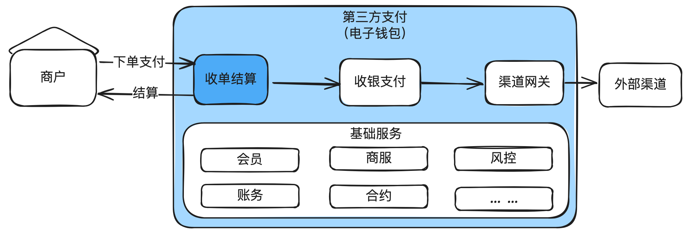
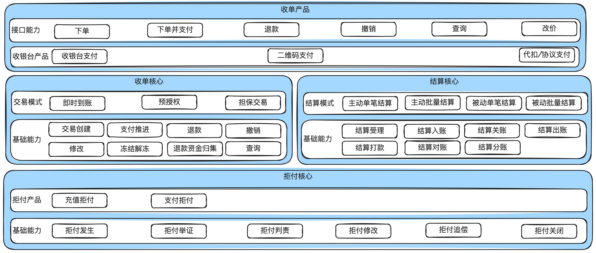
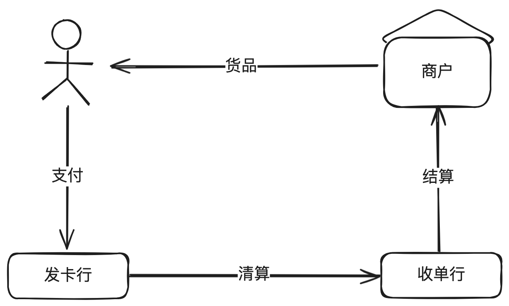
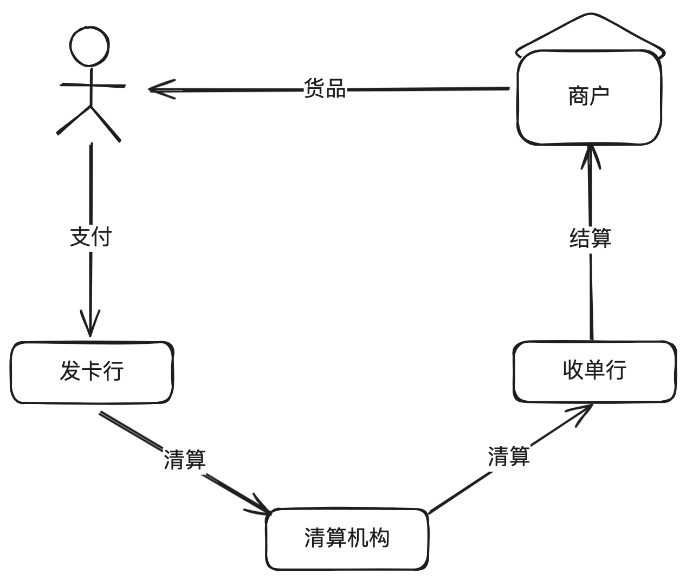

# 3.图解收单平台_打造商户收款的高效之道

收单结算是⽀付系统最重要的⼦域之⼀，⾏业内经常把有牌照的⽀付平台称为“收单机构”就可

见一斑 。

本章主要讲清楚⽀付系统中收单涉及的基本概念，产品架构、系统架构，以及⼀些核⼼的流程

和相关领域模型、状态机设计。

## 1. 收单结算概述

收单和结算结合很紧密，我们先讲⼀下收单结算的整体概念，再单独细讲收单平台，结算平

台，拒付平台。

### 1.1. 基本概念

我们通常把收单、结算、拒付放在⼀起讲，主要是因为这三个都是⾯向商户的最核⼼的服务。

简要如下：

收单：帮商户把钱从⽤户⼿⾥收进来。

结算：把从⽤户收进来的钱结转给商户。

拒付：在⽤户发起拒付后需要从商户待结算款⾥⾯扣除拒付的这部分钱（因为这部分钱需要退

回给⽤户）。在国际收单场景⽐较常⻅。

这三者紧密联系却⼜彼此各有侧重点，下⾯分开讲述。

### 1.2. 整体产品架构图

---

从图中可以看到，最上层是收单的产品层，负责对商户提供直接的服务，并且封装个性化的收

银台产品。主要包括有：

收银台⽀付：需要跳转到收银台进⾏⽀付；

⼆维码⽀付：需要先调⽤码平台进⾏解码，解码后就和普通的⽀付流程是⼀样的；

代扣/协议⽀付：商户后台发起扣款，不需要跳转到收银台。

再下⾯是三个核⼼，分别为收单核⼼、结算核⼼、拒付核⼼。三者的职能如下：

收单核⼼：主要负责处理商户订单的全⽣命周期管理：订单创建、⽀付推进、退款、撤销等。

结算核⼼：主要负责把商户应收账款算清楚，把结算款按合同约定结转给商户。

拒付核⼼：主要负责处理⽤户的拒付和对应的抗辩以及最后的判责。

收单演进形态

## 2. ⽆收单机构模式

**无收单机构模式**

这就是⼩时候去⼩卖部买糖的模式，⼀⼿交钱⼀⼿交货。

好处：⾜够简单。不⾜：⽆法完成线上交易。

**⾏内收单模式**

所谓⾏内收单，就是发⾏卡和收单是同⼀家银⾏。

好处：⼿续费低，成功率⾼。不⾜：业务⽐较受限，以线下收单为例，商户⽆法部署所有的银

⾏POS机。

**发卡行与收单行分离模式**

---

⼤部分情况下，⽤户的发卡⾏和商户的收单⾏是不同的银⾏。

不过，这种情况基本也已经灭绝，因为需要发卡⾏和收单⾏两两对接，形成⼀个巨⼤的⽹状结

构，维护成本⾼昂。

**清算机构模式**

---

发卡⾏和收单⾏之间不再直连，⽽是通过清算机构。清算机构通常是央⾏下⾯的特许经营的⾦

融机构。这样围绕清算机构形成⼀个星形架构，所有银⾏只需要和清算机构对接就⾏。

当前银⾏间的交易基本上是这种形态。⽐如中国的银联，国外的VISA，MASTERCARD等，是

卡组，也是清算机构。

**第三方支付（电子钱包）形态**

---

随着互联⽹⽀付的兴起，以第三⽅⽀付为中⼼形成另外⼀个星形结构。

上图做了很⼤的简化。在中国因为断直连的关系，⽀付宝、微信⽀付背后的财付通等这些第三

⽅⽀付机构都是对接银联、⽹联，⽽不是直连银⾏。但是在国外仍然是允许直连银⾏的。

## 3. 收单在⽀付系统中的位置

把收单和结算再细化分拆，收单的地位如下图所示：

---

如果⽤⼀句话说明收单的核⼼能⼒和定位，那就是：负责商户收单业务的全⽣命周期管理。

## 4. 收单产品架构

前⾯说过，收单核⼼负责商户业务单的全⽣命周期管理，对外提供下单、退款、撤销、查询等

接⼝。

⾏业内对于交易模式基本有3种：

a. 即时到账模式：⽤户⽀付完成后，钱就到商户账户。注意：这个“即时”是相对概念。商户

真正拿到钱还需要看结算协议及结算进度。去⼩卖部拿⽀付宝、微信⽀付买零⻝都是这种

模式。

b.预授权模式：先从用户账上预授权一笔钱，交易完成后再进行请款。最常见的就是酒店住

宿场景，⼊住时先预授权⼀笔钱做押⾦，离店时根据消费情况做请款，并撤销（Void）多

余的预授权款项。

c. 担保交易模式：⽤户⽀付完成后，钱先扣在⽀付平台，⽤户确认收货后，再通知⽀付平台

放款给商户。在淘宝买东⻄就是这种模式。

为⽀持对外的能⼒，收单需要建设很多基础服务，包括下单、⽀付推进、退款、撤销、通知、

冻结解冻等。

## 5. 收单系统架构

这个系统架构图中包含了收单最基本的能⼒。

收单在收到商户的请求后，需要调⽤会员、商户等域校验合法性，还会调⽤合约中⼼等校验商

户的权限，全部通过后，就会创建收单单据。

如果只是预下单，收单单据创建完成后就直接返回给商户订单创建成功，并返回收银台地址，

供⽤户跳转到收单台继续⽀付。

如果是下单并⽀付（⽐如代扣），收单单据创建完成后，调⽤收银⽀付域进⾏⽀付扣款流程。

## 6. 收单核⼼流程

### 6.1. 极简⽀付流程

上⾯的时序图已经清楚说明⽀付整体的流程，以及各⼦域之间的交互。部分⼦域没有画出来，

⽐如⽀付过程中需要调⽤⻛控、卡中⼼、额度中⼼等，这些在后⾯讲收银⽀付域时重点说明，本次

聚集在收单领域。

另外，这⾥只画了类似代扣场景的⽀付流程，现实中的预授权、请款，担保交易、预付款（多

次⽀付）等模式会复杂很多，后⾯有机会再单独开章节讲。

### 6.2. 极简退款流程

---

⽤户发起退款后，在商户侧会进⾏校验，校验通过后就会给⽤户展示退款已提交之类的提示。

收单接收到商户的退款请求后，需要先查询历史合约，检查合约是否⽀持退款，是否过了退款

有效期，是否满⾜最⼩退款⾦额，全部通过后，就创建退款单并保存。

接下来会进⼊退款资⾦准备阶段，因为从资损防控的⻆度，除⾮另有合约约定，否则⽀付平台

⼀般是不会做垫资退款的。在退款资⾦准备阶段，需要实时扣减商户待结算户的钱，这是与⽀付流

程很⼤不同的点。当然，有些⽀付公司可能和商户约定从独⽴的退款账户进⾏扣款，那也需要保证

这个退款账户余额充⾜。

上⾯最后⼀步的记账只写到了充退待清算户，之后等到清算⽂件过来后，会再继续推进充退待

清算户到渠道应收的记账。

## 7.收单领域模型设计

---

这是精简后的模型，对于说清楚收单的核⼼能⼒建设已经⾜够。真实场景下还需要增加很多必

要的字段，⽐如产品码，合约号，冻结标识等。在做详细设计时根据业务诉求去增加就⾏。

从图中也可以看出，最核⼼是交易主单，所有其它单据都与交易主单关联。

⽐较特别的是⾥⾯有普通⽀付单和预授权单。正常都是普通⽀付单，只有预授权产品才会有预

授权单，对应的还有请款单和预授权撤销单。

## 8. 收单状态机设计

下⾯以交易主单、普通⽀付单、退款单、预授权和请款单等常⻅的单据状态机做说明。

特别需要说明的是，状态机的推进⼀定要设计好，不能使⽤if else来写，要牢记“终态不

可变更”的原则，否则容易出问题。具体怎么使⽤代码实现状态机，以及为什么“终态不可变

更”，后⾯单独开章节来详细论述。

### 8.1. 交易主单状态机

交易主单创建初始⼊库就是INIT。

如果是下单并⽀付场景（⽐如代扣），就先推进到PAYING，然后调⽤收银⽀付进⾏扣款操

作。如果是部分请款，也是⽀付中，全额请款完成或未请款部分撤销了预授权，就推进到

SUCCESS。

如果是预下单，那停留在INIT，然后等⽀付域⽀付成功回执回来，推进到SUCCSSS。

如果订单关闭，就推进到CLOSE。

需要特别说明⼀点的是，⼀些经验不⾜的同学在交易主单耦合了很多不应该放在交易主单的状

态，⽐如退款成功，撤销成功等。这导致交易主单的状态机特别复杂，⾮常容易出错。⽐较好的经

验就是，交易主单、⽀付单、退款单、撤销单等全部只管⾃⼰的状态机。

### 8.2. ⽀付单状态机

---

⽀付单创建初始状态就是INIT。

收到⽀付域的⽀付成功回执，更新为SUCCESS。

交易超时关闭，推进到CLOSE。

### 8.3. 退款单状态机

退款单初始为INIT。

然后推进退款资⾦准备，这个过程把要退款的钱从商户待结算户或指定账户扣到退款过渡户，

如果收单合约中还要求退款退费，还需要从收费账户把⼿续费扣出来。

退款资⾦准备成功后，推进到PREPARE_CUSS。

然后向⽀付域发起退款，⽀付受理成功后，推进到SUCCESS。

### 8.4. 预授权状态机

预授权单初始为INIT。

预授权失败回执推进到CLOSE。预授权成功后，⽤户全额撤销，也推进到CLOSE。

成功回执推进到AUTHED。

开始请款为CAPTURING，部分请款成功仍然为CAPTURING。

### 8.5. 请款状态机

请款单初始为INIT。

请款失败回执推进到CLOSE。

请款成功回执推进到SUCCESS。

## 9. 资⾦流

### 9.1.即时到账

即时到账⽐较简单，⽀付过程，从⽀付⽹关过滤户到商户待结算户，再到商户余额。

退款则相反，在退款资⾦准备阶段需要从商户待结算户到退款⽹关过渡户。

### 9.2. 担保交易

担保交易模式⽐即时到账多了⼀个担保户。

### 9.3. 预授权模式

预授权模式⽐即时到账模式多了⼀个请款过渡户。

## 10. 结束语

本章主要讲了收单的基本概念，以及对应的产品和系统架构图，⼀些核⼼的领域模型和状态机

设计。

接下来⼏章会讲和收单紧密结合的结算平台和拒付平台。

