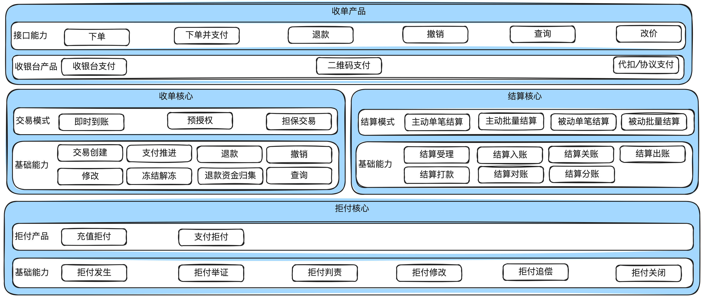
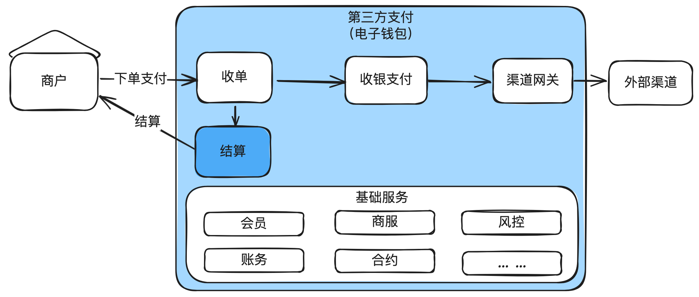
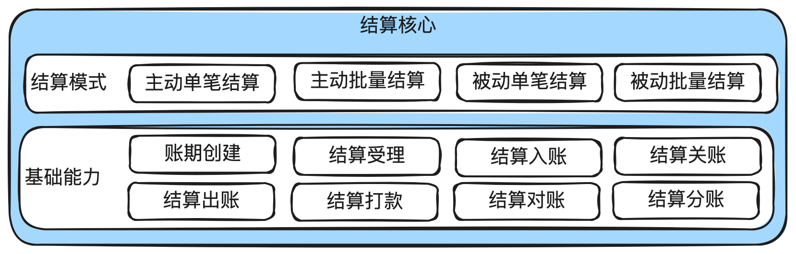
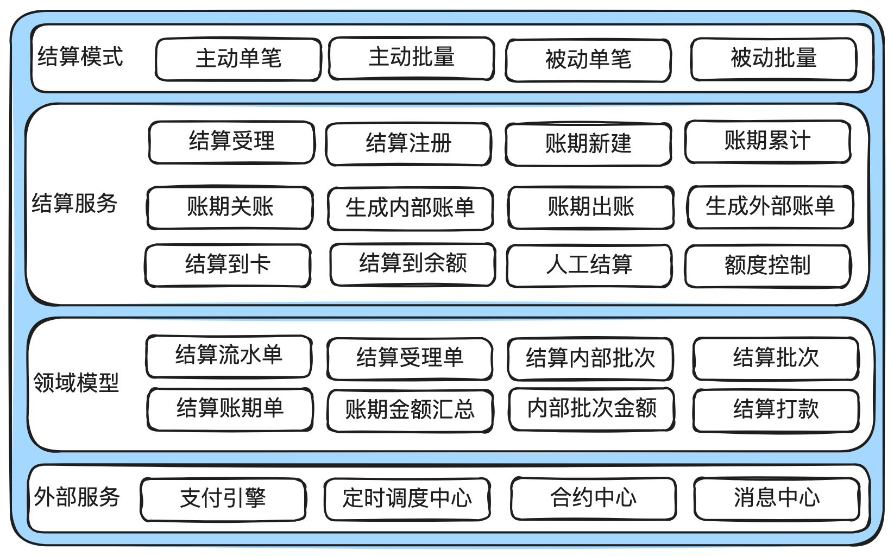
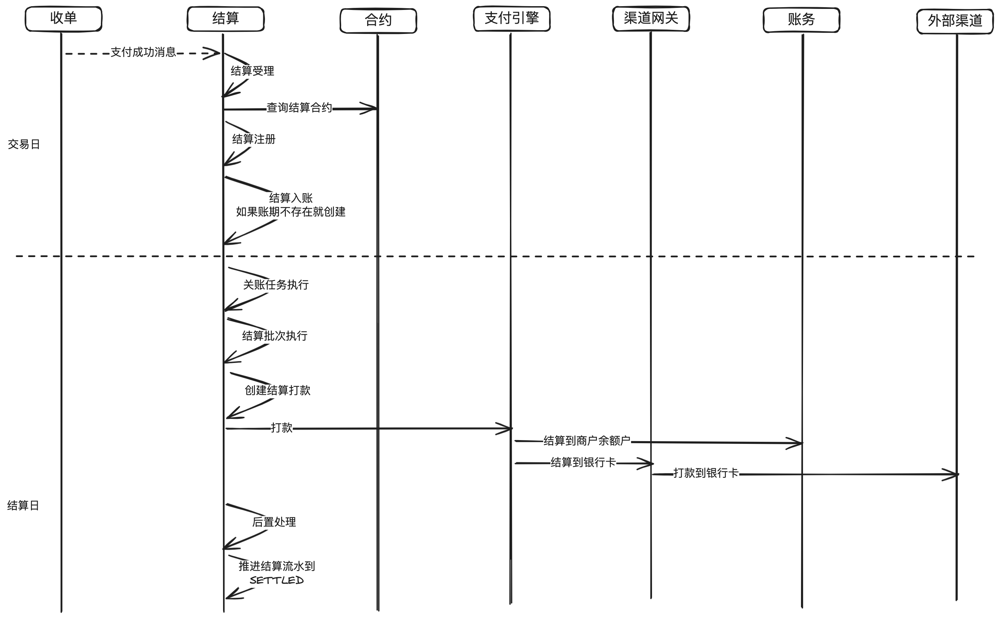
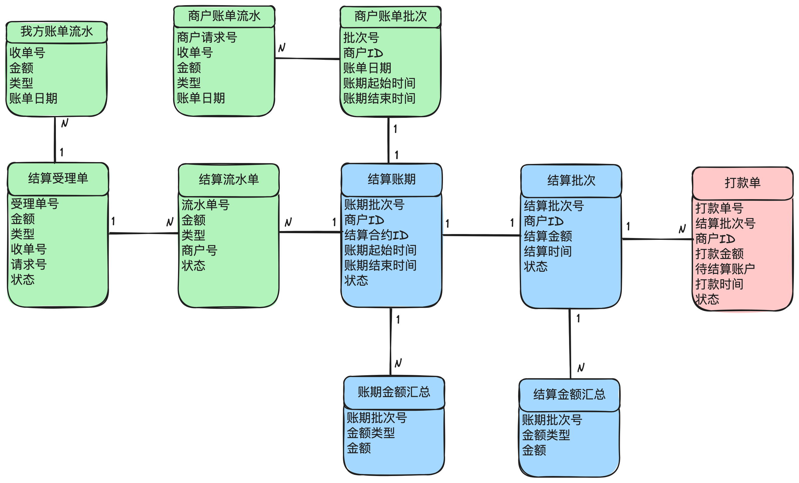
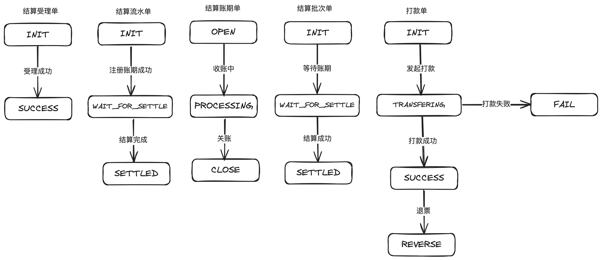
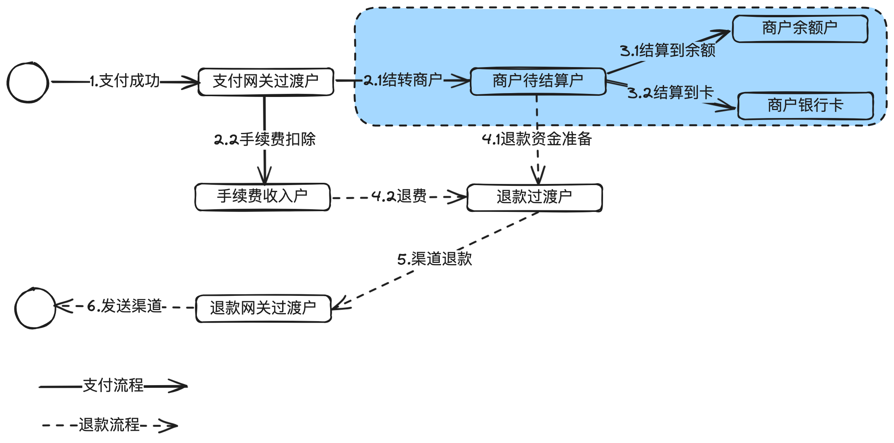

# 4.图解结算平台_准确高效给商户结款

本章主要讲清楚⽀付系统中商户结算涉及的基本概念，产品架构、系统架构，以及⼀些核⼼的

流程和相关领域模型、状态机设计等。

## 1. 前⾔

收单结算是⽀付系统最重要的⼦域之⼀，⾏业内经常把有牌照的⽀付平台称为“收单机构”就可

⻅⼀斑。

我们在上⼀篇⽂章讲了收单如何帮忙商户收钱，收完钱还得转给商户，⽤户⽀付100块钱，那

么到底给商户多少钱，什么时候给，这都是结算平台⼲的⼯作。谓之“结算”。

下面这个图留着是为了提高“收单、结算、拒付”紧密结合的印象。

---

三者的职能如下：

收单核⼼：主要负责处理商户订单的全⽣命周期管理：订单创建、⽀付推进、退款、撤销等。

结算核⼼：主要负责把商户应收账款算清楚，把结算款按合同约定结转给商户。

拒付核⼼：主要负责处理⽤户的拒付和对应的抗辩以及最后的判责。

## 2. 结算在⽀付系统中的位置

在收单机构（⽀付平台）⾥，结算就是把帮商户收进来的钱，按约定的结算规则、准确、及时地结算给商户。

---

## 3. 结算产品架构

结算模式分为主动结算和被动结算。站在商户的⻆度，被动结算就是以收单机构为准，收单机

构说结多少就是多少。主动结算就是以商户为准，商户说结多少就是多少。⼀般来说，⼤部分商户

都是被动结算，特殊的⼤商户⽐如Google，Apple经常使⽤主动结算。

结算⼀定要设计账期，就像账务系统要有会计⽇是⼀样的道理，避免跨天的交易或零点附近的

交易出现结算异常。对应就有账期创建、⼊账、关账、出账。

## 4.结算系统架构

核⼼的服务包括：结算受理、注册，账期的新建、关账、出账，最后就是结算。

## 5. 结算核⼼流程

下⾯以即时到账模式为例说明。担保交易模式和预授权模式稍有不同。

在交易⽇，收单收到⽀付成功回执后，就发消息给结算，结算收到消息去查结算合约，进⼊结

算注册流程。

在结算注册时，如果存在打开的账期，就直接挂过去，如果不存在，就创建⼀个账期。

在结算⽇，先进⾏关账，避免在途任务受影响。关账成功后，进⼊结算批次，再进⼊打款流

程。

打款有3种情况：1）结算到商户余额户。2）在线结算到提现卡。3）线下⼈⼯打款（⼈⼯结

算）。

打款完成后，推进结算流水SETTLED。

## 6. 结算核⼼领域模型

左边绿⾊部分是账单和流⽔相关信息，中间蓝⾊是账期和批次相关信息，右边是打款信息。

因为⼀个收单可能会有多种费⽤，所以会⽣成多条我⽅账单流⽔。同样的，⼀个收单可能结算

给多个主体，对应有多笔结算流⽔。

结算账期有点类似会计⽇的概念，是为了控制零点左右的收单单据的结算能落到正确的结算账

期⾥去。

关账后就会发起外部结算以及对应的打款。⼀个结算批次可能会分成多笔打款。

## 7.结算状态机设计

上⾯把结算涉及到的状态机都画出来了。

特殊的是打款单的状态机，因为打款有可能调⽤外部渠道打到商户的卡⾥去，外部渠道有⼀定

概率先返回打款成功，过两天后⼜返回退票（实际打款失败，资⾦退回），这个时候需要推进到

REVERSE，然后重新更新信息后再进⾏打款。

退票的原因有多种，⽐如商户的卡被冻结等。

## 8.资⾦流

结算⼀般只涉及到正向资⾦流，也就是⽀付成功后，⼀步步推进结算到商户余额户或者商户银

⾏卡，如果是结算到商户余额户，就需要商户主动在商户⻔户发起提现到卡。

## 9. 结束语

本章主要讲了结算的基本概念，以及对应的产品和系统架构图，⼀些核⼼的领域模型和状态机

设计。
