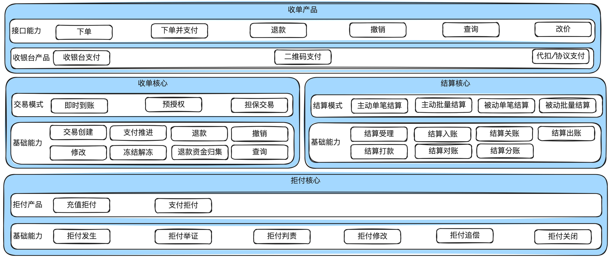
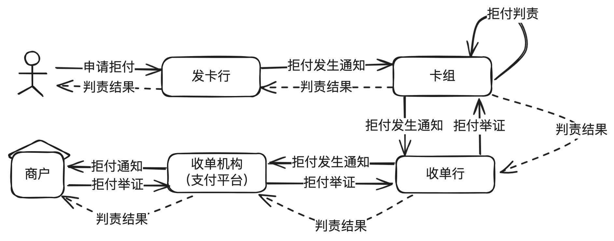
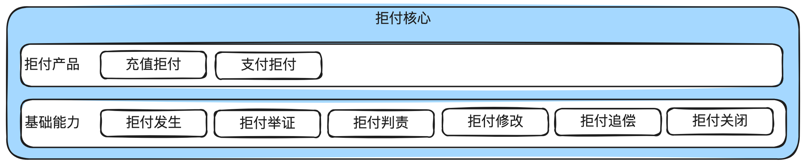
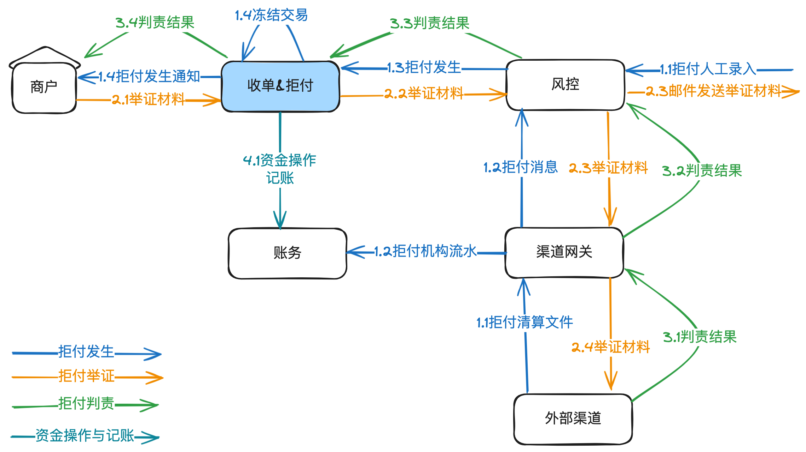
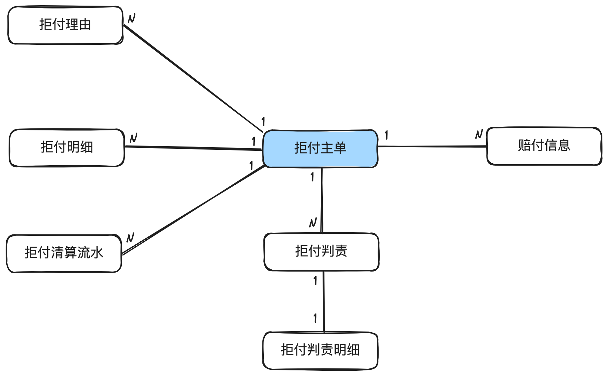
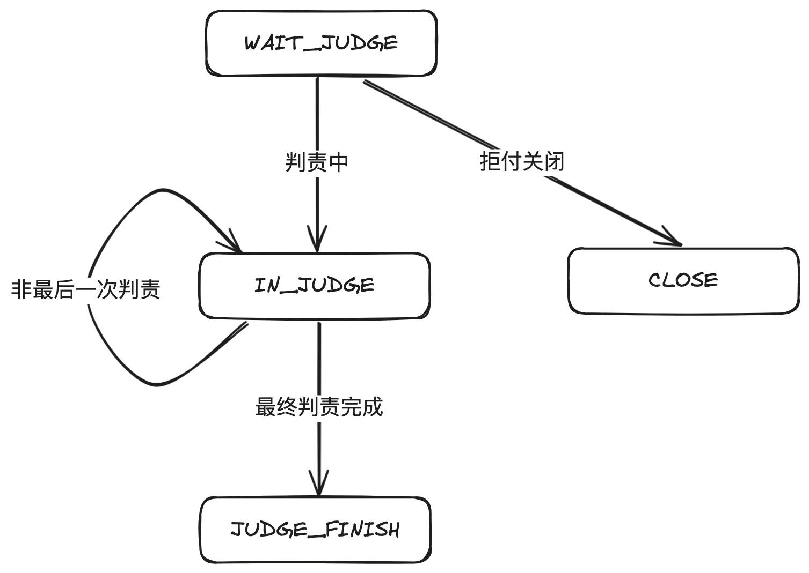
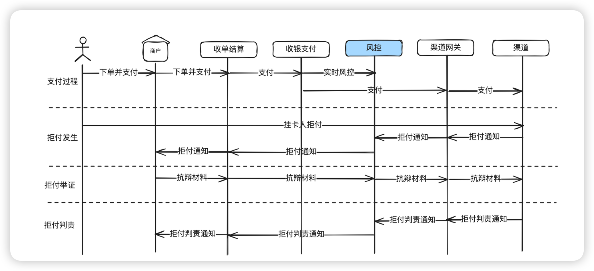

# 5.图解拒付平台_如何应对用户的拒付

本章主要讲清楚⽀付系统中拒付涉及的基本概念，产品架构、系统架构，以及⼀些核⼼的流程

和相关领域模型、状态机设计等。

## 1. 前⾔

拒付在中国⽐较少⻅，但是在海外⾮常普遍，只要做跨境收单⽀付系统，就⽆法绕开拒付。

拒付涉及到冻结收单单据，并扣减商户的结算款，所以拒付经常和收单、结算⼀起讲。下⾯这

个图第三次出现，只是想强调三者之间的紧密关系。

---

三者的职能如下：

**收单核⼼**：主要负责处理商户订单的全⽣命周期管理：订单创建、⽀付推进、退款、撤销等。

**结算核⼼**：主要负责把商户应收账款算清楚，把结算款按合同约定结转给商户。

**拒付核⼼**：主要负责处理⽤户的拒付和对应的抗辩以及最后的判责。

## 2. 拒付基本概念

拒付在中国⽐较少⻅，但是在海外⾮常普遍，只要做跨境收单⽀付系统，就⽆法绕开拒付。

简单地说，拒付就是指⽤户在收到账单后，向发卡⾏申请对某笔交易拒绝付款。然后发卡⾏、

卡组、收单⾏、第三⽅收单机构就开始正式进⼊拒付流程，中间会涉及到拒付举证、拒付判责等。

⼀旦拒付量⼤，卡组就会对收单机构的⻛控能⼒质疑，有⼀些惩罚措施，严重可能会影响收单

资质，所以一般的收单机构对拒付率看得比较重，收单机构的风控能力也就显得尤为重要。

拒付的原因通常有以下3种：

1. ⽤户的卡被盗。

2. 对商品不满意并产⽣交易纠纷。

3. 恶意拒付。

## 3. 拒付产品架构

拒付的业务相对⽐较简单，产品架构也⽐较简单。

## 4.拒付核⼼流程

---

拒付发⽣⼀般有两种来源：1）外部渠道的清算⽂件，这种⼀般称为在线拒付。2）外部渠道通

过邮件发送给收单机构，需要由收单机构⼈⼯录⼊到内部系统，这种⼀般称为离线拒付。

拒付发⽣后，需要通知商家，商家⼀般会举证。⽐如证明是⽤户亲⾃签收的，或者收货地址是

⽤户常⽤地址等。

不过从实际情况看，⼤部分的拒付会判商家或收单机构的责任。所以对收单机构的⻛控能⼒要

求⽐较⾼。

## 5.拒付领域模型

---

拒付的领域模型是根据拒付处理承载的信息来设计的。⾸先是拒付主单，关联拒付的理由、明

细、清算流⽔，判责等。⼀旦判断是商家责任，还需要记录赔付信息。

## 6.拒付状态机

---

拒付初始化为等待拒付（WAIT_JUDEG），可以被关闭（CLOSE)，如果进⼊判责流程，就推

进到IN_JUDGE，最后判责完成后，推进到JUDGE_FINISH。

## 7.⻛控系统与拒付关系

拒付除了和收单结算紧密相关外，还和⻛控系统紧密相关，因为交易是由⻛控系统来判断⻛险的，

如果这个⽤户的卡被盗刷，那⻛控系统的实时⻛控就不应该通过。如果是正常的购买，那⻛控系统

就应该收集证据去抗辩。

这⾥⾯涉及的东⻄会⽐较多，后⾯有机会再讲。

## 8. 结束语

本章主要讲了拒付的基本概念，以及对应的产品和系统架构图，⼀些核⼼的领域模型和状态机

设计。

到现在为⽌，与商户业务强相关的收单、结算、拒付就讲完了，后⾯会进⼊收银⽀付的讲解。

