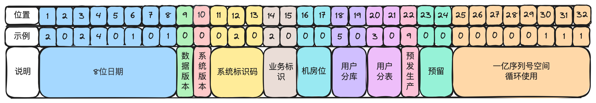
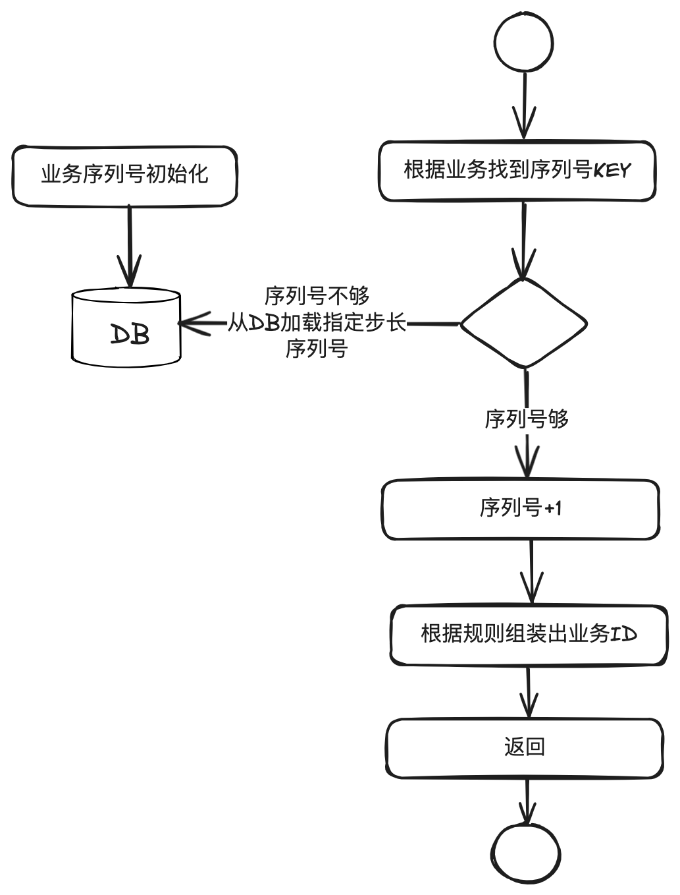

# 6.交易流水号的艺术_掌握支付系统的业务ID生成指南

本章主要讲清楚⽀付系统中为什么要有业务ID，各⼦域的业务ID为什么要统⼀规范，以及最佳

实践。

假如你也好奇为什么有了数据库⾃增ID外还需要业务ID，或者如何在业务ID中编织进业务信息

⽐如业务系统，数据版本，分库分表位等，值得花⼏分钟了解⼀下。

## 1. 什么是业务ID

数据库⼀般都会设计⼀个⾃增ID做为主键，同时还会设计⼀个能唯⼀标识⼀笔业务的ID，这就

是所谓的业务ID（也称业务键）。⽐如收单域有收单单号，⽀付域有⽀付号，渠道⽹关域有渠道⽀

付号等，这些都属于业务ID。

为什么有了⾃增ID后，还需要有业务ID呢？⼀般来说有以下⼏个核⼼原因：

1. 分库分表的强诉求。⼀旦分库分表，各表之间的⾃增ID就⼀定会重复。

2. 全球化部署的强诉求。在跨境⽀付系统建设时，部分国家地区要求本地化部署，需要通过业务

ID知道业务运⾏在哪个机房。

3. 标识业务语义，在处理故障时能快速定位是哪个域哪个业务。

4. ⽅便系统升级。通过业务ID的版本所在位判断业务应该⾛新系统，还是⾛⽼系统。

## 2.为什么业务ID要统⼀规范

互联⽹⽀付系统基本都是微服务化部署，每个⼦域都是相对独⽴的⼀些同学在研发，架构实现

差异⾮常⼤，但是业务ID是必须要统⼀的。主要有以下⼏个原因：

1. 减少维护成本。避免在不同服务中重复发明相似机制，也减少了沟通成本。⽅便做成统⼀的组

件。

2. 加速异常处理和诊断。在分布式环境下发现和解决问题⼀般都⽐较复杂，统⼀的业务ID规范可

以快速判断问题所在的域，以及对应的业务。

3. 避免新同学因经验不⾜导致设计缺陷，在后期⽆法满⾜业务诉求。

## 3. 常⻅业务ID⽣成规范及应⽤场景

业务ID⽣成规则有很多种，⽐如知名的Snowflake算法，UUID算法，时间戳+随机数/序列号

等。以下是部分规范的简要介绍。

**1.Snowflake算法**

组成：时间戳 + 数据中⼼标识 + 机器节点 + 序列号。

适⽤场景：⽆中⼼化的环境中⽣成⼤量的唯⼀ID，⽆具体业务语义，且性能要求极⾼。⽐如社

交媒体的聊天消息记录。

**2. UUID算法**

⾼度唯⼀且随机。

适⽤场景：不想让外界感知内部系统的交易量级。⽐如调⽤外部渠道的请求号，如果使⽤序列

号，有可能会让外部猜测出交易的规模。

**3. 编码系统**

特定组织中⼼化⽣成。

适⽤场景：药品或供应链管理，全球范围内标识或追踪商品。

**4. 业务规则编码**

把⼀些业务语义编码到ID中。

适用场景:金融支付、电商订单等。

## 4. ⽀付系统业务ID⽣成最佳实践

### 4.1. 业务ID⽣成规范

下⾯以32位的⽀付系统业务ID⽣成为例说明。实际应⽤时可灵活调整。

第1-8位：⽇期。通过单号⼀眼能看出是哪天的交易。

第9位：数据版本。⽤于单据号的升级。

第10位：系统版本。⽤于内部系统版本升级，尤其是不兼容升级的时候，⽼业务使⽤⽼的系统

处理，新业务使⽤新系统处理。

第11-13位：系统标识码。⽀付系统内部每个域分配⼀段，由各域⾃⾏再分配给内部系统。⽐

如010是收单核⼼，012是结算核⼼。

第14-15位：业务标识位。由各域内部定，⽐如00-15代表⽀付类业务，01⽀付，02预授权，

03请款等。

第16-17位：机房位。⽤于全球化部署。

第18-19位：⽤户分库位。⽀持百库。

第20-21位：⽤户分表位。⽀持百表。

第22位：预发⽣产标识位。⽐如0代表预发环境，1代表⽣产环境。

第23-24位：预留。各域根据实际情况扩展使⽤。

第24-32位：序列号空间。⼀亿规模，循环使⽤。⼀个机房⼀天⼀亿笔是很⼤的规模了。如果

不够⽤，可以扩展到第24位，到⼗亿规模。

### 4.2. 业务ID⽣成技术实现

序列号通常采⽤数据库⽣成，保证机房内唯⼀性。

---

简要流程如下：

1. DB初始化序列号数据。KEY为业务类型，VALUE初始为0；

2. 调⽤业务ID⽣成组件。核⼼传参：数据版本号，系统版本号，系统名，业务类型等。

3. 业务ID⽣成组件查看对应业务类型是否有缓存数据。如果没有，就以指定步⻓（⽐如100）去

更新数据库，然后缓存起来。

4.在内存中加一，然后根据规则生成业务ID，返回给调用方。

这⾥使⽤指定步⻓去更新数据库，主要是考虑提⾼性能。但是存在⼀定的损失，⽐如发布重

启，缓存中的序列号就会被浪费掉。但因为是循环使⽤，所以基本上对业务没有影响。

## 5. 结束语

本章主要讲了业务ID是什么，业界常⻅⽣成规则及适⽤场景，以及⽀付系统业务ID⽣成的最佳

实践。
