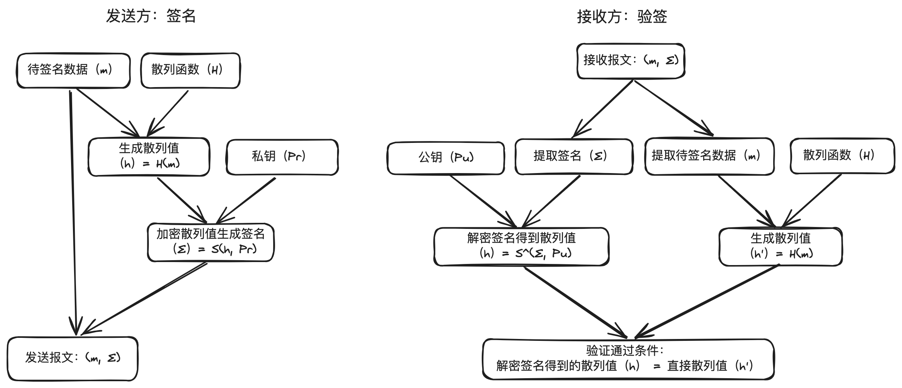
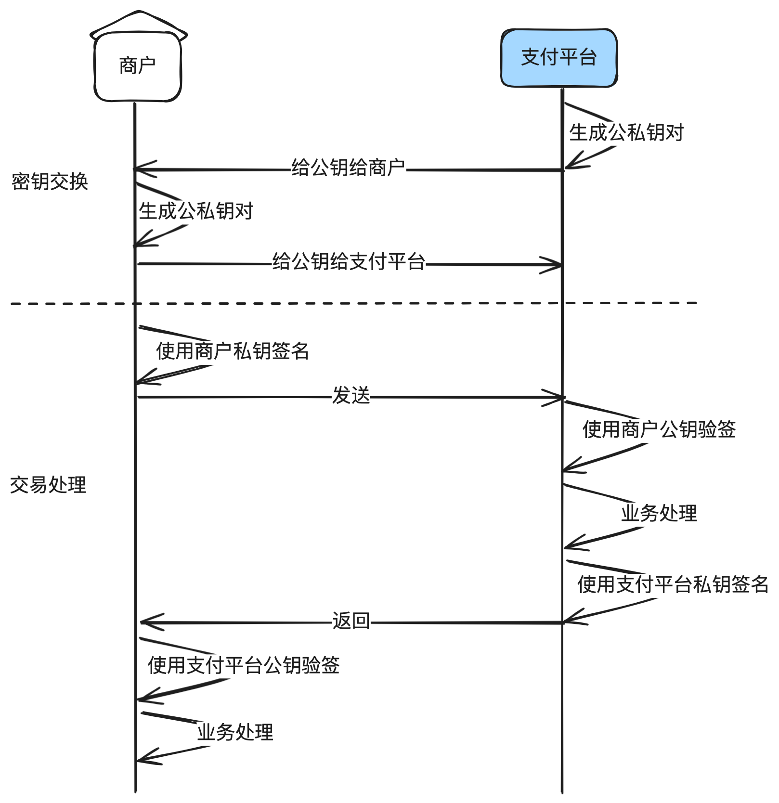

# 7.揭密支付安全_为什么你的交易无法被篡改

本⽂主要讲清楚⽀付系统中为什么要做签名验签，哪些是安全的算法，哪些是不安全的算法，

以及对应的核⼼代码实现。

通过这篇⽂章，你可以了解到：

1. 什么是签名验签

2. ⽀付系统为什么⼀定要做签名验签

3. 哪些是安全的算法，哪些是不安全的算法

4. 常⻅签名验签算法核⼼代码

5. 联调中常⻅的问题


## 1. 什么是签名验签

在电⼦⽀付的万亿市场中，安全⽆疑是核⼼中的核⼼。有⼀种称之为“签名验签”的技术在⽀付

安全领域发挥着⾄关重要的作⽤。那什么是签名验签呢？

签名验签是数字加密领域的两个基本概念。

签名：发送者将数据通过特定算法和密钥转换成⼀串唯⼀的密⽂串，也称之为数字签名，和报

文信息一起发给接收方。

验签：接收者根据接收的数据、数字签名进⾏验证，确认数据的完整性，以证明数据未被篡

改，且确实来⾃声称的发送⽅。如果验签成功，就可以确信数据是完好且合法的。

假设被签名的数据（m），签名串（Σ），散列函数（H），私钥（Pr），公钥（Pu），加密

算法（S），解密算法（S^），判断相等（eq）。

简化后的数学公式如下：

签名：Σ=S[H(m), Pr]。

验签：f(v)=[H(m) eq S^(Σ, Pu)]。

流程如下：



**签名流程：**

1. **散列消息：**对消息(m)应⽤散列函数（H）⽣成散列值（h）。

2. **加密散列值：**使⽤发送⽅的私钥 ( Pr ) 对散列值 ( h ) 进⾏加密，⽣成签名 ( Σ )。 Σ = S(h,

Pr)

把数字签名（Σ）和原始消息（m）⼀起发给接收⽅。

**验签流程：**

1. **散列收到的消息:**使用同样的散列函数(H)对消息(m)生成散列值(h')。 h'=H(m)

2. **解密签名：**使⽤发送⽅的公钥 ( Pu ) 对签名 (Σ ) 进⾏解密，得到散列值 ( h )。 h = S^(Σ,

Pu)

3. **⽐较散列值：**⽐较解密得到的散列值 ( h ) 与直接对消息 ( m ) 散列得到的 ( h' ) 是否⼀致。

验证成功条件： h = h' 。

如果两个散列值相等，那么验签成功，消息（m)被认为是完整的，且确实来⾃声称的发送

⽅。如果不⼀致，就是验签失败，消息可能被篡改，或者签名是伪造的。

现实中的算法会复杂⾮常多，⽐如RSA，ECDSA等，还涉及到填充⽅案，随机数⽣成，数据

编码等。


## 2. ⽀付系统为什么⼀定要做签名验签

银⾏怎么判断扣款请求是从确定的⽀付平台发出来的，且数据没有被篡改？商户不承认发送过

某笔交易怎么办？这都是签名验签技术的功劳。

签名验签主要解决3个问题：

1. 身份验证：确认⽀付信息是由真正的发送⽅发出，防⽌冒名顶替。

如果⽆法做身份验证，⽀付宝就⽆法知道针对你的账户扣款99块的请求是真实由你楼下⼩卖

部发出去的，还是我冒充去扣的款。

2. 完整性校验：确认⽀付信息在传输过程中未被篡改，每⼀笔交易都是完整、准确的。

如果⽆法校验完整性，那么我在公共场景安装⼀个免费WIFI，然后截获你的微信转账请求，把

接收者修改成我的账号，再转发给微信，微信就有可能会把钱转到我的账号⾥。

3. 防抵赖性：避免任何⼀⽅否则曾经进⾏过的交易，提供法律证据⽀持。

⽐如微信⽀付调⽤银⾏扣款100块，银⾏返回成功，商户也给⽤户发货了，⼏天后银⾏说这笔

扣款成功的消息不是他们返回的，他们没有扣款。而签名验签就能让银行无法抵赖



---

流程：

1. 双⽅先交换密钥，可以通过线下邮件交换，也可以通过线上⾃助平台交换。

2. 请求⽅发出交易报⽂前使⽤⾃⼰的私钥进⾏签名，接收⽅接收报⽂后先进⾏验签，验签通过后

再进⾏业务处理。

3. 接收⽅处理完业务，返回前使⽤⾃⼰的私钥进⾏签名，请求⽅接收返回报⽂后先进⾏验签，验

   签通过后再进行业务处理。


## 3. 安全签名验签算法推荐

安全⼀直是⼀个相对的概念，很多曾经是安全的算法，随着计算机技术的发展，已经不安全

了，以后到了量⼦计算的时代，现在⼤部分的算法都将不再安全。

⼀般⽽⾔，安全同时取决于算法和密钥⻓度。⽐如SHA-256就⽐MD5更安全，RSA-2048就

⽐RSA-1024更安全。

已经被认为不安全的算法有MD5、SHA-1等算法，容易受到碰撞攻击，不应该在⽀付系统中

使⽤。

仍然被认为是安全的算法有：SHA-256，SHA-3， RSA-1024，RSA-2048，ECDSA

等。

当前最常⻅推荐的算法是RSA-2048。RSA-1024以前使⽤得多，但因为密钥⻓度较短，也已

经不再推荐使⽤。

SHA-256只是⼀种单纯的散列算法，其实是不适合做签名验签算法的，因为需要双⽅共⽤⼀

个API密钥，⼀旦泄露，⽆法确认是哪⽅被泄露，也就是只解决了完整性校验，⽆法解决身份验证

和防抵赖性。但因为使⽤简单，国内外仍然有不少的⽀付公司公司在⼤量使⽤。


## 4. 常⻅签名验签算法核⼼代码

下⾯以RSA（SHA256withRSA）为例，示例代码如下：

```java
import java.security.KeyFactory;
import java.security.PrivateKey;
import java.security.PublicKey;
import java.security.Signature;
import java.security.spec.PKCS8EncodedKeySpec;
import java.security.spec.X509EncodedKeySpec;

/**
 * RSA 签名/验签工具（SHA256withRSA）
 */
public final class RSASignatureUtil {

    private RSASignatureUtil() {
        // 工具类禁止实例化
    }

    /**
     * 使用私钥对数据进行签名
     *
     * @param data       待签名数据
     * @param privateKey PKCS#8 编码的私钥
     * @return 签名结果
     * @throws Exception 签名过程中的异常
     */
    public static byte[] sign(byte[] data, byte[] privateKey) throws Exception {
        PKCS8EncodedKeySpec pkcs8KeySpec = new PKCS8EncodedKeySpec(privateKey);
        KeyFactory keyFactory = KeyFactory.getInstance("RSA");
        PrivateKey priKey = keyFactory.generatePrivate(pkcs8KeySpec);

        Signature signature = Signature.getInstance("SHA256withRSA");
        signature.initSign(priKey);
        signature.update(data);
        return signature.sign();
    }

    /**
     * 使用公钥验证签名
     *
     * @param data          原始数据
     * @param publicKey     X.509 编码的公钥
     * @param signatureBytes 待验证的签名
     * @return 验签是否通过
     * @throws Exception 验签过程中的异常
     */
    public static boolean verify(byte[] data, byte[] publicKey, byte[] signatureBytes) throws Exception {
        X509EncodedKeySpec keySpec = new X509EncodedKeySpec(publicKey);
        KeyFactory keyFactory = KeyFactory.getInstance("RSA");
        PublicKey pubKey = keyFactory.generatePublic(keySpec);

        Signature signature = Signature.getInstance("SHA256withRSA");
        signature.initVerify(pubKey);
        signature.update(data);
        return signature.verify(signatureBytes);
    }

    /* ---------------- 简单使用示例 ---------------- */
    public static void main(String[] args) throws Exception {
        // 这里仅做演示，实际使用时请替换为真实密钥
        byte[] mockPrivateKey = new byte[1217]; // 假设已加载 PKCS#8 私钥
        byte[] mockPublicKey  = new byte[294];  // 假设已加载 X.509 公钥
        byte[] data = "hello rsa".getBytes();

        byte[] signBytes = sign(data, mockPrivateKey);
        boolean ok = verify(data, mockPublicKey, signBytes);
        System.out.println("验签结果: " + ok);
    }
}
```


签名输出是字节码，还需要编码，⼀般是base64。

如果使用SHA-256(很多公司仍在使用，但不推荐)，如下:

```java
import java.security.MessageDigest;

/**
 * SHA-256 散列工具
 */
public final class SHA256Util {

    private SHA256Util() {
        // 工具类禁止实例化
    }

    /**
     * 使用 SHA-256 对数据进行散列
     *
     * @param data 待散列数据
     * @return 256-bit（32 字节）散列结果
     * @throws Exception 计算过程中的异常
     */
    public static byte[] hash(byte[] data) throws Exception {
        MessageDigest digest = MessageDigest.getInstance("SHA-256");
        return digest.digest(data);
    }

    /* ---------------- 简单使用示例 ---------------- */
    public static void main(String[] args) throws Exception {
        byte[] input = "hello sha256".getBytes();
        byte[] hash = hash(input);
        System.out.println("SHA-256 = " + bytesToHex(hash));
    }

    /** 辅助：字节数组转十六进制字符串 */
    private static String bytesToHex(byte[] bytes) {
        StringBuilder sb = new StringBuilder();
        for (byte b : bytes) {
            sb.append(String.format("%02x", b));
        }
        return sb.toString();
    }
}
```


这⾥data已经是加了API密钥（也称为API KEY）。所谓的API密钥，就是交易双⽅共享的⼀个

密钥，这样双⽅⽣成的哈希值才会⼀致。


## 5. 联调中常⻅的问题

不管是与商户的联调，还是与⽀付渠道（或银⾏）之间的联调，签名验签都是⾮常耗费精⼒的

环节。验签不通过通常有以下⼏个情况：

1. 密钥不匹配：双⽅以为⾃⼰都配置了正确的密钥，但实际没有。

2. 数据编码不⼀致：⽐如⼀⽅使⽤GBK，⼀⽅使⽤UTF-8。

3. 原始数据选择不⼀致：⽐如接⼝⽂档要求拼接10个字段，但是代码实现却只拼接了9个字段。

或者⼀⽅没有把空值放⼊计算，另⼀⽅把空值也放⼊计算。

4. 原始数据排序⽅式不⼀致：⽐如接⼝要求按key的升序排列，调⽤⽅却忘记排序就进⾏签名。

5. 字符转义不⼀致：特殊字段的转义必须保持⼀致。

解决上述问题的最好办法，就是让服务提供⽅提供⼀段示例代码，以及示例报⽂+示例签名，

然后在本地使⽤main⽅法先跑成功，再移植到项⽬代码中。

## 6.结束语

本章主要讲了签名验签名的概念，对于⽀付系统的重要性，以及常⻅签名验签名算法及JAVA

代码实现。

但是还有⼀个同样⾮常重要的问题没有讲：如何安全储存密钥？如果密钥放在代码⾥或数据库

⾥，开发⼈员是可以直接获得的，如果不⼩⼼泄露出去怎么办？

应对的解决⽅案就是创建⼀个密钥中⼼专⻔负责密钥的管理，⽆论加密解密还是签名验签，全

部调⽤密钥中⼼来处理，业务系统不接触密钥明⽂。

那⼜来了⼀个新的问题：这个密钥中⼼如何设计和实现，才能既保证很⾼的安全性，⼜能有⾮

常⾼的性能表现呢？

后⾯有机会再开⼀个密钥中⼼的设计和实现专题来聊。

