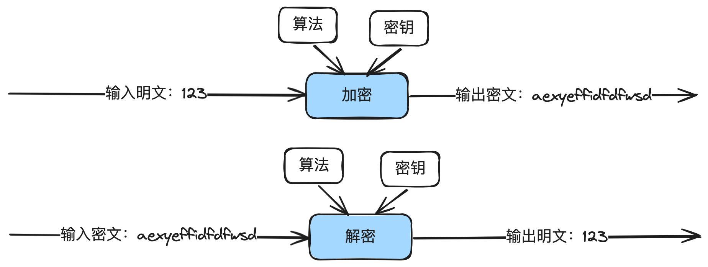
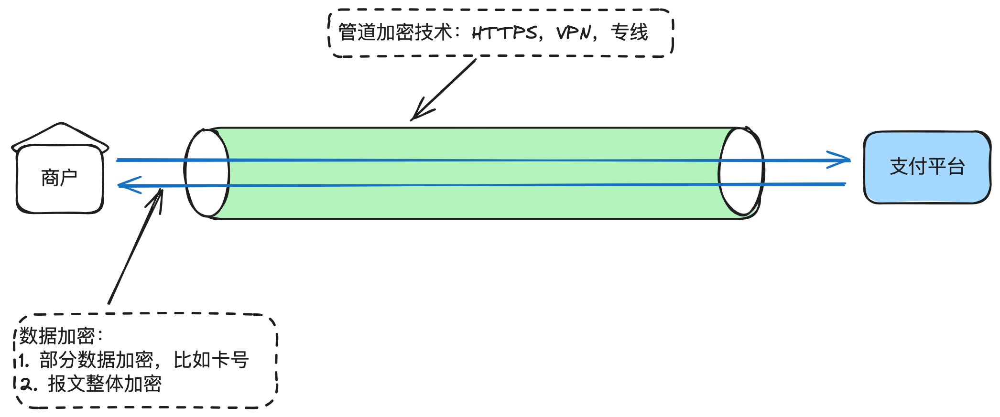
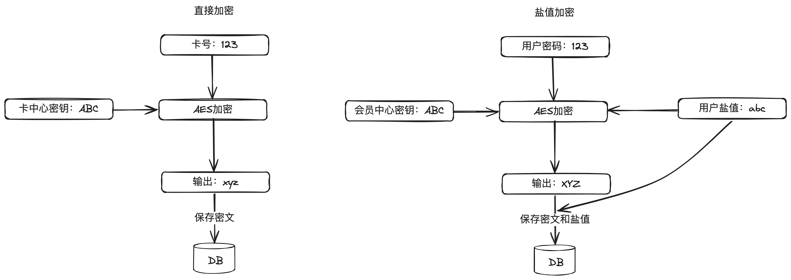
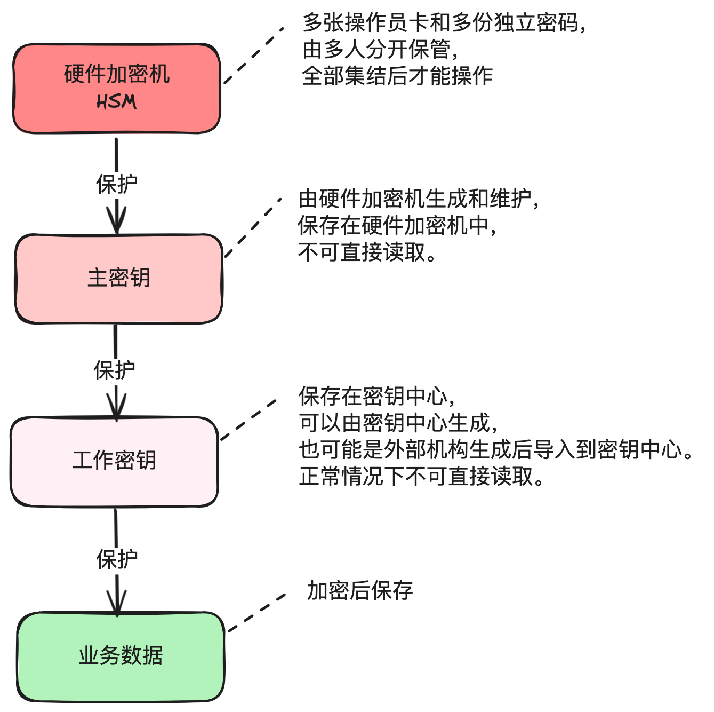

# 8.金融密语_揭秘支付系统的加解密艺术

本⽂主要讲清楚加解密技术在⽀付系统中的重要地位，核⼼应⽤场景，哪些是安全的算法，哪

些是不安全的算法，以及对应的核⼼代码实现。

通过这篇⽂章，你可以了解到：

1. 什么是加解密

2. ⽀付系统中哪些核⼼场景需要⽤到加解密技术

3. 哪些是安全的加解密算法，哪些是不安全的加解密算法

4. 常⻅加解密算法核⼼代码

5. ⽇常研发过程中常⻅的问题


## 1. 什么是加密解密

在数字经济的舞台上，在线⽀付系统扮演着⾄关重要的⻆⾊。究竟是什么技术让⾦钱能够在公

开的互联⽹上安全⽆忧地穿梭？加密和解密是这舞台背后隐秘的艺术，同时确保资⾦的安全流转和

个人信息安全




---

在数字通信中，加密是将明⽂通过⼀定的算法和密钥转换成⽆法识别的密⽂的过程。这样即使

数据被截获，未经授权的第三⽅也⽆法理解其内容。

解密则是加密的逆向过程，通过⼀定的算法和密钥将密⽂转换成明⽂的过程。


## 2. 核⼼应⽤场景

⽀付系统做为⼀个安全系数⾮常⾼的系统，加解密技术在⾥⾯起到了极其重要的作⽤。通常以

下⼏个核⼼应⽤场景都会⽤到加解密技术：1）传输加密；2）存储加密。



1. 传输加密：保护交易数据在互联⽹上传输过程中的安全，防⽌数据被窃听或篡改。

具体的实现通常有两种：



---

1）通道加密：⽐如使⽤HTTPS，或者VPN、专线等，实现数据传输端到端的加密。HTTPS和

VPN可以参考⽹络上公开的⽂档。

2）部分字段单独加密：⽐如把卡号等关键信息进⾏加密后再发出去。

3）整体报⽂单独加密：先⽣成业务报⽂，然后对整个报⽂加密再发出去。

2. 存储加密：对敏感数据⽐如信⽤卡信息、⽤户身份证信息、密码等需要进⾏加密后存储到数据

库中，以防⽌数据泄露。

具体的实现通常也会分两种：

1）直接加密：原始信息直接加密。通常⽤于信⽤卡、身体证等常规数据的加密。

2）加盐值（SALT）后再加密：原始信息先加上盐值，然后再进⾏加密。通常⽤于密码管

理。


## 3. 密码的特殊处理

密码的存储⽐较特殊，值得单独说⼀说。

前⾯有说过，登录或⽀付密码需要加上盐值后，再进⾏加密存储。那为什么密码管理需要使⽤

盐值？为了提⾼密码安全性。

1. 防⽌彩虹表攻击。彩虹表是⼀种预先计算出来的哈希值数据集，攻击者可以使⽤它来查找和破

译未加盐的密码。通过为每个⽤户加盐，即使是相同的密码，由于盐值不同，加密后的密⽂也

是不⼀样的。

2. 保护相同密码的用户。如果多个用户使用了相同的密码，没有盐值情况下，一个被破解后，就

能找到使⽤相同密码的其它⽤户。每个⽤户不同的盐值，确保⽣成的密⽂不同。

3. 增加破解难度。尤其是密码较弱时，显著增加攻击者难度。

在实现时，需要留意加盐策略：

1. 随机和唯⼀：每个⽤户都是随机和唯⼀的。

2. 存储盐值：每个⽤户的密码和盐值都需要配对存储。因为在加密密钥更新时，需要使⽤盐值⼀

起先解密再重新加密。

3. 盐值⾜够⻓：增加复杂性，推荐⾄少128位。


## 4. 加解密算法选择推荐

推荐的算法如下：

AES：当前最⼴泛使⽤的对称加密算法，速度快，适⽤于⾼速加密⼤量数据。密钥⻓度推荐

256或以上。

RSA：⼴泛使⽤的⾮对称加密算法，安全性⽐AES更⾼，但是加密速度慢，适⽤于⼩量数据或

做为数字签名使⽤。密钥⻓度推荐2048或以上。

在https⾥⾯，数据加密使⽤AES，AES密钥通过RSA加密后传输，这样既解决了安全性，⼜

解决了加密速度的问题。

当前公认不够安全的算法，不推荐使⽤，主要有：

DES：密钥⻓度较短，不够安全。

特别强调⼀点：千万千万不要⾃⼰去发明⼀种【私有的】，【⾃⼰认为很安全】的算法，并应

⽤到⽣产环境。因为业界推荐的这些算法的安全性是经过⼤量数字家和计算机科学家论证过的，也

经过⼯业界持续地验证，每天都有⽆数的攻击或破解在进⾏，⼀旦有被破解的⻛险就会很快知道。


## 5. 加密密钥的存储及更新

明⽂数据被加密存储，安全了，那加密明⽂数据的密钥怎么办？

---

加密密钥有多重要呢？有⼀个公式是这样的：密钥的价值 = 密⽂的价值。⽐如你加密存储的

密⽂价值10亿，那对应的密钥价值也有10亿。

密钥的管理涉及4个⽅⾯：密钥存储、更新、备份和恢复、废⽌和销毁。



**密钥存储：**

安全存储环境：密钥保存在特殊的安全环境中，包括服务器、⽹络环境、硬件加密机等。

最⼩权限原则：管理密钥的⼈越少越好。

密钥分为主密钥和⼯作密钥，其中⼯作密钥⽤来加解密普通的业务数据，⽽主密钥⽤来加解密

⼯作密钥。

⼀般来说主密钥应该存储在专⻔的硬件安全模块（HSM）中，俗称：硬件加密机，安全性极

⾼。但是相对来说性能有限，且价格昂贵，管理复杂。

⼯作密钥⼀般由主密钥加密后保存在DB中，在需要的时候调⽤主密钥解密后，缓存在内存

**密钥更新机制：**

1. 需要定期更新，减少被破解的⻛险。

2. ⾃动定时更新，减少⼈为失误。‘

3. 版本控制和回滚：要有版本号，要能快速回滚。

密钥备份和恢复，废⽌和销毁等机制，以及如何设计主密钥和⼯作密钥等细节，后⾯在介绍密

钥中⼼设计与实现的章节再详细说明。


## 6. 常⻅加解密算法核⼼代码

以经常使⽤的AES加解密为例：

```java
import javax.crypto.Cipher;
import javax.crypto.SecretKey;
import javax.crypto.SecretKeyFactory;
import javax.crypto.spec.IvParameterSpec;
import javax.crypto.spec.PBEKeySpec;
import javax.crypto.spec.SecretKeySpec;
import java.security.SecureRandom;
import java.security.spec.KeySpec;
import java.util.Base64;

public class AESWithPasswordExample {

    private static final String PASSWORD = "123456";
    private static final int ITERATION_COUNT = 65536;
    private static final int KEY_LENGTH = 256; // AES密钥长度可以是128、192或256比特
    private static final String ALGORITHM = "AES/CBC/PKCS5Padding";

    // 使用PBKDF2从密码派生AES密钥
    private static SecretKey getKeyFromPassword(String password) throws Exception {
        SecureRandom random = new SecureRandom();
        byte[] salt = new byte[16];
        random.nextBytes(salt); // 创建安全随机盐

        KeySpec spec = new PBEKeySpec(password.toCharArray(), salt, ITERATION_COUNT, KEY_LENGTH);
        SecretKeyFactory factory = SecretKeyFactory.getInstance("PBKDF2WithHmacSHA256");
        byte[] secretKey = factory.generateSecret(spec).getEncoded();

        return new SecretKeySpec(secretKey, "AES");
    }

    // 加密
    public static String encrypt(String data, SecretKey key, IvParameterSpec iv) throws Exception {
        Cipher cipher = Cipher.getInstance(ALGORITHM);
        cipher.init(Cipher.ENCRYPT_MODE, key, iv);
        byte[] encrypted = cipher.doFinal(data.getBytes("UTF-8"));
        return Base64.getEncoder().encodeToString(encrypted);
    }

    // 解密
    public static String decrypt(String encryptedData, SecretKey key, IvParameterSpec iv) throws Exception {
        Cipher cipher = Cipher.getInstance(ALGORITHM);
        cipher.init(Cipher.DECRYPT_MODE, key, iv);
        byte[] original = cipher.doFinal(Base64.getDecoder().decode(encryptedData));
        return new String(original, "UTF-8");
    }

    public static void main(String[] args) throws Exception {
        String originalData = "Confidential data that needs to be encrypted and decrypted";

        // 生成密钥和初始化向量 (IV)
        SecretKey key = getKeyFromPassword(PASSWORD);
        byte[] ivBytes = new byte[16]; // AES使用16字节的IV
        SecureRandom random = new SecureRandom();
        random.nextBytes(ivBytes);
        IvParameterSpec iv = new IvParameterSpec(ivBytes);

        // 加密数据
        String encryptedData = encrypt(originalData, key, iv);
        System.out.println("Encrypted data: " + encryptedData);

        // 解密数据
        String decryptedData = decrypt(encryptedData, key, iv);
        System.out.println("Decrypted data: " + decryptedData);
    }
}
```


请注意，这是⼀个简化的版本，实际应⽤中需要采取更多的安全措施，⽐如加密密钥的存储，

盐值需要⼀起保存等。


## 7. ⽇常研发过程中的常⻅问题

曾经碰到的常⻅问题有：

密钥管理不规范：把密钥加密后保存在数据库，但是加密密钥⽤的密钥是123456。

算法选择不合适：⼤批量数据选择使⽤速度极慢的⾮对称的RSA算法。

兼容性算法不对：尤其是模式、填充⽅式是直接影响加解密结果的。⽐如AES下⾯仍然细分

为：ECB，CBC，CFB，OFB，CTR，GCM等模式，以及PKCS7/PKCS5填充，零填充等填充⽅

式。具体的可以找密码学相关资料参考。

异想天开地使⽤⾃⼰创造的私有算法：以为很安全，其实太傻太天真。

管理机制不完善：没有制定严格的规范，或有规范执行不严重，导致密钥能被轻易访问。


## 8. 结束语

在数字⽀付世界⾥，加解密是⽀付系统安全的基⽯之⼀，和众多安全措施⼀起保护⽤户和平台

的资产。安全的加解密算法，严谨的管理密钥，是⽀付系统安全的两⼤⽀柱。

加解密涉及的密码学是⼀个很⼤的领域，⽀付系统的安全则是⼀个更⼤的领域，因篇幅关系，

这⾥只介绍了⼀些⼊⻔知识，不过对于⽀付系统⽇常研发已经⾜够。

