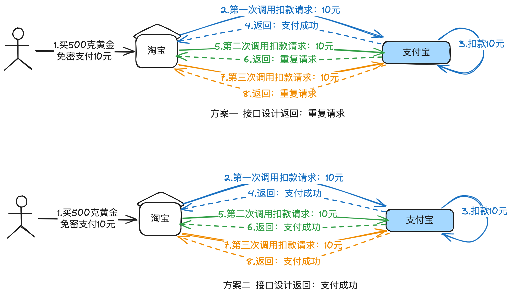
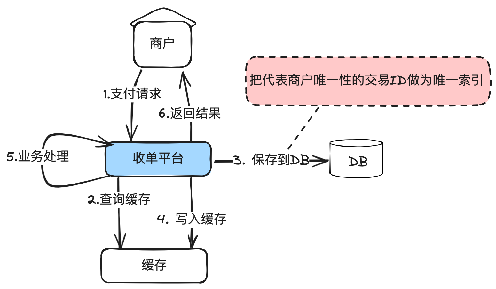
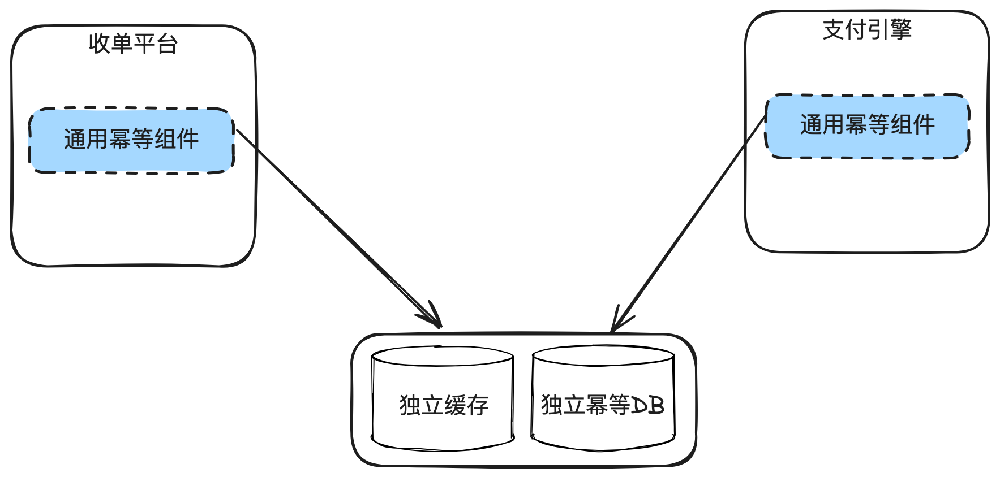
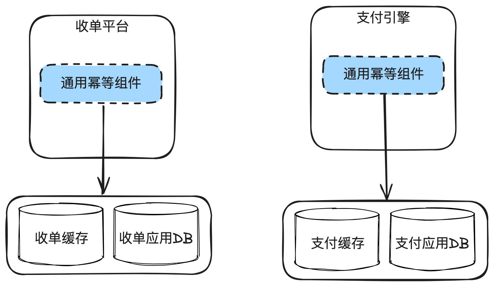
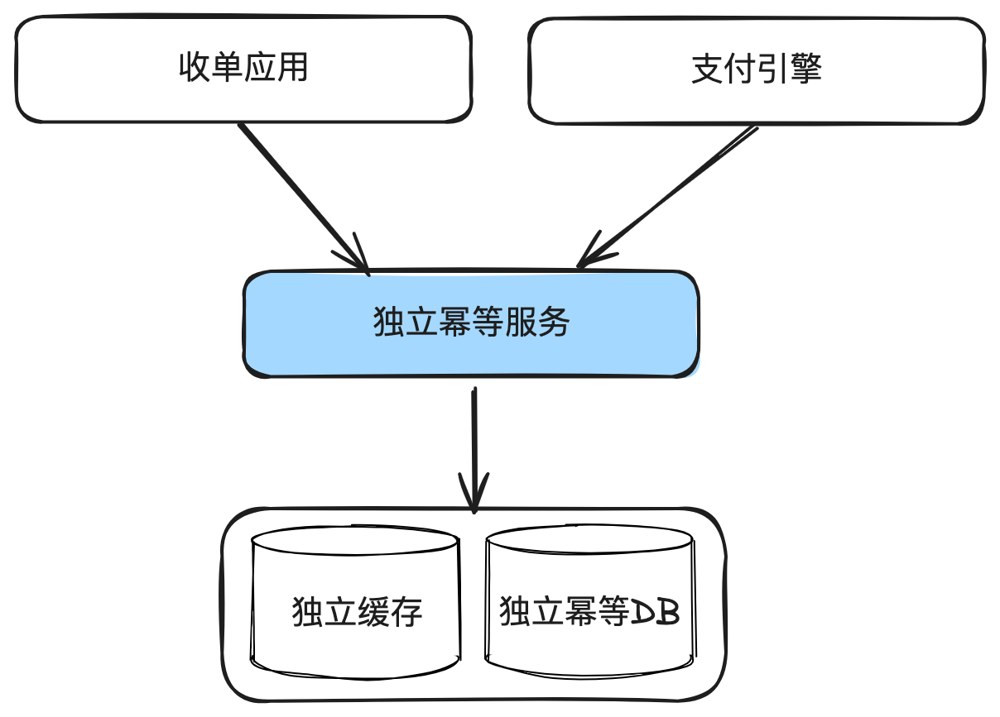
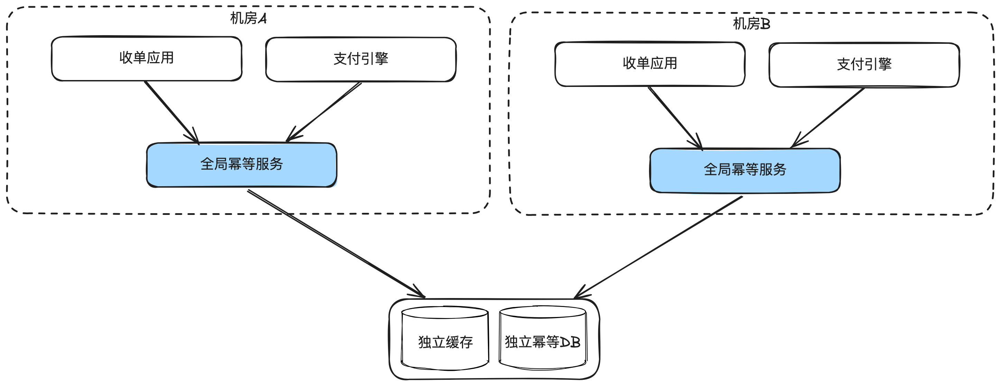

# 9.避免重复扣款_分布式支付系统的幂等性原理与实践

本⽂主要讲清楚什么是幂等性原理，在⽀付系统中的重要应⽤，业务幂等、全部幂等这些不同

的幂等⽅案选型带来的收益和复杂度权衡，幂等击穿场景及可能的严重后果。

这也是⽀付公司⾯试的必考题⽬之⼀。

## 1. 什么是幂等性原理

幂等性是⼀个数学和计算机科学术语，⽤于描述⽆论操作执⾏多少次，都产⽣相同结果的属

性。在软件⾏业，应⽤极其⼴泛，当我们说⼀个接⼝⽀持幂等时，⽆论调⽤多少次，对系统造成的

结果是⼀致的。

注意这⾥说的“对系统造成的结果是⼀致的”是指系统内部数据或状态的变更，不是指返回值。

同的系统设计，返回值可能是不一样的。

举个例⼦，你在淘宝免密⽀付10元，淘宝针对这笔订单调⽤⽀付宝⽀付接⼝进⾏⽀付，⽆论是

调⽤1次，还是调⽤100次，最终只扣了你10元。但是第⼆次有可能返回“重复请求”，也有可能返

回“⽀付成功”，这个取决于接⼝设计。也就是⽀付宝内部只扣了你10元，但是接⼝可能返回给商

户是是不同的结果。

我个⼈倾向于⽅案⼀，如果等幂等，就返回：重复请求。减少误解，虽然两种⽅案中系统都只

扣了⼀次钱。

## 2. 为什么幂等性在⽀付系统中极其重要

⽀付系统必须以最⾼的可靠性和准确性处理交易，这对于⽤户信任⾄关重要。如果⼀个⽀付系

统不能保证幂等性，可能会导致多次扣除同⼀笔费⽤，引发⽤户不满和法律责任，严重时就会有舆

情⻛险，甚⾄会被吊销牌照。

⼀般情况下，⽀付系统的幂等性能⼒要求⽐电商系统要求更⾼，如果⽤户在电商下单多了，只

要没有⽀付，⽤户还是可以忍受的，但⼀旦多扣了⽤户的钱，后果就会⽐较严重。

这也是为什么幂等性会是支付系统招人的面试必考题目之一。

## 3. ⽀付系统中应⽤幂等性的场景

幂等是针对重复请求的，⽀付系统⼀般会⾯临以下⼏个重复请求的场景：

1. ⽤户多次点击⽀付按钮：在⽹络较差或系统过载情况下，⽤户由于不确定交易是否完成⽽重复

点击。

2. ⾃动重试机制：系统在超时或失败时重试请求，可能导致同⼀⽀付多次尝试。

3. ⽹络数据包重复：数据包在⽹络传输过程中，复制出了多份，导致⽀付平台收到多次⼀模⼀样

的请求。

4. 异常恢复：在系统升级或崩溃后，未决事务需要根据已有记录恢复和完成。内部系统重发操

作。

## 4. 幂等解决⽅案

### 4.1. 业务幂等

所谓业务幂等，就是由各域⾃⼰把唯⼀性的交易ID作为数据库唯⼀索引，这样可以保证不会重

复处理。

---

在数据库前⾯可以加⼀层缓存来提⾼性能，但是缓存只⽤于查询，查到数据认为就返回幂等成

功，但是但不到，需要尝试插⼊数据库，插⼊成功后再刷新数据到缓存。

为什么要使⽤数据库的唯⼀索引做为兜底，是因为缓存是可能失效的。

在⾯临时经常有同学只回答到“使⽤redis分布式锁来实现幂等”，这是不对的。因为缓存有可

能失效，分布式锁只是⽤于防并发操作的⼀种⼿段，⽆法根本性解决幂等问题，幂等⼀定是依赖数

据库的唯⼀索引解决。

⼤部分简单的⽀付系统只要有业务幂等基本也够⽤了。

### 4.2. 通⽤幂等组件

每个域都要做幂等处理，那就单独出⼀个独⽴的幂等组件，各⼦业务系统通过引⽤这个公共

JAR包解决。	

适用场景：应用部署不太多的时候。如果应用非常多，独立幂等DB的连接池就不够用。

这个时候，可以把幂等组件的代码共⽤，但是幂等数据库表使⽤业务系统的DB资源。解决独

⽴幂等DB导致的连接数不够⽤的场景。

### 4.3. 通⽤幂等服务

---

解决DB连接数不够⽤的第⼆个解决⽅案：幂等组件服务化。这样的坏处就是复杂度和耗时都会增

加。

### 4.4. 全局幂等

在多机房部署情况下，需要解决机房之间的幂等服务。这就使⽤到了全局幂等概念。

所谓全局幂等，就是多个机房共⽤⼀份幂等数据，这⾥⾯涉及的技术⽐较复杂，后⾯单独开⼀个章

节讲。除了极少数全球部署的多活⽀付系统都⽤不上。

### 4.5. 通⽤幂等数据库表设计

核⼼字段：

uniqueKey：幂等主键，由各应⽤⾃定义，需要保证全局唯⼀性，使⽤这个uniqueKey做hash后

分库分表。⽐如商户的收单ID，上游的ID等。

appName: 应⽤名称，⽐如收单，⽀付等。

siteId：站点ID

extInfoMap：扩展字段，由各应⽤⾃定义，⽐如保存我⽅单号。

### 4.6. ⽅案选型建议

简单的⽀付系统，只需要使⽤业务幂等就够。

中型的⽀付系统，推荐使⽤通⽤幂等组件。这样⽅便运维。

全局幂等⽅案只有极少数公司会考虑。

## 5. 分布式场景下实现幂等性的挑战及应对

分布式⽀付系统⾯临的幂等性挑战核⼼有两点：

1. 如何保证分布于不同地理位置数据中⼼的系统数据的⼀致性。

2. 幂等数据和业务数据跨库事务⼀致性。⽐如幂等已经⼊库成功，但是业务数据库⼊库失败。

为了解决这些挑战，可以采取以下解决⽅案：

1. 使⽤全局唯⼀的交易ID，跟踪每次⽀付请求，防⽌重复处理。
2. 构建强⼤的状态机推进能⼒，严格定义事务各个状态的转换。
3. 构建强大的状态机推进能力，严格定义事务各个状态的转换。
4. 幂等服务的⾼可靠性。

## 6. 幂等被击穿场景及可能的严重后果

尽管有了上述措施，幂等性仍然可能因为以下原因失效：

1. 在分布式系统中，由于同步延迟，导致多个节点未能即时识别重复请求。

2. 请求流量切换。原本应该路由A机房的数据路由到了B机房，但是B机房的幂等数据缺失。

3. ⽣成全局唯⼀ID的算法出现故障或⼈为变更，同⼀笔业务可能出现了2个业务ID。

在⽀付系统中，只要幂等被击穿，基本上都会出现资损事件。有时候是⽤户资损，有时候是平

台资损。曾经碰到⼀个真实案例，上游域把某个幂等字段组成规则的取值变了，但是下游不知道，

导致下游幂等失败，对同⼀笔业务处理了2次，直接资损数⼗万美⾦。

## 7. 结束语

幂等性是分布式⽀付系统的基本要求，对于确保交易的正确性和避免重复扣费⾄关重要。除开

⽀付系统外，很多互联⽹应⽤基本上都需要有幂等能⼒。

有机会再单独讲讲全局幂等。
